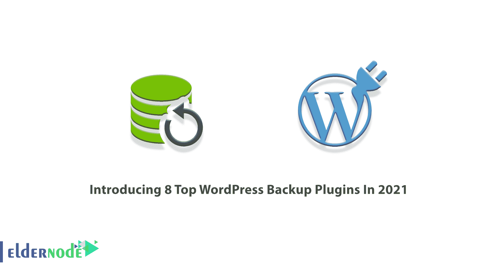
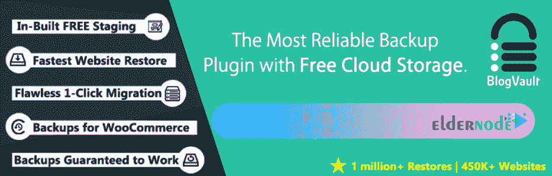
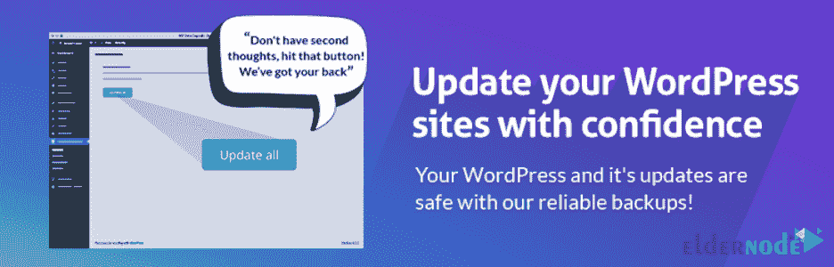
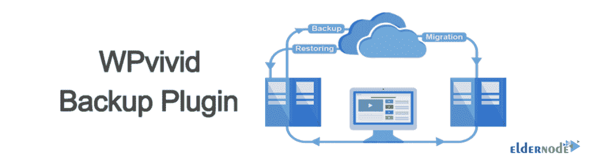

# 介绍 2021 年 8 大 WordPress 备份插件- Eldernode

> 原文：<https://blog.eldernode.com/8-top-wordpress-backup-plugins/>

制作网站备份被认为是至关重要的。因此，网站管理员，尤其是那些在这个领域有丰富经验的人，知道缺乏备份对一个网站来说是多么危险。因此，手动或自动备份网站应该非常重视。站点备份让网站管理员松了一口气，这样在紧急和灾难性的情况下，他们可以将存储的信息恢复到标准状态。在本文中，我们将向您介绍 2021 年的 **8 大 WordPress 备份插件。如果你想买一台 [WordPress VPS](https://eldernode.com/wordpress-vps/) 服务器，你可以访问 [Eldernode](https://eldernode.com/) 中的可用软件包。**

## **2021 年 8 大 WordPress 备份插件**

随着科技的进步，更新的黑客方法正在被发明出来。增加网站的安全性取决于各种因素，你安装[安全插件](https://blog.eldernode.com/4-top-wordpress-security-plugins/)只是为网站的安全性迈出了一步。

仅仅拥有一堵坚固的安全墙并不能保证你的网站。一个网站可能因为任何原因被破坏，无意有意，长期投入的内容不复存在！

诸如网站主机中断或安装恶意插件或意外错误等问题会导致部分或全部网站丢失。现在想象这个噩梦发生在你身上，你没有任何来自网站的备份文件，你必须重新开始；这里变得有点困难！！因为故事的坏处不仅仅是花时间重新开始！

需要记住的一点是，随着网站信息的丢失:

1.网站流量急剧下降

2.这会损害业务

3.搜索引擎优化得分下降

4.你可能会因为恶意软件而被搜索引擎屏蔽

5.你可能会因为恶意软件而被主机暂停

为此，我们决定在本文中介绍 8 款 2021 年最好的 [WordPress](https://blog.eldernode.com/tag/wordpress/) 备份插件。请继续关注本文的其余部分。

## **2021 年 8 大 WordPress 备份插件有哪些？**

在介绍最好的 WordPress 备份插件之前，最好回答几个问题:

我的站点需要特殊类型的备份吗？WordPress 网站有很多种。例如，一个站点可能需要简单的备份，而一个 WooCommerce 站点可能需要即时备份。

**_ 我应该何时备份？**这个问题的显而易见的答案是，您可以随时备份！一旦您备份了站点，请尝试指定一个时间表。例如，如果一个团队每天都在您的站点上工作，备份的理想时间可能是晚上 9 点

**_ 我应该备份什么？**你做的备份应该包括文件和网站数据库。很容易想象你有一份网站所有内容的拷贝，并且你不会丢失任何信息。

**_ 我应该多久备份一次？**你多久备份一次网站取决于网站本身。通常，您可以设置每小时、每天或每周的备份次数。当然，还有一个叫做实时备份的选项，只要对网站做了最轻微的改动，它就会制作一份副本。我建议你每周至少备份一次，不要考虑更长的时间，比如每两周或每月一次。

在本文的续篇中，和我们一起介绍 2021 年最好的 WordPress 备份插件。

### **1) UpdraftPlus 备份插件**

UpdraftPlus 是 WordPress 备份插件中最优秀和最受欢迎的。这个插件在 WordPress 知识库中有超过 300 万的活跃安装。UpdraftPlus 插件有免费版和高级版，但免费版的功能令人钦佩。有了这个插件的免费版本，你可以计划整个网站的备份(数据库、插件和模板等)。).这个插件很容易恢复备份文件，初学者不会有任何设置问题。

如果你愿意，你可以[从 WordPress 插件库下载 UpdraftPlus Backup](https://downloads.wordpress.org/plugin/updraftplus.1.16.56.zip) 插件。

**UpdraftPlus 备份插件特性**

这个好插件的一个优点是，它让你有权选择备份存储的远程内存。Google Drive、Dropbox 和亚马逊 S3 都是远程和云存储的一部分。跟随我们解释这个插件的一些特性:

1_ 备份和恢复备份的能力

2_ 能够在各种云空间中保存备份

3_ 计划站点的自动备份

4_ 速度快，使用的服务器资源少

5_ 克隆站点并将其移动到新域或主机

**Pro 版插件的附加特性:**

6_ 增量备份

7_ 兼容 WordPress 多站点和多网络

8_ 在更多云空间中存储的能力

9_ 能够在多个目的地保存备份

10_ 数据库加密

### **2) BlogVault 备份插件**

BlogVault 服务是 WordPress 备份插件中最著名的服务之一。该服务有超过 80，000 个活动安装，可以从一个站点传输高达 300GB 的数据，而不会给服务器带来额外的负载和降低速度。有了 BlogVault，你可以在任何时候备份你的 WordPress 站点或者定义一个备份时间表。

除了备份的可能性之外，这项服务还可以很好地恢复您的站点。这意味着，如果您的站点结构由于事故而丢失，恢复是 BlogVault 幸运地提供的唯一解决方案。

BlogVault 不仅仅是一个插件；因为所有操作都是在专用的 BlogVault 服务器上执行和存储的。此外，安装这个插件只是为了在你的站点计数器和 BlogVault 站点上的用户面板之间建立一座桥梁。当然，由于操作是在 BlogVault 服务器上执行的，所以不会对您的站点服务器造成额外的压力。事实上，如果提高你的 WordPress 站点的速度对你来说一直很重要，那么积极地看待这个插件吧。

如果你愿意，你可以[从 WordPress 插件库中下载 BlogVault Backup](https://downloads.wordpress.org/plugin/blogvault-real-time-backup.4.58.zip) 插件。

**BlogVault 备份插件功能**

在这一节中，我们将解释这个插件的特性。这些功能包括:

1_ 创建文件和数据库的备份文件

2_ 计划备份的能力

3 _ 商务备份

4_ 每天自动备份

5_ 在站点发生微小变化时立即备份

6_ 备份站点后测试备份的能力

用于备份文件存储的 7_ 90 天归档

8_ 使用专用服务器执行操作

9_ 转移场地的能力

10_ 将站点复制到暂存环境的能力

11_ 安全功能，包括防火墙和安全扫描

### **3) Jetpack 备份插件**

VaultPress 是最好的 WordPress 备份插件之一。该许可证被重写以与 JetPack 集成，现在被称为 JetPack Backup。这个插件有超过 500 万个来自 WordPress 知识库的活跃安装。JetPack 作为共享服务为备份付费。他们的 JetPack 个人版的定价计划从每年 39 美元起。

建议如果你有大型网站，一定要用 JetPack 插件。因为这是一个强大而可靠的网站备份解决方案。最主要的原因是，它可以随时为你提供支持，这对于大型网站来说非常重要。

如果你愿意，你可以从 WordPress 插件库下载 Jetpack 备份插件。

**Jetpack 备份插件功能**

在这一节中，我们将解释这个插件的特性。这些功能包括:

1_ 实时自动备份站点的能力

2_ 无限制的备份存储空间。非常适合电商店铺，尤其是 Woo。

3_ 无论您是要创建一个临时站点还是要移动到新主机，都可以轻松复制、克隆或迁移您的站点。

4_ 自动扫描恶意软件和其他代码威胁

5_ 利用 Akismet 设计的反垃圾邮件功能阻止垃圾邮件评论并生成回复

6_ 暴力保护来保护 WordPress 登录页面免受攻击

7_ 通过电子邮件了解站点故障时间的能力

8_ 能够自动更新插件，便于网站维护和管理

9_ 安全 WordPress-powered 登录被数百万网站使用，可选的 2FA(双因素认证)提供额外保护。

### **4)复印机备份插件**

另一个值得列入最佳 WordPress 备份插件列表的插件是 Duplicator 插件。这个插件不仅仅是用来备份 WordPress 网站的！这意味着这个插件捆绑了所有站点插件、模板、内容、数据库和 WordPress 文件的完整包。通过这种方式，您可以将站点从一台主机转移到另一台主机。由于这个包也包括 WordPress 设置，所以在重新定位后不需要安装和配置它。当然，Duplicator 给了用户选择备份的权利。例如，你有机会在网站上备份你想要的部分！由于其出色的性能，该插件迄今已有超过 100 万的活跃安装。

如果你愿意，你可以从 WordPress 插件库下载副本备份插件。

**复印机备份插件功能**

在这一节中，我们将解释这个插件的特性。这些功能包括:

1_ 备份整个站点或部分站点的能力

2_ 能够克隆 WordPress 站点，并以零故障率将站点转移到域和主机

3_ 捆绑整个网站以便重复使用或分发的能力

4_ 完全转移 WordPress 的能力，没有导入和导出 SQL 脚本的麻烦

**Pro 版插件的附加特性:**

5_ 备份计划

6_ 能够将站点复制到演示或试运行环境

7_ 将备份文件传输到 Google Drive 等云服务

8 _ WP-Config 的附加设置

9_ 多站点 WordPress 传输

### **5) WP 时间胶囊备份插件**

另一个最好的免费 WordPress 备份插件是 WP Time Capsule。这个插件允许实时备份。有趣的是，这个插件会在每次更新前自动备份你的文件，这样你就不会错过重要的内容。

需要注意的是，如果发生不愉快的事件，您可以恢复数据。您还可以备份数据库文件。另一个需要注意的重要事情是，您可以加密数据库备份以增加安全性。这将使您的 GDPR 备份兼容。

此外，这个插件备份和恢复修改过的文件和数据库，而不是所有的网站内容。最后，您可以将您的内容存储在云存储位置，如 Google Drive、亚马逊 S3、Wasabi 等。

如果你愿意，你可以从 WordPress 插件库下载 WP Time Capsule 备份插件。

**WP Time Capsule 备份插件功能**

在这一节中，我们将解释这个插件的特性。这些功能包括:

1_ 实时备份的能力。您还可以将备份间隔更改为每 6 小时、12 小时或每天。

2_ 只需单击 staging，即可轻松测试您计划在站点上进行的任何更改。只需点击一下鼠标，即可测试您的更新

3_ 自动备份和更新的能力

4_ 能够加密数据库备份，以创建额外的安全层和备份 GDPR。

5_ 能够使用 WPTC 备份来模拟您的站点或将您的站点迁移到新位置

### **6)back up 备份插件**

另一个在最佳 WordPress 备份插件列表中的好插件是 BackWPup。这个插件在 WordPress 插件库中有超过 700，000 个活跃的安装。有了这个插件，你可以创建一个完整的网站备份，并保存在任何服务和云空间。要选择备份文件格式，有三个选项:Zip、Tar、Tar GZip，可以根据需要选择自己想要的。这个插件只支持 MYSQLI 数据库备份数据库文件。

如果你愿意，你可以从 WordPress 插件库下载 BackWPup 备份插件。

**back pup 备份插件功能**

在这一节中，我们将解释这个插件的特性。这些功能包括:

1_ 文件备份

2_ 数据库备份(mysqli)

3_ 数据库优化

4_ 数据库检查和修复

5_ WordPress XML 文件导出

6_ 备份已安装插件的能力

7_ 直接查看备份日志

8_ WordPress 网络或多站点支持

9_ 将备份文件直接传输到所需的云空间、主机文件夹或电子邮件

**Pro 版插件的附加特性:**

10_ 将备份文件传输到更多服务，包括亚马逊冰川和谷歌驱动

11_ 恢复备份的能力

12_ 安全备份 zip 加密和恢复

### **7)WP 生动备份插件**

WPvivid 备份插件提供了一个备份插件应该具备的所有基本功能，包括备份和恢复。此外，这个插件还提供了一些功能，比如未使用的图片清理器。在备份和传输图像之前，您可以轻松删除所有未使用的图像。

需要注意的是，这个插件有超过 100，000 个活跃安装，是 WordPress 插件库中最好的免费备份插件之一。在这个插件的帮助下，你可以很容易地将你的 WordPress 站点拷贝转移到一个新的主机上。很高兴知道这个插件允许数据库加密来为你的数据库文件创造更多的安全性。

如果你愿意，你可以[从 WordPress 插件库中下载 WPvivid Backup](https://downloads.wordpress.org/plugin/backwpup.3.8.0.zip) 插件。

**WP 生动备份插件功能**

在这一节中，我们将解释这个插件的特性。这些功能包括:

1_ 为备份定制一切

2_ 您可以创建登台站点并将登台定向到活动站点

3_ 增量备份的可能性

4_ 能够加密数据库备份

5_ 自动备份主题、主题和插件的能力

6_ 未使用的图像雨刷(测试版)

7 _ WordPress 的多媒体备份能力

8_ 为 WordPress 管理部门创建暂存的能力

9_ 具有高级存储空间

10_ 从远程内存恢复备份的能力

11_ 通过远程存储传输一切的能力

12_ 编辑用户角色权能的能力

### **8)bold 网格备份插件**

我们在本文中介绍的最后一个插件是 BoldGrid Backup。BoldGrid Backup plugin 是另一个 WordPress 备份插件，具有检索甚至在更换主机时移动站点的功能。这个插件在 WordPress 插件库中有超过 80，000 个活跃的安装。这个插件的一个很大的特点是，它会在更新前自动为你的站点创建一个备份，这是保存更新信息和错误的最好方法。应该注意的是，BoldGrid 备份插件允许您通过 FTP 或 SFTP 传输备份。

如果你愿意，你可以从 WordPress 插件库下载 BoldGrid 备份插件。

**bold 网格备份插件特性**

在这一节中，我们将解释这个插件的特性。这些功能包括:

1_ 自动和手动备份的可能性

2_ 能够完全备份文件和数据库，并根据需要进行调整

3_ 通过 FTP/SFTP、亚马逊 S3 和 Google Drive 进行远程备份(高级)

4 _ Total maintenance 检查，以确保您的 web 服务器具有创建适当的备份归档所需的功能，从而保护您的备份的完整性

5_ 只需点击几下鼠标，即可克隆、复制或迁移您的站点

6_ Site Check 监控您的站点是否存在导致站点崩溃的问题，并提供一套工具来检索您的站点。

## 结论

WordPress 备份插件现在有免费和高级版本，并且已经发布在 WordPress 插件库中。因此，它们可能非常有效，但我们总是建议在网站设计中使用 WordPress 内容管理系统的用户和网站管理员不要满足于这些插件，并自己手动备份托管空间。在这篇文章中，我们试图向你介绍 2021 年最好的 8 个 WordPress 备份插件。如果你愿意，可以参考[教程对主机 Cpanel](https://blog.eldernode.com/make-a-full-backup-of-host-cpanel/) 进行完整备份。