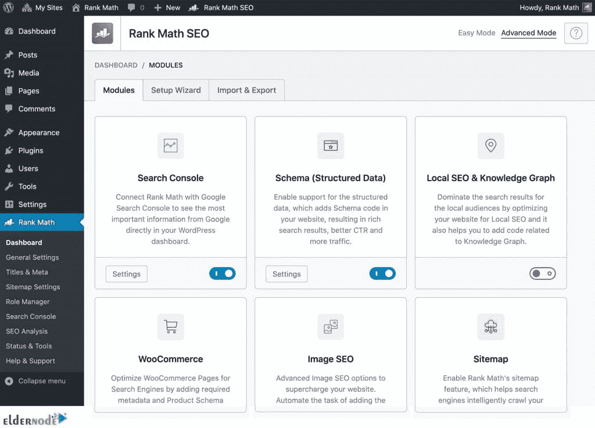

# 2021 年推出 8 款顶级 WordPress SEO 插件

> 原文：<https://blog.eldernode.com/8-top-wordpress-seo-plugins/>

WordPress 需要 SEO。插件和工具使 SEO 变得简单易行。为了使编辑、发布和搜索变得容易，WordPress 提供了许多插件。当你需要与公众分享你的博客时，SEO 帮助你拥有一个对你的见解和专业知识感兴趣的大社区。为了达到这个目的，你需要确保你的搜索引擎优化是有效的。所以，加入我们的文章**一步步介绍 2021 年的 8 个顶级 WordPress SEO 插件**。

## **2021 年 8 大最佳 WordPress SEO 插件**

根据统计和研究，SEO 是提高内容性能的最佳方式。在官方的 WordPress 知识库上有超过 55，000 个插件。你必须检查最好的插件，让它们根据你的需要和目标发挥作用。并非所有的 WordPress 插件都是免费的，你需要付费才能获得额外的功能。接下来，你将学习**什么是 WordPress 插件，为什么你需要它们**。

### **关于 WordPress SEO 插件的一切**

要想在数字营销方面取得进步，SEO 是一把强有力的钥匙。使用 SEO 可以让你决定你的内容在搜索结果中的位置。所以，你需要一份 WordPress 网站的 SEO 插件和工具列表。你可以很容易地将 WordPress 插件添加到你的 WordPress 站点，并改善它的整体外观、功能和效率。计算机还不够专业，不足以写出吸引人的标题，它们对关键词的选择也不尽如人意。所以，你的努力也很重要。

你需要好的 SEO 插件来正确地选择你的目标关键词，知道你的图像文件的合适大小，甚至呈现可读的内容。如果不使用 WordPress SEO 插件，你很难增加网站的流量。有几个 WordPress SEO 插件，其中许多是免费的。为了不错失流量和转化的机会，请和我们一起回顾 2021 年的 8 个顶级 WordPress SEO 插件。

## **2021 年 8 大顶级 WordPress SEO 插件有哪些**

SEO 插件的工具和强大功能允许你审计清单、网站地图和内容洞察。现在，如果你对使用一个 SEO 插件足够满意，让我们看看 8 个最好的 WordPress SEO 插件的概述。要优化您的网站，请检查哪一个最适合您公司的需求。

### **1- Yoast SEO**

约斯特是 WordPress 的一个非常受欢迎的 SEO 插件。无论你是在经营一个个人博客，还是一个为客户管理网站的 SEO 专家，它都可以帮助你在为访问者和搜索引擎创建内容之间找到平衡。通过提供免费和高级功能，Yoast 插件保证了关键字、关键短语、同义词和相关关键字的优化。使用这个有价值的工具，你可以添加搜索引擎优化描述和标题到你的网站的文章和页面。这个插件帮助你自动生成 XML 站点地图。当您安装 Yoast 插件时，您可以从您以前使用的其他 SEO 插件中导入 SEO 数据。Yoast 有助于您的网站发展。以下是这个插件最有用的地方:

一段式结构

2-关键字密度

3-弗莱施-金凯阅读容易

4 元描述

五连杆支架

6-以前的关键字用法

7-副标题中的关键字使用

8- Permalink 清理

9-社交分享

如果你愿意，[通过 WordPress 官方网站下载 Yoast](https://wordpress.org/plugins/wordpress-seo/) 。

**Yoast 特性**

由于不再需要手动搜索关键字，Yoast 可以帮助您节省时间。让我们通过阅读 Yoast 的特性来了解它的更多信息:

1-检查您的页面和博客帖子的可读性和 SEO 改进。

2-能够看到你的谷歌搜索引擎结果。调整元描述，让更多的吸引力和关键字丰富。

3-对所有页面进行可读性检查，可以让你明白是否需要拆分段落或添加元素，如编号列表或标题。

4- Yoast 会告诉你你的页面或文章中是否有重复的内容。

5-谷歌搜索控制台集成。

还有很多。

### **2-SEO press**

SeoPress 快速、简单，被认为是最适合初学者的 Seo 插件之一。因此，如果你是插件新手，但你希望提高你的网站的搜索引擎优化，从 SeoPress 开始是一个好主意。有了这个免费的强大插件，你可以安装和设置你的数据，因为它提供了一个安装向导。SeoPress 允许您管理帖子、页面、帖子类型和术语的所有标题和元描述。

如果你愿意，[通过 WordPress 官方网站下载 SeoPress](https://wordpress.org/plugins/wp-seopress/) 。

**SeoPress 功能**

使用这个插件可以帮助你节省金钱和时间。SeoPress 简单易用。以下是其主要功能列表:

1-它用无限的关键词分析内容。所以，你可以为搜索引擎编写优化的内容

2-谷歌知识图

3-移动/桌面谷歌预览，看看你的文章在谷歌搜索结果中的样子

4-脸书和 Twitter 社交预览，看看你的帖子在社交媒体上会是什么样子，以增加转化率

5-可定制的 URL 重写

6- Image XML 站点地图，用于改进 Google 图片的搜索索引

还有很多。

### **3- All in one SEO**

WordPress 的 All in One SEO (AIOSEO)是最初的 WordPress SEO 插件。WordPress 认为，All in one 插件为你充当 SEO 专家，因为它是全面的，可以帮助你提高网站的 SEO 排名，并在不到 10 分钟的时间内发现新的增长机会。凭借易于使用的界面，in one SEO 插件允许您添加元标签、生成 XML 站点地图、添加模式标记和优化社交共享。

如果你愿意，[通过 WordPress 官方网站下载所有内容。](https://wordpress.org/plugins/all-in-one-seo-pack/)

**多合一搜索引擎优化功能**

AIOSEO 被认为是世界上最好的 WordPress SEO 插件。其功能是高度优化的谷歌和其他流行的搜索引擎算法。让我们回顾其中的一些:

1-你可以在 10 分钟内设置好 WordPress SEO，因为它使用了 WordPress SEO 设置向导

2-你不需要开发人员，因为它是网页上的搜索引擎优化优化

3-运行 SEO 健康检查器

4-编辑您的 robots.txt 文件

5- API 支持

6-搜索引擎验证工具

7-高级规范 URL

还有很多。

### **4-白金 SEO**

这是一个轻量级的功能齐全的 WordPress SEO 插件，旨在帮助你满足所有的搜索引擎优化需求。初学者和 WordPress SEO 专家都喜欢白金 SEO，因为它对每个人来说都很容易，并且可以完全控制你网站上的页面 SEO。它还提供了一个生成 Google 支持的任何模式的工具，以及一个帮助你为每个帖子或页面定义所有重要元标签的功能包。如果你渴望能够控制所有的技术问题，白金搜索引擎优化插件是你需要的。因为你会被报告所有 404 错误。

如果你愿意，[通过 WordPress 官方网站下载白金](https://wordpress.org/plugins/platinum-seo-pack/)。

**白金 SEO 功能**

白金搜索引擎优化插件是挤满了所有的功能，你需要做技术和网页搜索引擎优化。让我们来看看它的功能的简要总结:

1-自动设置规范 URL 或设置跨站点规范 URL 的能力

2-能够为脸书，Twitter，Pinterest 和 Linkedin 创建社交元标签。它还会自动生成所有与 SEO 相关的 META 标签

3-为搜索引擎优化帖子和页面标题

4-支持自定义帖子类型和自定义分类

5-兼容大多数其他插件。您可以使用 Google XML 站点地图生成器来生成您的站点地图

还有很多。

### **5-squirry SEO**

Squirrly SEO 给你最快的方法来获得最好的 SEO 结果，因为它能够像 Google 一样查看 WordPress 站点上的每个页面。你可以升级你的 WordPress，用这个流行的插件增加搜索流量。使用这个插件可以让你有一个基于人工智能的私人 SEO 顾问。如果你不是 SEO 专家，你可以享受使用这个插件。它检查你的流量，人们如何参与你的网站内容，查看你在谷歌搜索引擎中所有页面的位置，告诉你如何带来更多的流量，如何让更多的页面可见，给你提供更多点击的可靠建议，等等。

如果你愿意，可以通过 WordPress 官方网站下载[squirly SEO](https://wordpress.org/plugins/squirrly-seo/)。

**squirry SEO 功能**

Squirrly 是一个一体化的插件，有一些独特的功能。它与其他搜索引擎优化插件和每个页面的细节以及网站内部的上下文兼容。Squirrly 告诉你如何处理每一页，让它在搜索引擎上被找到。由于这个免费插件提供了 Yoast、RankMath、SEOpress 和 SEOpressor 的付费功能，您可以使用它免费获得它们的付费功能。但这里列出了它的主要特点:

单焦点页面

双关键词研究工具

3-最佳搜索引擎优化目标

四轨搜索引擎优化结果

5- SEO live 助手

6-批量 SEO

7- SEO 审计

8- SEO 代码片段工具

还有很多。

### **6-智能爬行**

作为一名管理员，你必须通过改进关键词优化，XML 站点地图，优化你的元标签，标题和描述，提高你在 Google 上的 PageRank，来给你的站点更好的 SEO 优化和排名。SmartCrawl 是你所需要的，因为它现在是最好的，使您的网站更容易阅读和查找。当它在文章和页面编辑器中运行内容分析时，你会得到即时的反馈和改进内容的建议。SmartCrawl 有助于您不遗漏任何内容。它指出了哪里你需要应用你的关键字研究是最有效的。

如果你愿意，[通过 WordPress 官方网站下载 SmartCrawl](https://wordpress.org/plugins/smartcrawl-seo/) 。

**SmartCrawl 功能**

你可以用 SmartCrawl 体验快速而强大的 WordPress SEO。让我们回顾一下它的更多特性:

1-自动搜索引擎优化检查和报告

2-站点地图自动生成器和搜索引擎通知

3-标题和元描述

4-完全支持默认的 schema.org 类型

5-网站抓取、扫描和报告

6-自动链接

7- 301 重定向

8-高级社交媒体分享

### **7-monster insights**

由于 MonsterInsights 是 WordPress 最完整的谷歌分析插件，它可以很容易地向你显示你的网站访问者来自哪里，他们在你的网站上做什么，以及哪些内容表现最好。这个插件是初学者最常用的，因为 MonsterInsights 显示了他们需要改善你的网站的 SEO 策略的洞察力。此外，其他人可以使用这个插件来监控他们的电子商务搜索引擎优化，以避免失去客户。

如果你愿意，可以通过 WordPress 官方网站下载 [MonsterInsights](https://wordpress.org/plugins/google-analytics-for-wordpress/) 。

**MonsterInsights 特性**

MonsterInsights 是市场上最强大和用户友好的 WordPress 分析插件。让我们回顾一下它的主要特点:

1-通用跟踪

2-谷歌分析仪表板

3-实时统计

4-增强的电子商务跟踪

5 页级分析

6-附属链接和广告跟踪

还有很多。

### **8 级数学**

要为搜索引擎和社交媒体优化你的网站，你可以使用设置向导附带的 Rank Math WordPress SEO 插件。因此，你可以在设置过程中从其他 SEO 插件导入数据。使用排名数学允许您添加元标题、描述和开放图表元数据到您的博客帖子。你知道了阿尤索和尤斯特的事。如果你选择了其中一个，你就不需要再安装这个插件了。排名数学帮助你保持领先于你的竞争对手，因为它与谷歌搜索控制台和关键字排名工具相结合。

如果你愿意，[通过 WordPress 官方网站下载 Rank Math](https://wordpress.org/plugins/seo-by-rank-math/) 。

**排名数学特征**

这个强大的插件是一个功能丰富的 SEO 插件，易于使用。在下面的列表中查看有关其功能的更多信息:

1-易于操作的安装向导

2-简洁的用户界面

3-内置高级搜索引擎优化分析模块

4-谷歌分析集成

五级跟踪器

6-关注职位历史

7-文章关键词排名

8-最先进的模式生成器

还有很多。

## 结论

本文向大家介绍了 2021 年 8 款顶级 WordPress SEO 插件。你可以下载并安装任何你需要的插件。您查看的所有功能对于免费版本都是有效的。它们中的大多数都提供了一些你应该付费使用的功能。如果您需要向您的朋友询问他们最喜欢的插件或任何其他问题，请前往 [Eldernode 社区](https://community.eldernode.com/)并提交您的反馈。