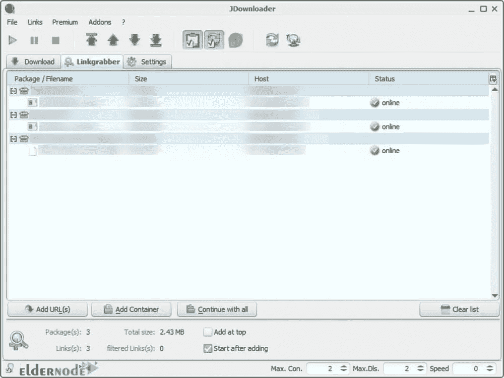
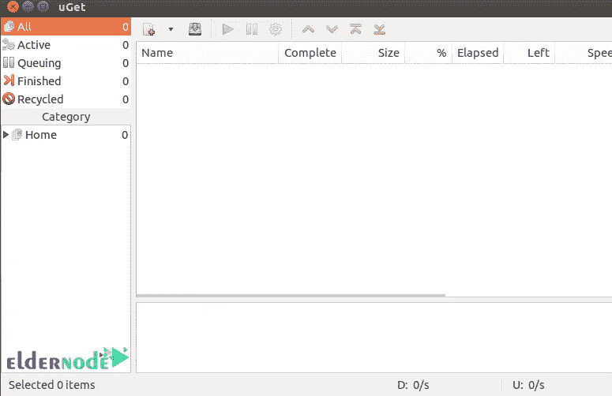
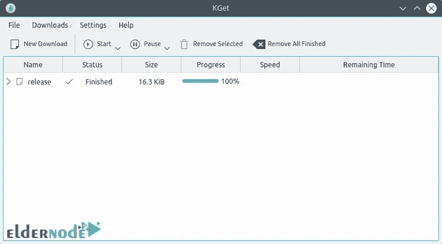
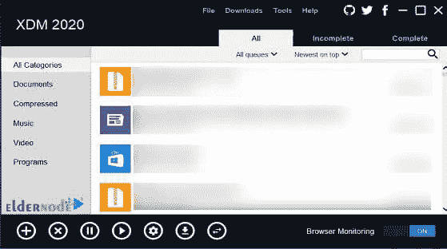
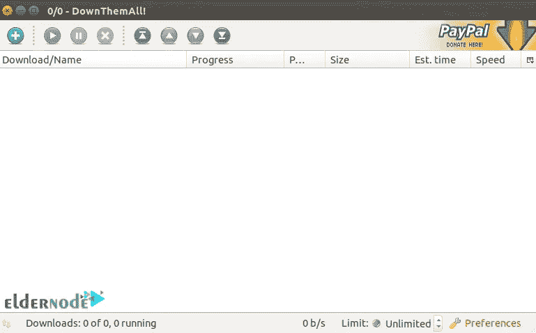
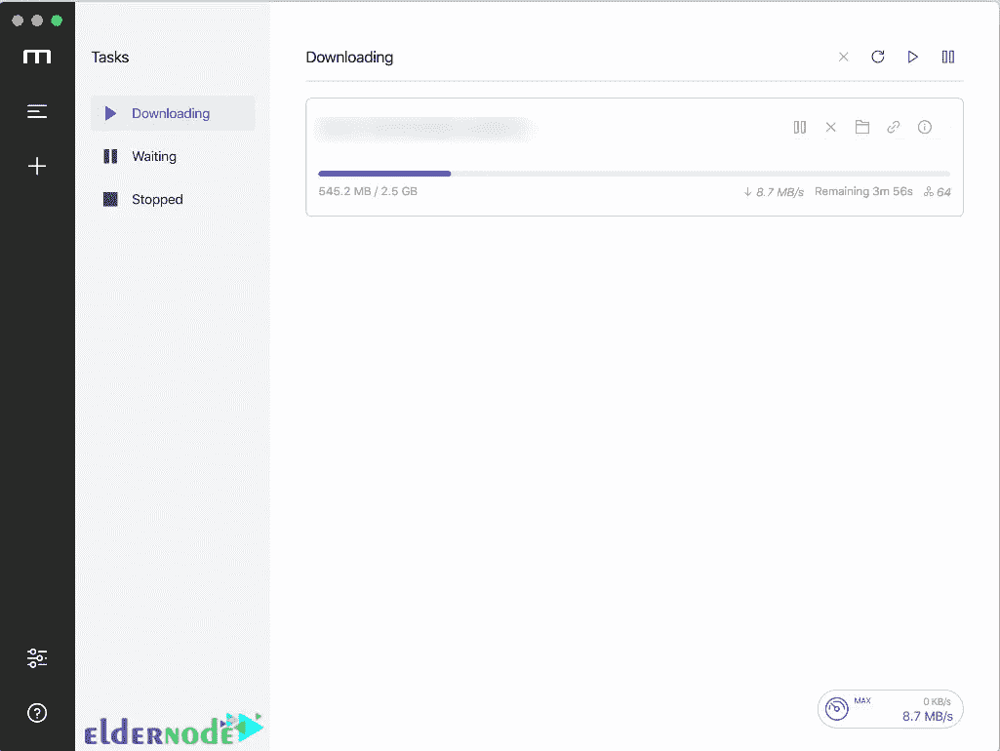
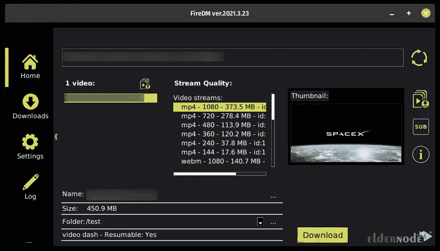
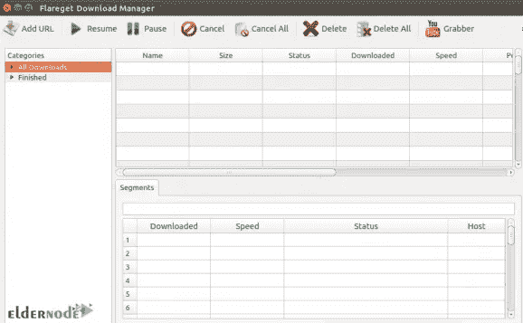
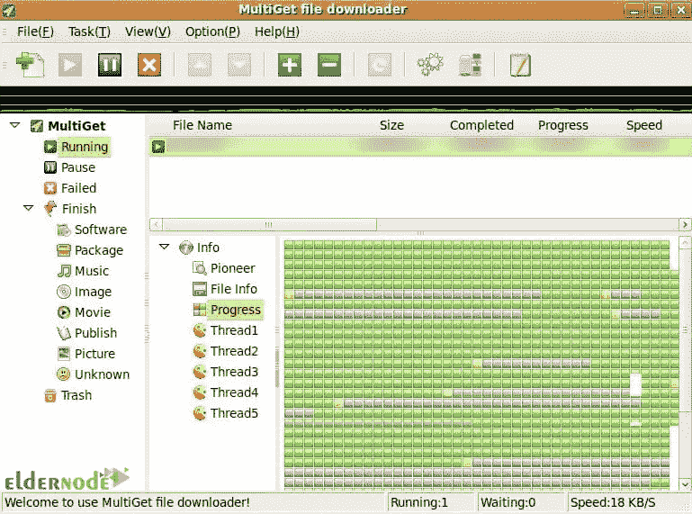

# Linux Server 的 9 大下载管理器[2022]

> 原文：<https://blog.eldernode.com/9-download-managers-for-linux/>

![TOP 9 Download Managers for Linux Server [2022]](img/2a573b14a0e064589494d3e8a040e901.png)

所有现代浏览器都有一个默认的下载管理器，但是如果你有下载时间或失败的问题，下载管理器可以解决你的问题。甚至，一个默认的下载管理器不足以管理一个有效的下载系统，最好有一个单独的下载管理器程序。本文将向您介绍**Linux Server[2022]**的 9 大下载管理器。如果你打算购买一台 **[Linux VPS](https://eldernode.com/linux-vps/)** 服务器，你可以查看 [Eldernode](https://eldernode.com/) 网站上提供的软件包。

## **2022 年推出 9 款 Linux 服务器下载管理器**

### **什么是下载管理器？**

下载管理器是一个软件，允许您更快的下载速度，优先下载，暂停和恢复下载支持，检查自动防病毒，并提供一个内置的调度程序。通常，从互联网上下载一些东西是容易和简单的。但如果你想下载大文件或多个文件，你应该有一个下载管理器。使用下载管理器，你也可以更容易地管理你的下载，并获得更多的功能，如种子支持，磁铁链接，下载速度控制等。

在这篇来自 [Linux 教程](https://blog.eldernode.com/tag/linux/)系列的文章的继续中，我们将向您介绍适用于 Linux 服务器的最佳下载管理器。

## **Linux 服务器下载排行榜**

在这一节中，我们将介绍适用于您的 Linux 服务器的最佳下载管理器。Linux 服务器有很多下载管理器，用户很难选择其中之一。本教程将帮助你找到最适合你的 Linux 服务器的下载管理器。

### 1。JDownloader

JDownloader 是一个用 Java 编写的开源免费下载管理器。它允许你从一键托管网站自动下载文件组。用户可以轻松管理下载，没有任何麻烦。该软件提供了对下载的全面控制，如暂停和恢复功能，带宽分配，下载速度调整等。

### **2。uGet 下载管理器**

uGet 是一个免费、快速、轻量级和开源的下载加速应用程序，用于管理和提高从互联网下载文件的速度。这个软件有一个有吸引力的和简单的用户界面，并包含精彩的功能。它不需要激活，也不需要成本，而且不限于不同的操作系统。你可以在 Windows，Mac，BSD， [Linux](https://blog.eldernode.com/tag/linux/) ，甚至移动平台上使用 uGet。

#### **uGet 特性**

uGet 下载管理器的主要功能有:

–支持简历

–对下载进行分类和排序

–自定义下载管理设置

–设置关闭系统的时间

–设置在特定时间停止或开始下载

–同时下载多个文件，数量不限

–使用插件支持 BitTorrent

### **3。kGet 下载管理器**

kGet 是一个开源的、快速的、轻量级的、多功能的、用户友好的下载管理器，它集成了 KDE 桌面环境和 Konqueror 浏览器。它适用于所有主要的 Linux 发行版，并允许您一次从不同的 URL 下载。这个应用程序允许用户从 HTTP 和 FTP 源下载和管理文件。

#### **kGet 特性**

我们来列举一下 kGet 的特点:

–暂停和继续下载文件

–嵌入系统托盘

–支持 BitTorrent

–支持 Metalink，它包含用于下载、校验和及其他信息的多个 URL

### **4。Xtreme 下载管理器**

Xtreme Download Manager 也称为 XDM，是一个强大的工具，可以提高下载速度，安排和转换下载，并恢复中断的下载。它是用 Java 编写的，可以在 Linux 桌面下获得。这个下载管理器可以让你保存来自脸书、谷歌、DailyMotion 和 YouTube 的流媒体视频。

#### **极限特性**

Xtreme 下载管理器的主要功能有:

–支持代理、认证和其他高级功能

–暂停/恢复下载支持

–支持从著名网站捕获多媒体文件

–快速从剪贴板中获取 URL

–支持 HTTP、HTTPS 和 FTP 协议

### **5。DownThemAll 下载管理器**

DownThemAll 是一个 Firefox 插件，为您的浏览器增加了新的高级下载功能。它可以在 Windows、macOS、BSD 和 Linux 上使用，并允许您下载网站上的所有链接或图像。您无需安装成熟的专用下载应用程序，就可以提高下载量。

#### **下降所有特征**

向下所有主要特性包括:

–支持下载网页上的所有图片和链接

–下载后自动检查 SHA1 和 MD5 哈希

–支持下载多个文件，并支持为每个文件设置下载速度

–为 Firefox 和 DownThemAll 之间的集成定制大量设置

–支持从 Firefox 浏览器自动抓取下载的链接

### **6。Motrix 下载管理器**

Motrix 是适用于 Linux 的开源下载管理器。它允许您毫无问题地下载常规文件和媒体内容，并通过一个平台管理 FTP/HTTP 下载、torrent 下载和 magnet URL 下载。这个下载管理器可用于 Linux、Windows 和 macOS，并与 BitTorrent 链接和类似系统兼容。

### **7。FireDM 下载管理器**

FireDM 下载管理器是一个开源的令人印象深刻的下载管理器，它通过集中硬件和服务器资源来提高下载速度。它是使用 libcurl 多协议传输库和 youtube-dl 库用 Python 编程的。这个下载管理器提供了完美的日志和并发下载队列管理。

#### **FireDM 功能**

FireDM 的最佳特性包括:

–支持 Youtube 和其他流媒体网站

–下载整个视频播放列表或选定的视频

–下载多重连接

–自动文件分段和刷新死链接

### **8。linux 版 FlareGet 下载管理器**

FlareGet 是一个多功能的下载软件，允许你以最快的速度从不同的网站下载文件，保存视频和音乐，甚至是 YouTube。它是保存来自谷歌 Chrome、Opera、Mozilla Firefox 和 IE 等浏览器的多媒体文件的最佳软件之一。这个软件中有一个恢复选项，这样即使在系统挂起的情况下，它也可以恢复下载。FlareGet 软件的智能文件管理根据扩展名自动对下载的文件进行分类。

#### **FlareGet 特性**

FlareGet 的最佳特性如下:

–支持 HTTP、HTTPS、FTP 协议

–多线程支持

–支持从剪贴板中自动抓取 URL

–有 18 种不同的语言版本

–支持每个文件 4 段

### **9。MultiGet 下载管理器**

MultiGet 是一个开源的免费下载管理器，它依靠其多功能性和同时执行多项任务的可能性来提高下载速度。它只针对 Linux 发布，但无需特殊配置就可以在许多系统上运行。该软件是用 C++编程语言编写的，将适用于所有用户。

#### **MultiGet 特性**

让我们列出 MultiGet 的主要特性:

–在图形环境中管理下载的文件

–多语言支持

–支持 HTTP 和 FTP 协议

–剪贴板监控

–支持 SOCKS4，4a，5 代理，FTP 代理，HTTP 代理

就是这样！我们介绍了 Linux 服务器的最佳和前 9 名下载管理器。

## 结论

Linux 服务器有很多下载管理器，很难选择其中之一。在本文中，我们介绍了 Linux 服务器的 9 大下载管理器，并列出了它们的特性。我希望在本教程的帮助下，你找到了你想要的 Linux 服务器下载管理器。如果你有建议或任何问题，你可以在评论区联系我们。