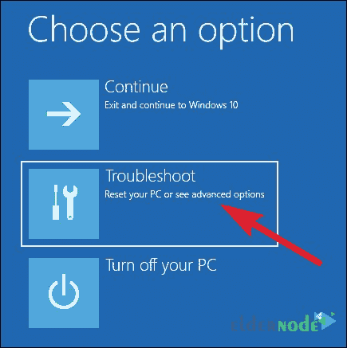

# 如何在 Windows 10 - ElderNode 博客中访问安全模式

> 原文：<https://blog.eldernode.com/access-safe-mode-in-windows-10/>

如何在 [Windows 10](https://eldernode.com/tag/windows-10/) 中进入安全模式？在上一代 Windows 8 中，在启动时按下 **F8** 键会显示一个菜单，允许你进入各种 Windows 模式，比如[安全模式](https://en.wikipedia.org/wiki/Safe_mode)。这在 Windows 8 以后有所改变。在本文中，我们将以 Windows 应用教程的形式，教大家如何在 Windows 10 中访问安全模式。

[**【廉价 VPS】用比特币托管，完美货币**](https://eldernode.com/vps-hosting/)

安全模式是 Windows 中的一种模式，在 Windows 出现问题或手动扫描病毒时使用。当 Windows 以安全模式启动时，只有**基本 Windows 服务**被启动，没有驱动程序、软件、病毒等。以这种模式启动。因此，这种环境称为安全模式。

关注我们如何在 Windows 10 中访问安全模式。注意，本教程也适用于 [Windows 虚拟服务器](https://eldernode.com/windows-vps/)。

### 进入 Windows 10 的安全模式

**1。** 在引导 Windows 10 之后，进入之前，在**登录**窗口，点击电源。

**2。**T3 打开菜单后，按住 Shift 键，然后点击重启。

**注意:**你可以在**开始菜单**中点击电源，按住 Shift 键点击重启。

**3。在如下图所示的**窗口中，点击排除故障。

**4。**T3 选择高级选项。

**5。** 在高级设置窗口中，选择启动设置选项，这样你就可以在 Windows 启动前看到 **Windows 启动设置**。

**6。** 进入启动设置后，点击重启启动系统。

**7。**启动系统后，会显示如下菜单。您可以选择任何想要的模式。

选择必须与写在选项旁边的数字相关，并以同样的方式使用 **F1** 到 **F9** 键。

例如，在这一步我们按下 **F4** 选择启用安全模式。

**8。** 选择所需选项后， Windows 安全模式环境将启动。

**注意** 在安全模式下完成工作并重启系统后，Windows 将正常加载。

### 方法二:从设置区进入 Windows 10 的安全模式

**1。T3 首先进入 Windows 10 设置。**

要进入设置部分，可以点击开始选项和设置部分，看起来像一个齿轮。

**2。** 点击更新&安全然后选择恢复按钮。

**3。** 从高级启动部分，找到现在重启并点击它。

**4。** 选择此选项，您的系统将重启，再次出现后，会出现一个蓝色的屏幕。

蓝屏上有几个选项。你可以点击启动设置，然后点击重启。

**5。** 系统重启后，你会看到几个选项。

你点击**第四个**选项(启用安全模式)。这将重启系统并进入安全模式。

### 方法三:在 Windows 10 中按 f8 或 shift + f8 键进入安全模式

有些 windows 只有传统 BIOS 。如果您的计算机是这些计算机中的一种，并且安装在硬盘上，您可以使用这种方法。

事实上，这种方法是最常见的进入安全模式的方法之一。

要使用此方法进入安全模式，您必须在电脑启动时按下 **f8** 键或 **shift 键+ f8** 。

### 方法四:安装 Windows 10 时的安全模式

要在 **Windows 10** 中进入安全模式，也可以通过安装 Windows 来进行。为此，请按照以下步骤操作:

**1。将**想要的内存( DVD 或 USB )连接到你的系统。

**2。** 照常引导系统。

**3。在安装页面的**上，点击下一步的选项。

**4。在出现的** 页面中，点击修复你的电脑。

**5。** 现在按照这些步骤依次进行:

故障排除 > > 高级选项 > > 命令行提示。

**6。** 当 **命令提示符** 出现时，在里面键入以下命令:

bcdedit/set { default } safeboot minimal

**7。** 执行完这些步骤后，**关闭**命令提示。

**8。** 然后选择继续和退出到**引导**系统进入安全模式。

### 退出 Windows 10 中的安全模式

以上，我们已经教了你一些在 Windows 10 中进入安全模式的方法。现在我们想说在 Windows 10 中脱离安全模式是什么感觉？

要在 Windows 10 中 **退出** 安全模式，您必须执行以下操作:

**1。** 当您的系统安全启动或进入安全模式时，使用 Win + R 组合键。

**2。T3 此时，显示**运行**窗口。在运行窗口中，键入 msconfig 并按下 ok 。**

**3。** 转到总选项卡，确认正常启动是开启。

**4。T3 选择开机标签。如果在该选项卡中**启用了**，则关闭。**

**5。T3 现在按下 ok 键。**

**6。** 重启系统。

通过执行上述步骤，您的系统将退出安全模式。

**尊敬的用户**，我们希望您能喜欢这个[教程](https://eldernode.com/category/tutorial/)，您可以在评论区提出关于本次培训的问题，或者解决[老年人节点培训](https://eldernode.com/blog/)领域的其他问题，请参考[提问页面](https://eldernode.com/ask)部分，并尽快提出您的问题。腾出时间给其他用户和专家来回答你的问题。

好运。