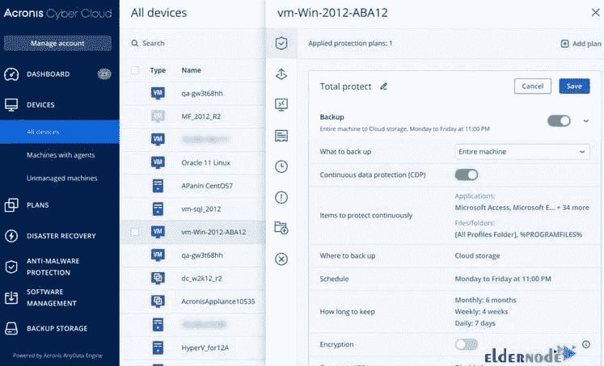

# 介绍适用于 Linux 的 Acronis 备份和恢复- Eldernode 博客

> 原文：<https://blog.eldernode.com/acronis-backup-and-recovery-for-linux/>

你的数据很有价值。作为管理员或用户，您可能会在系统操作中面临一些基本的和常见的问题，迫使您快速修复它们。在这种情况下，如果您决定重新安装 Windows，安装所需的驱动程序和软件将非常耗时。否则你甚至会丢失你的重要信息。但是还有一个选择可以跳过所有这些风险事件。要找到第二种选择，请阅读这篇文章，阅读介绍 Acronis Backup And Recovery For Linux 的文章。准备好你自己的 [Linux VPS](https://eldernode.com/linux-vps/) ，根据你的需求选择你的完美套装。我们理解您可能会在白天或晚上的任何时间面临问题。这就是我们提供全天候支持的原因。

## **Acronis Linux 备份与恢复**

**备份和恢复**系统的最快方法之一就是使用 **Acronis** 。Acronis 被称为世界上恢复最快的。它可以让你在安装 Windows 和所有程序时拍摄一张**图片**，这样你就可以用重新安装 Windows 的方法来替换它。与前一种方法相反，使用 Acronis true image 只需几分钟就可以用您最近的所有信息重新安装您的操作系统。

如果您需要用于备份、灾难恢复、安全文件访问、同步和共享的软件，那么功能强大的 Acronis 软件正是您所需要的。**个人**、**商家**、**服务**、**提供商**都是他们的客户。

## 什么是 Acronis 备份，为什么使用它

Acronis 数据保护平台是执行备份活动的地方。采用全系统镜像备份技术，Acronis 的备份软件包括 [Acronis 真实镜像](https://en.wikipedia.org/wiki/Acronis_True_Image)。为了保护您的数据，最好备份整个机器，尤其是当您不知道您到底需要保护什么数据时。当您选择**整台电脑备份**的类型时，Acronis True Image 可以以磁盘模式备份您所有的内部硬盘。

这样，您将能够备份操作系统、已安装的程序、系统设置以及照片、音乐和文档等个人数据。当您使用 Acronis 真实映像创建备份或 Acronis 备份压缩映像时。tib 文件将被创建来发送给你一个硬盘的精确副本。这是一个基于磁盘的备份和恢复程序。正如我们提到的，用于备份和恢复目的的映像文件是由 Acronis 软件的备份操作创建的。备份操作不会对生产环境和处理过程产生不良影响。这个软件很容易管理和使用。

### 肩峰特征

您将体验到 Acronis 的简单备份。凭借灵活的平台，it **通过直观的界面保护**您能想象到的一切，包括照片、文件、应用程序、系统和设备。你将很难找到替代方案，因为 T2 已经足够高效了。享受可靠的备份和先进的反恶意软件。不再需要管理多种工具和额外成本。网络威胁越现代，黑客就越发达。从磁盘故障到设备丢失/被盗等等，确保**安全。**

### 肩峰溶液

Acronis 支持任何环境，如物理、虚拟、云、应用、移动和端点。它为您的业务提供一些解决方案，如**网络安全**、**数据保护**和**端点管理**。任何用户都需要持续的数据保护来防止数据丢失。当客户面临“数据丢失”的情况时，他们会询问关键数据是否能够恢复。所以，关键因素是他们最后一次备份是什么时候。

### 

### Acronis 赛博云

正如我们提到的，恢复的机会取决于最新的定时备份。但是，如果您使用持续数据保护来保护客户的高优先级文件和文件夹，您很容易忘记这一点。如果您使用 Acronis Cyber Clients 保存当天和客户的数据，这是可能的。这样，您可以防止经常使用的应用程序和文件夹的进度丢失。您的 IT 系统通过 Acronis 云基础设施得到保护和恢复。还有一些其他功能，例如:

双重保护

活动磁盘克隆

不间断备份

云恢复

虚拟保护仪表板

通用恢复

自动移动备份

保护暂停

Acronis 救生包。

### Acronis Linux 代理

每台服务器都有一个要备份的代理。根据预先定义的时间表(每隔 15-60 分钟)，代理会将客户端服务器上的数据复制到本地(T2)设备上。所有的应用程序和文件的变化是由 Acroni 的代理监控，以便能够不断地备份它们。由于这种监控，没有数据丢失。一旦任何恶意软件感染，您可以从上次备份恢复数据。您还可以使用代理来帮助您在 Linux 下启用**磁盘级**和**文件级**数据保护。

## 结论

在本文中，您了解了 Acronis Backup And Recovery For Linux 简介。您建议为您的企业制定一个备份和恢复计划。关键数据的安全性是任何企业最重要的部分之一。您可以使用 Acronis Backup 获得持续的数据保护，无需任何额外成本，并享受其经济实惠的功能。如果您有兴趣阅读更多内容，请找到我们的相关文章[介绍 Amanda Linux 备份工具](https://blog.eldernode.com/amanda-backup-tool-for-linux/)。