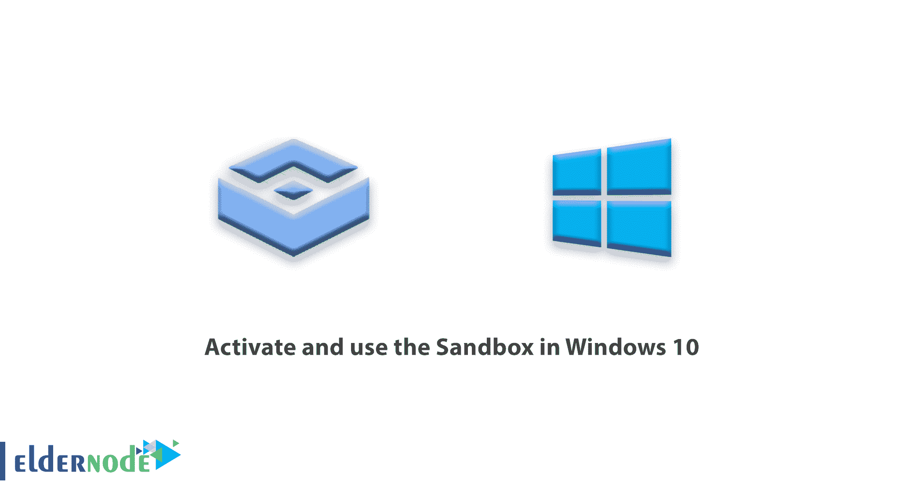
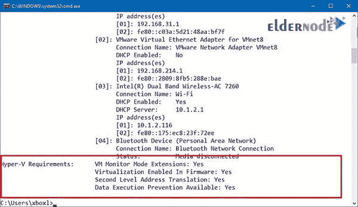
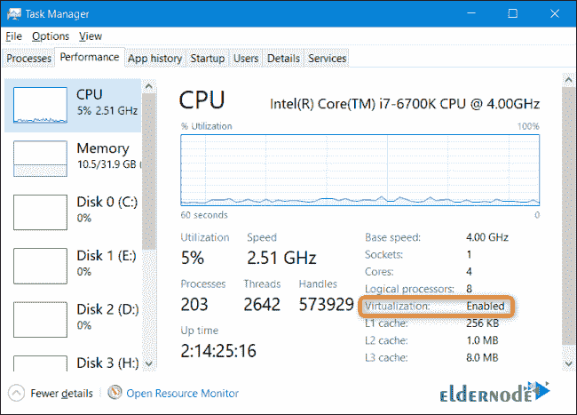
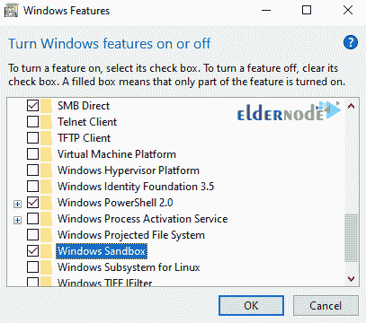
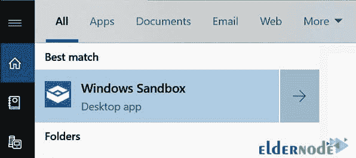
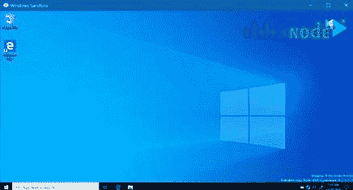
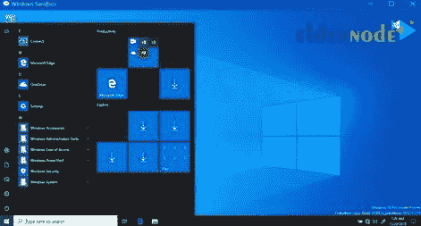
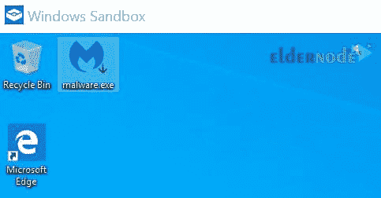
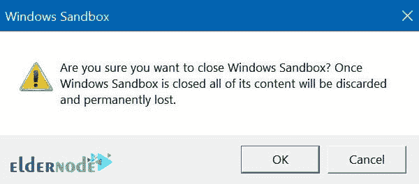

# 如何在 Windows 10 - ElderNode 博客中激活和使用沙盒

> 原文：<https://blog.eldernode.com/activate-and-use-sandbox-in-windows-10/>



如何在 Windows 10 中**激活并使用[沙箱](https://en.wikipedia.org/wiki/Sandbox_(computer_security))。沙盒是 Windows 10 (1903 版)2019 年 5 月更新中增加的一个新功能的名称。沙箱旨在为测试和执行不安全的软件在系统中提供一个独立和安全的空间。你可以用比特币购买便宜的[虚拟主机](https://eldernode.com/vps-hosting/)，完美货币 [Eldernode](https://eldernode.com/) 。**

## 如何在 Windows 10 中激活和使用沙盒

通过在 Windows 10 中添加这一功能，您可以在沙盒中安全地运行任何程序，而不必担心损坏系统的各个部分。在本文中，我们将教你如何在 Windows 10 中激活沙盒功能，以及如何使用它。和我们在一起！

### 什么是 Windows 沙盒？

沙箱是一个**虚拟机**，使用[微软系统管理程序](https://eldernode.com/install-and-configure-hyper-v-on-windows/)或虚拟机监视器设计，以创建一个完全类似 Windows 的环境来测试和运行不安全的程序。

沙箱与原始窗口完全分离。从而不允许**恶意**和**不安全程序**影响主计算机系统。这个空间的容量约为 100 MB，运行起来更容易也更快，一般来说，它的主要精力放在了**系统安全**上。

简单来说，沙盒就像一个完全封闭隔离的**密室**，没有任何威胁可以从里面渗透的门。当沙箱关闭时，所有通过恶意程序或文件应用于它的效果都将消失。当然，你可以通过在 Windows 中构建一个虚拟机来创建一个类似的环境，但是 Windows 沙盒在这方面有几个主要的**优势**。

**例如**，您不再需要花费额外的时间来构建和下载虚拟机。或者每次运行沙盒时，它都会给你一个全新的、干净的 Windows 10 映像。此外，每次关闭沙盒时，里面的所有东西都会被测试，它们的影响会被自动移除，其安全性非常高。

在下文中，我们将全面解释如何激活和使用 Windows 沙箱。

### 使用 Windows 沙盒的先决条件

**1。** Windows 10 pro(或企业版)

**2。**硬件虚拟化

**3。** AMD64 架构

**4。**最低双核处理器(建议使用支持“超线程”的四核处理器)

**5。**至少 4 GB 内存(建议 8 GB)

**6。**1gb 硬盘空间(建议使用固态硬盘)

### 教程确保启用虚拟化

首先，您需要确保在您的**系统的 BIOS** 中启用了虚拟化。它通常是默认的，但是有一个简单的方法来检查。

通过点击 **Ctrl+Shift+Esc** 打开**任务管理器**，然后前往**性能**选项卡。

确保在左侧和右侧选择了 **CPU** 类别，只需确保它显示虚拟化:**启用**。



***注意:*** 如果未启用虚拟化，您需要在继续操作之前在电脑的 BIOS 设置中启用它。

### 了解如何激活沙盒

在 Windows 10 中激活沙盒非常容易，不需要复杂的步骤。首先，确保您的设备支持硬件虚拟化，并且在 BIOS 或 [UEFI](https://en.wikipedia.org/wiki/Unified_Extensible_Firmware_Interface) 中启用了该功能。

要**检查**您的设备是否支持虚拟化，请遵循以下步骤:

**1。**打开**开始菜单**。

**2。**搜索**命令提示符**并打开。

**3。**输入以下命令，然后按回车键:

```
systeminfo.exe
```

**4。**现在检查 **Hyper-V 要求**部分。

如果单词 **Yes** 用在短语**Firmware**中启用的虚拟化前面，这意味着该功能在您的系统中是活动的，您可以使用沙箱。



### 如何启用 Windows 沙盒功能

**1。**打开**开始菜单**。

**2。**搜索并选择**打开或关闭 Windows 功能**。

**3。**然后在打开的窗口中，寻找 **Windows 沙盒**选项并**勾选**它。



**4。**点击**确定**按钮。

**5。**最后，点击**现在重启**按钮。

重启 Windows 后，**沙盒功能**在 Windows 中被**激活**，可以轻松使用。

### 如何使用 Windows 沙盒

开始使用沙盒非常容易，你只需要做以下事情:

**1。**打开**开始菜单**。

**2。**搜索 **Windows 沙盒**。然后**在显示的第一个结果上右击**，选择**以管理员身份运行**。



然后，您应该会看到当前操作系统的近似副本。



有一些不同。

这是一个全新的 Windows 安装，所以你会看到**默认壁纸**，除了 Windows 自带的默认应用程序之外什么也看不到。



虚拟操作系统是从您的主 Windows 操作系统中动态生成的，因此它将始终运行您正在使用的相同版本的 Windows 10，并且它将始终完全保持最新**。**

****3。**到**将需要的程序**转移到主系统的**沙盒空间**，在**程序**上**右击**，从下拉列表中选择**复制**。**

*****注意:*** 拖拽不起作用！**

****4。**在沙盒窗口中，**在桌面空白处右击**，选择**粘贴**，将您的应用程序移动到**沙盒测试环境**。**

****

****5。**到**安装**沙箱内的程序，**双击**并执行安装步骤。**

****6。**安装完成后，就可以按照通常的方式运行程序并使用了。**

*****注意:*** 如果你在沙箱里删除了一个文件，它**不会进入**回收站，那个文件将被永远删除。删除项目时，您会收到警告。**

****

**在测试并使用完程序后，**关闭**沙盒窗口，**移除**虚拟机及其内部执行的操作。**

****结论****

**在这篇文章中，在提供了关于 Windows 沙盒的解释之后，如何激活沙盒及其功能，以及如何在 Windows 10 中使用它，都得到了充分的传授。**

**In this article, after providing explanations about Windows Sandbox, how to activate sandbox and its features and how to use it in Windows 10 were fully taught.**