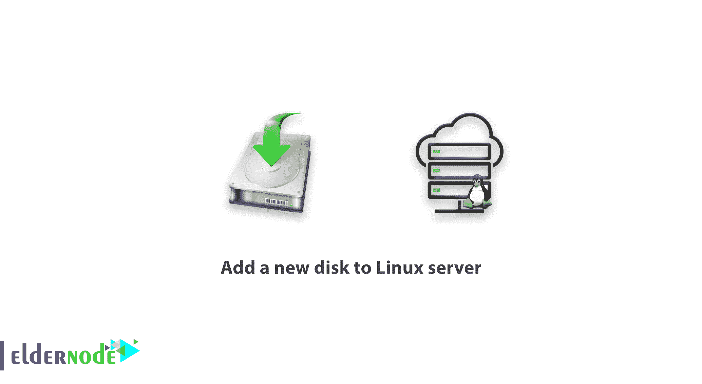

# 教程向 Linux 服务器添加新磁盘——向现有 Linux 服务器添加磁盘

> 原文：<https://blog.eldernode.com/add-a-new-disk-to-linux-server/>



作为系统管理员，您需要知道如何为现有服务器配置原始硬盘。在本文中，您将学习**教程向 Linux 服务器**添加新磁盘。在下文中，您将看到如何向现有服务器添加新磁盘，作为升级服务器容量的一部分，或者在磁盘出现故障时替换磁盘。因此，请加入我们，看看如何将新的原始硬盘添加到现有的 [Linux 服务器](https://en.wikipedia.org/wiki/Linux)中，例如[**【RHEL】**/**CentOS**](https://eldernode.com/tag/centos/)或[**Debian**](https://eldernode.com/tag/debian/)/**[Ubuntu](https://eldernode.com/tag/ubuntu/)。**

**先决条件**

如果您知道以下内容，本教程可能会更有用:

*   请注意，您将只学习创建一个新分区，而不是任何分区扩展或其他开关。
*   使用 fdisk 实用程序进行此配置。
*   要挂载为/数据分区，添加一个 **20GB** 容量的硬盘。

## 教程向 Linux 服务器添加新磁盘

要查看和管理 Linux 系统上的硬盘和分区，请运行以下命令。

```
fdisk -l 
```

分区和配置如下所示。

```
[[[email protected]](/cdn-cgi/l/email-protection) installer]# -l  Disk /dev/xvda: 107.4 GB, 107374182400 bytes, 209715200 sectors  Units = sectors of 1 * 512 bytes  Sector size (logical/physical): 512 bytes 512 bytes  I/O size (minimum/optimal): 512 bytes / 512 bytes  Disk lable type: dos  Disk identifier: 0x000969af       Device Boot     Start      End     Blocks   Id  System  /dev/xvda1    *       2048   1026047    512000   83  Linux  /dev/xvda2         1026048  209715199  104344576 8e  Linux LVM  Disk /dev/mapper/rhel-root: 104.7 GB 104681439232 bytes, 204455936 sectors  Units = sectors of 1 * 512 = 512 bytes  Sector size (logical/physical): 512 bytes / 512 bytes  I/O size (minimum/optimal): 512 bytes / 512 bytes    Disk / dev/mapper/rhel-swap: 2164 MB, 2164260864 bytes, 4227072 sectors  Units = sectors of 1 * 512 = 512 bytes  Sector size (logical/physical): 512 bytes / 512 bytes  I/O size (minimum/optimal): 512 bytes / 512 bytes 
```

fdisk -l 在附加了 **20GB** 容量的硬盘后，会给出如下输出。

```
fdisk -l    [[[email protected]](/cdn-cgi/l/email-protection) installer]# fdisk -l  Disk /dev/xvda: 107.4 GB, 107374182400 bytes, 209715200 sectors  Units = sectors of 1 * 512 = 512 bytes  Sector size (logical/physical): 512 bytes / 512 bytes  I/O size (minimum/optimal): 512 bytes / 512 bytes   I/O size lable type: dos  Disk identifier: 0x000969af        Device Boot    Start     End    Blocks  Id  System  /dev/xvda1    *       2048    1026047  512000  83 Linux  /dev/xvda2         1026048 209715199 104344576 8e Linix LVM  Disk /dev/mapper/rhel-root: 104.7 GB, 104681439232 bytes, 204455936 sectors  Units = sectors of 1 * 512 = 512 bytes  Sector size (logical/physical): 512 bytes / 512 bytes  I/O size (minimum/optimal): 512 bytes / 512 bytes     Disk /dev/mapper/rhel-swap: 2164 MB, 2164260864 bytes, 4227072 sectors  Units = sectors of 1 * 512 = 512 bytes  Sector size (logical/physical): 512 bytes / 512 bytes  I/O size (minimum/optimal): 512 bytes / 512 bytes  Disk /dev/xvdc: 21.5 GB, 21474836480 bytes, 41943040 sectors  Units = sectors of 1 * 512 = 512 bytes  Sector size (logical/physical): 512 bytes / 512 bytes  I/O size (minimum/optimal): 512 bytes / 512 bytes 
```

可以查看新添加的磁盘为 /dev/xvdc 。如果您添加了物理磁盘，它将根据磁盘类型显示为 /dev/sda 。在本教程中，我们使用了虚拟磁盘。

例如 **/dev/xvdc，**对特定硬盘进行分区。

```
fdisk /dev/xvdc 
```

[购买 Linux 虚拟主机](https://eldernode.com/linux-hosting/)

`在下面，您可以使用 fdisk 命令。`

*   `n–创建分区`
*   `p–打印分区表`
*   `d–删除一个分区`
*   `q–退出而不保存更改`
*   `w–写入更改并退出。`

`使用 n 选项时，创建的分区如下。`

```
`[[[email protected]](/cdn-cgi/l/email-protection) installer]#  fdisk  /dev/xvdc  Welcome to fdisk (unil-linux 2.23.2).    Changes will remain in memory only, until you decide to write them.  Be careful before using the write command.    device does not contain a recognized partition table  Building a new Dos disklable with disk identifier 0xea4ddcaf    Command (m for help): n`
```

`此外，建议您创建主/扩展分区。默认情况下，最多可以有 4 个主分区。`

```
`Command (m for help): n  Partition type:      P    primary (0 primary, 0 extended, 4 free)      e    extended  Select   (default p): p`
```

`现在建议您使用默认值 1 。根据需要给出分区号。`

```
`Partition number (1-4, default 1) : 1`
```

`在使用新磁盘的情况下，您应该始终选择默认值。要在同一个磁盘上创建第二个分区，需要将 1 添加到前一个分区的最后一个扇区。`

```
`First sector (2048-41943039, default 2048) : 2048`
```

`是时候给出最后一个扇区的值或分区大小了。总是试图给出分区的大小和前缀 + 以避免值超出范围的错误。`

```
`Last sector, +sectors or +size{k,m,g} (2048-41943039, default 41943039) : +18G`
```

`然后保存更改并退出。`

```
`Partition 1 of type Linux and of size 18 Gib is set  Command (m for help) : w    Calling ioctl() to re-read partition table.  Syncing disk.  [[[email protected]](/cdn-cgi/l/email-protection) installer]#`
```

```
`Disk /dev/xvdc: 21.5 GB, 21474836480 bytes, 41943040 sectors  Units = sectors of 1 * 512 = 512 bytes  Sector size (logical/physical) : 512 bytes / 512 bytes  I/o size (minimum/optimal) : 512 bytes / 512 bytes  Disk lable type: dos  Disk identifier : 0xea4ddcaf          Device boot     Start      End      Blocks    Id   System  /dev/xvdcl             2048  37750783 18874368      83   Linux  [[[email protected]](/cdn-cgi/l/email-protection) installer]#`
```

`现在用 **mkfs** 命令格式化磁盘。`

```
`mkfs.ext4 /dev/xvdc1`
```

```
`[[[email protected]](/cdn-cgi/l/email-protection) installer]# mkfs.ext4 /dev/xvdc1  mke2fs 1.42.9 (28-Dec-2013)  Filesystem lable=  OS type: Linux  Block size=4096 (log=2)  Fragment size=4096 (log=2)  Stride=0 blocks, Stripe width=0 blocks  1179648 inodes, 4718592 blocks  235929 blocks (5.00%) reserved for thr super user  First data block=0  Maximum filesystem blocks=2153775104  144 block groups  32768 blocks per group, 32768 fragment per group  8192 inodes per group  Superblock backups stored on blocks:        32768, 98304, 163840, 229376, 294912, 819200, 884736, 1605632, 2654208, 4096000    Allocating group tables: done  Writting inode tables: done  Creating Journal (32768 blocks): done   Writting superblocks and filesystem accounting information: done` 
```

`格式化完成后挂载分区。`

```
`mount /dev/xvdc1 /data` 
```

`现在，您应该在 **/etc/fstab** 文件中为引导时的永久挂载创建一个条目。`

```
`/dev/xvdc1	/data	ext4	defaults     0   0`
```

`**使用分区时请注意**，尤其是在编辑已配置的磁盘时。`

`亲爱的用户，我们希望这个向 Linux 服务器添加新磁盘的教程对你有所帮助，如果你有任何问题或者想查看我们的用户关于这篇文章的对话，请访问[提问页面。](https://eldernode.com/ask)也为了提高你的知识，[老年节点培训准备了很多有用的教程。](https://eldernode.com/blog/)`

`**亦作，见**`

`[教程 Linux 上连接 ssh](https://eldernode.com/tutorial-connect-to-ssh-on-linux/)`

`[如何在 Linux 中使用 Fping](https://eldernode.com/work-with-fping-in-linux/)`

`[教程向 Linux 服务器上的所有用户发送消息](https://eldernode.com/send-messages-to-all-users-on-linux/)`