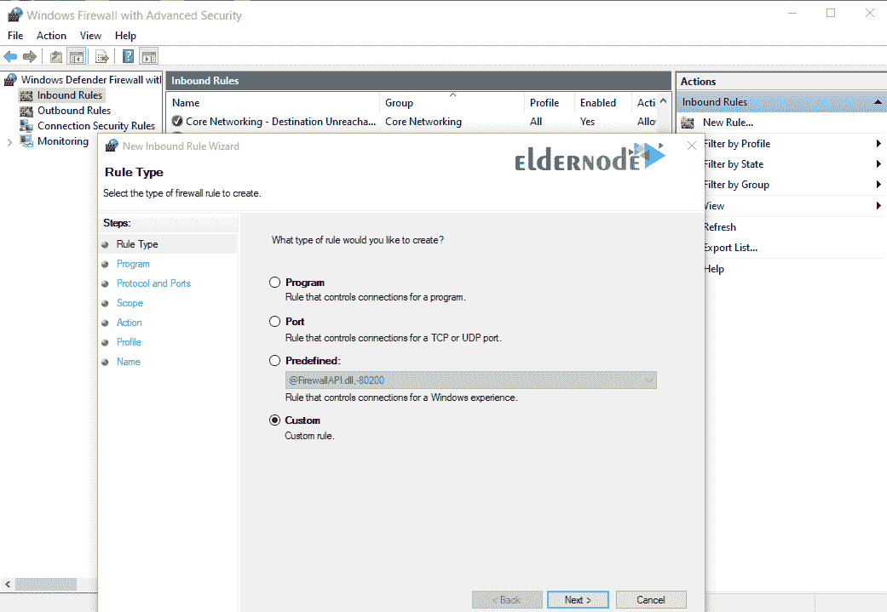

# 如何在 Windows 防火墙- ElderNode 博客中添加规则

> 原文：<https://blog.eldernode.com/add-a-rule-in-windows-firewall/>

如何在 Windows 防火墙中添加规则？在上一篇文章中，向您介绍了 [Windows 防火墙环境](https://eldernode.com/windows-firewall-environment/)。在这篇文章中，我们将教你如何**在 [Windows 防火墙](https://en.wikipedia.org/wiki/Windows_Firewall)中添加一条规则**。

在开始本教程之前，有必要了解如何在中添加规则，入库和出库的步骤彼此相似。

[**在 Eldernode**](https://eldernode.com/windows-vps/) 选择您的完美 Windows 虚拟专用服务器包

### 了解如何在 Windows 防火墙中添加规则

**1。在入库规则选项上右击**，选择新规则。

**2。** 在打开的页面中，有 4 种模式可供选择，分别是:

**–程序 :** 为 Windows 内部的软件 **写一个规则**

**–端口 :** 为一个或多个特定端口编写规则

**–预定义的 :** 为预定义的 Windows 服务如[远程桌面](https://eldernode.com/tag/remote-desktop/)写一个规则

**–自定义 :** 用打开选项(以上 3 个选项的组合)编写一个规则

在本文中，我们使用自定义选项来包含所有场景。

**3。**T3 选择自定义选项，点击下一步。

在下一页，您将看到以下 3 个选项:

**–所有程序 :** 将规则应用于所有 Windows 程序

**–该程序路径 :** 将规则应用于特定程序

**–服务 :** 将规则应用于特定的 Windows 服务

在本节中，我们选择所有程序选项。

**4。** 在下一步中，您可以选择**期望的** 端口和协议。

**注意** 端口和协议的选择取决于你对是打开还是关闭那个**端口**的看法。

在这一部分，我们选择了**端口 80 和 81** 。

**5。** 你可以**打开**或者**关闭**这个端口给一个特定的 IP。

如果您点击此部分下一个的，所有 IP 的设置将被默认考虑。如果你需要为一个特定的 IP 地址定义这个规则，使用这些 IP 地址选项。

在本教程中，我们将为一个特定的 IP 定义这个规则。

这里我们添加了一个地址为5.56.133.29的服务器的 IP 地址。

**注意** 添加 IP 时还可以定义一个具体范围。

**6。** 在这一步，您可以选择您的规则模式:

**a)** 允许连接

**b)** 如果安全，允许连接

**c)** 阻断连接

选择所需选项后，点击下一个的。

**7。** 这一步，你**决定**对不同网络执行**规则**的权限。

Windows 防火墙分为 3 个不同的部分:

**–域 :** 如果您的系统连接到一个域，它遵循以下规则。

**–公共 :** 如果您的系统连接到公共网络，如互联网，则遵循此规则。

**–专用 :** 如果您的系统连接到内部网络，则遵循此规则。

这里我们选择了所有 3 个选项，这意味着**对所有 3 种防火墙模式执行**该规则。

**8。** 最后一步，**为你的规则定义一个名字**，点击完成。

**注:** 本教程中定义的规则在5.56.133.29阻止系统上所有应用程序访问到**端口 80 和 81** 。

**亦作，见:**

[了解如何在 Windows 防火墙上打开端口](https://eldernode.com/open-a-port-on-a-windows-firewall/)

[MikroTik 防火墙](https://eldernode.com/mikrotik-firewall/)

[教程在 Ubuntu 20.04 上用 UFW 设置防火墙](https://eldernode.com/setup-firewall-ufw-ubuntu-20/)

**尊敬的用户**，我们希望您能喜欢这个[教程](https://eldernode.com/category/tutorial/)，您可以在评论区提出关于本次培训的问题，或者解决[老年人节点培训](https://eldernode.com/blog/)领域的其他问题，请参考[提问页面](https://eldernode.com/ask)部分，并尽快提出您的问题。腾出时间给其他用户和专家来回答你的问题。

好运。