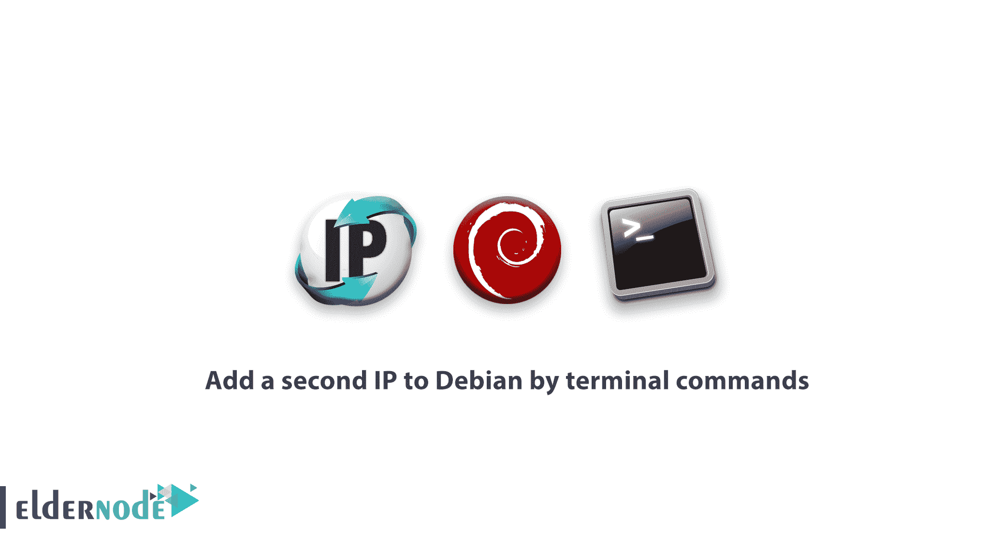

# 如何通过终端命令给 Debian 添加第二个 IP

> 原文：<https://blog.eldernode.com/add-a-second-ip-to-debian-by-terminal/>



之前你已经了解了在 Ubuntu 上添加第二个 IP。所以我们来回顾一下如何通过终端命令给 Debian 添加第二个 IP。一个 [**Debian**](https://eldernode.com/create-user-on-debian-with-root-access/) 管理员可能希望他们的[操作系统](https://edu.gcfglobal.org/en/computerbasics/understanding-operating-systems/1/)在具有**不同** IP 范围的**两个**网络上运行。如果您的服务器有两个物理网卡，您必须为这两个网卡设置所需的 IP。但是如果您的服务器有网卡，您需要使用以下命令将虚拟**网卡**添加到您的操作系统中。

## 如何通过终端命令给 Debian 添加第二个 IP？

**1**–临时添加第二个 IP**(重启 Debian 时)
**2-** 永久添加第二个 IP**(如果不重启 Debian，第二个 IP 不会被删除)****

****如何购买 [Linux 虚拟主机](https://eldernode.com/linux-hosting/)****

****向 Debian 添加第二个 IP，就像向 [Ubuntu](https://eldernode.com/tag/ubuntu/) 添加第二个 IP 一样，需要输入几个简单的[命令](https://eldernode.com/most-used-commands-in-ssh-and-linux/)，我们将在下面解释。****

******注** :该指令和步骤仅适用于 **Debian 7** 和 **Debian 8** 。****

### ****添加第二个 IP 到 Debian(临时)****

******1**–进入 Debian 终端环境。
**2**–输入以下命令添加第二个 IP。****

```
 **`ifconfig eth0:1 10.10.10.3 netmask 255.255.0.0 up`**
```

****在这个例子中，地址 10.10.10.3 被添加到 Debian 作为**第二个 IP** 。****

******注:** T he 以上 IP 命令会一直保留到 Debian 重新启动，操作系统重新启动后会被删除。****

### ****给 Debian 添加第二个 IP(永久)****

******1**–进入 Debian 终端环境。****

******2**——用编辑器打开文件 **/etc/network/interfaces** 。****

```
**`nano /etc/network/interfaces`**
```

******3**–在打开的文件末尾输入以下短语。****

```
**`auto eth0:1    iface eth0:1 inet static    address 10.10.10.5    netmask 255.255.0.0    broadcast 10.10.10.255    network 10.10.10.0`**
```

******注意:** 通过比较上面的命令和第一个 IP 命令，你会注意到增加的选项是 **eth0: 1** 。****

****事实上，通过输入短语 **eth0: 1** ，一个虚拟网卡被添加到您的 Debian，并使用您的主网卡连接到网络。****

******4**–保存文件并退出。****

******5**–完成上述步骤后，使用以下命令打开虚拟网卡。****

```
**`ifup eth0:1`**
```

******6**–如果您需要关闭添加的虚拟网卡，请输入以下命令。****

```
**`ifdown eth0:1`** 
```

****亲爱的用户，我们希望这篇关于如何通过终端命令给 Debian 添加第二个 IP 的教程对你有所帮助，如果你有任何问题或者想回顾我们的用户关于这篇文章的对话，请访问[提问页面](https://eldernode.com/ask)。也为了提高你的知识，这里有很多关于[老年节点训练](https://eldernode.com/blog/)的有用教程。****