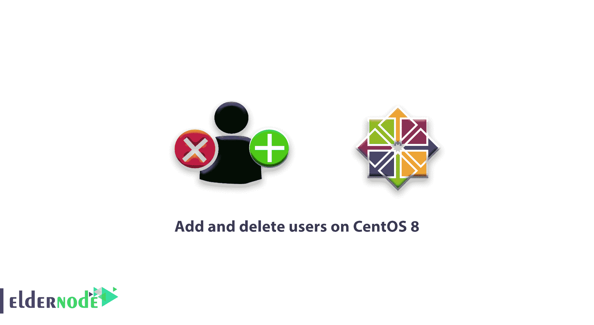

# 教程在 centos 8 上添加和删除用户-在 CentOS 8 上创建用户

> 原文：<https://blog.eldernode.com/add-and-delete-users-on-centos-8/>



在 [Linux](https://www.linux.com/) 服务器上最常见的活动之一是添加或删除用户。今天我们来介绍一下在 CentOS 8 上添加和删除用户的**教程。在本文中，您将学习如何在 CentOS 8 服务器上创建用户帐户、分配 sudo 权限以及删除用户。**

**先决条件**

我们认为您是以未启用 **root** sudo- 的用户身份登录 CentOS 8 服务器的，但是如果您以 **root** 身份登录，您可以删除以下所有命令的 sudo 部分。因为它们无论如何都会起作用。

## 教程在 CentOS 8 上添加和删除用户

### 添加用户

通过键入以下命令添加新用户:

```
sudo adduser noodi
```

要为您的用户提供登录密码，请使用下面的命令。

```
sudo passwd noodi
```

现在新用户已经设置好，可以使用了，你可能需要输入两次密码来确认。【T2 

**建议阅读:**

[初始设置 centos 8](https://eldernode.com/initial-set-up-centos-8/)

### 授予用户 Sudo 权限

如果你想给你的用户以 **root** (管理)权限执行命令，你需要给他们 sudo 的访问权限。要将您的用户添加到**滚轮**组，使用以下命令。

```
sudo usermod -aG wheel noodi
```

然后会要求您输入您的用户帐户的密码。提交正确的密码后，您输入的命令将以 **root** 权限执行。

### 管理拥有 Sudo 权限的用户

虽然您可以通过 usermod 使用组来添加和删除用户，但是该命令可能不会显示哪些用户是组的成员。当您需要查看哪些用户属于 滚轮组时，您可以使用 lid 命令。并且用 -g 标志，你可以反过来显示哪些用户属于一个组:

```
sudo lid -g wheel    Output
```

```
 centos(uid=1000)   noodi(uid=1001)
```

为了验证前面的命令是否成功以及用户是否拥有所需的权限，输出将显示与该组相关联的用户名和 uid。

[**购买 Linux 虚拟主机**](https://eldernode.com/linux-hosting/)

### 删除用户

删除所有长期不使用的用户帐户。要做到这一点而不删除任何文件，请使用下面的命令。

sudo userdel noodi

但是，如果您想删除用户的主目录及其帐户，请添加

-r 标志给用户:

sudo userdel -r noodi

使用上述命令，用户将从他们被添加到的任何组中删除。包括适用的车轮组。如果您想添加另一个同名的用户，也可以将他们再次添加到轮盘组，以获得 sudo 访问权限。

**总之，**现在您知道了如何在 CentOS 8 服务器上添加和删除用户。尝试将用户分开，只给他们完成工作所需的访问权限，以面对有效的用户管理。

`亲爱的用户，我们希望这篇在 CentOS 上添加和删除用户的教程能对你有所帮助，如果你有任何问题或想查看我们的用户关于这篇文章的对话，请访问[提问页面](https://eldernode.com/ask)。也为了提高你的知识，有这么多有用的教程为[老年节点培训](https://eldernode.com/blog/)准备。`

`**如果你对相关文章感兴趣:**`

`[如何移除 CentOS 7 上的网络管理器](https://eldernode.com/remove-network-manager-centos-7/)`