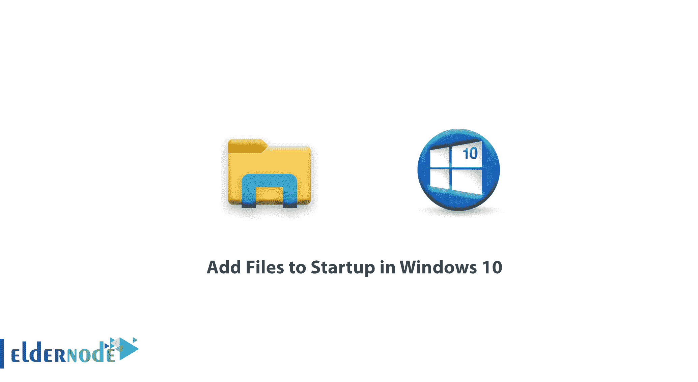
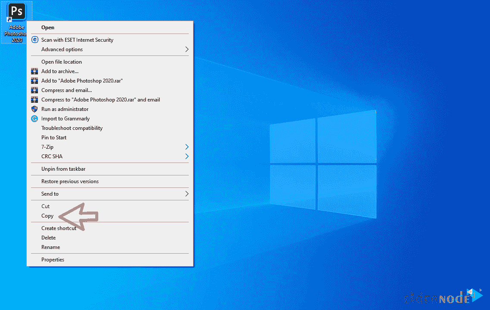
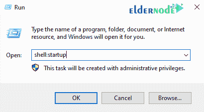
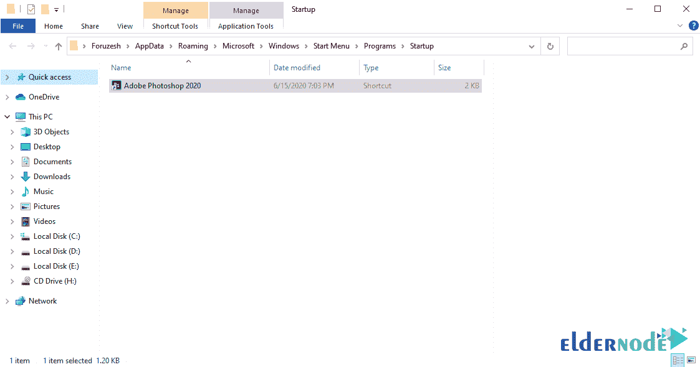
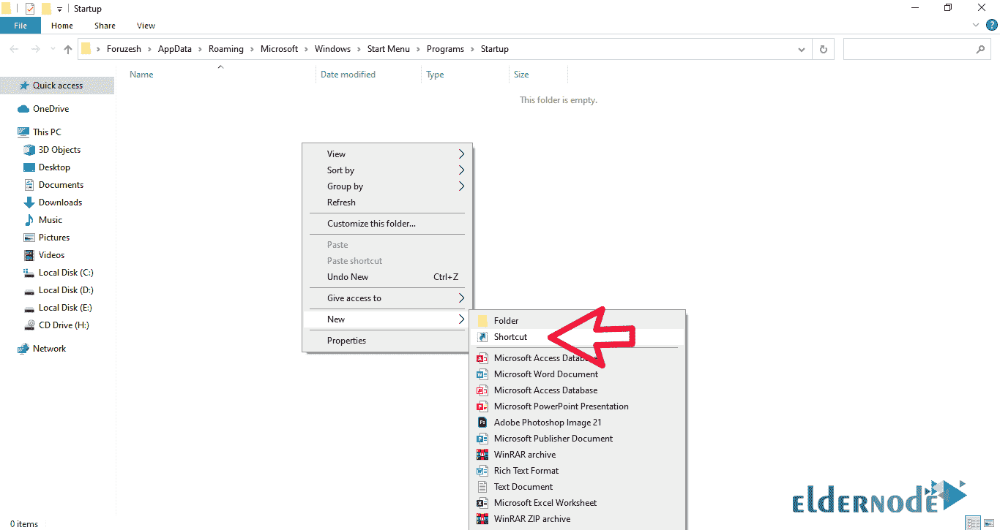
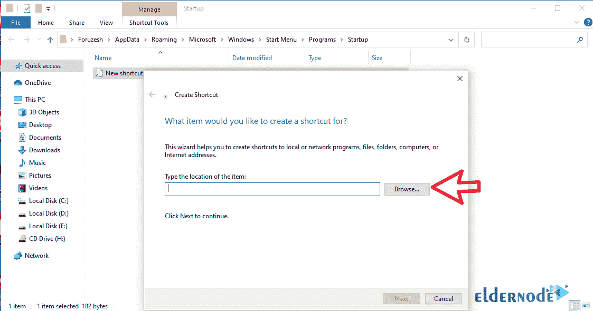
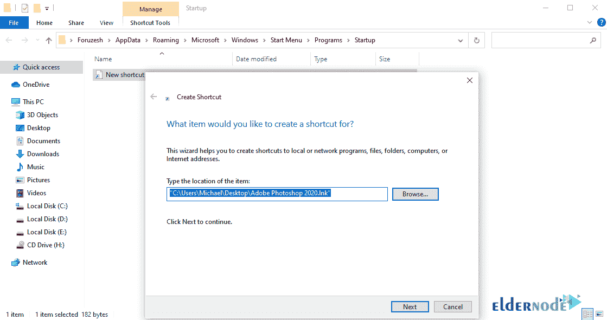
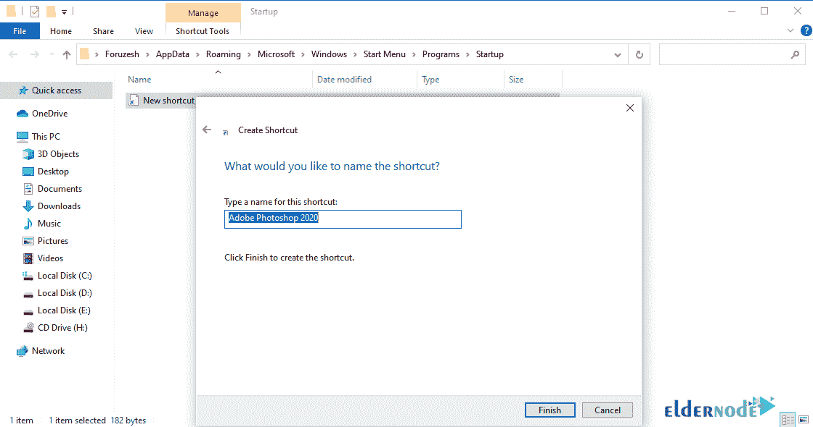

# 如何在 Windows 10 - Windows VPS 服务器中添加启动文件

> 原文：<https://blog.eldernode.com/add-files-to-startup/>

如何在 Windows 10 中添加文件启动？在 Windows 中默认安装一些程序后，它们被放置在 Windows 启动中，当 Windows 运行时，该程序自动运行。为此，我们将教你如何添加启动文件，以便将你想要的程序放入 Windows 引导。

您可能还想知道在 Windows 启动中添加文件或文件夹有什么好处。比如，你有一个程序，因为各种原因，不小心在没有你干预的情况下，重启 Windows 后需要打开运行。或者你需要在每次重启 Windows 时运行一个脚本。

[**购买 Windows 虚拟专用服务器**](https://eldernode.com/windows-vps/)

## 了解如何在 Windows 10 中向启动添加文件

您可以通过两种不同的方式将文件和文件夹添加到启动中:

**1-** 复制启动文件夹中的程序快捷方式

**2-** 在启动文件夹中创建一个程序的快捷方式

下面解释了这些方法中的每一种:

### 第一种方法)将程序快捷方式复制到启动文件夹中

**1。** 首先，**在你程序的快捷方式上右击**，复制。

**2。** 然后打开 [运行](https://en.wikipedia.org/wiki/Run_command) 窗口，在其中输入短语 shell:启动，点击 OK 。

您可以使用 Winkey + R 组合键打开 Run 窗口。

**3。在打开的** 文件夹中，粘贴所需程序的快捷方式。

完成这些步骤后，程序将在 Windows 的每次引导后运行。

在本教程中，我们将 Photoshop 程序放在 Windows 启动中。

### 第二种方法)在启动文件夹中创建一个程序的快捷方式

**1。** 首先打开运行窗口，输入短语 shell:启动。(类似于第一种方法的第二步)

**2。** **在空环境中右键单击**，选择快捷选项，如图所示。

**3。在打开的**窗口中，点击浏览。

**4。** 转到所需的程序文件夹并选择它。

**5。** 在这一步，为你的快捷方式选择一个名字。

**6。** 点击完成后，您的程序快捷方式将被创建。

请记住，当 Windows 启动时，该文件夹中的所有程序或文件夹都将打开并启动。

**注意:** 如果要将程序从启动中移除，进入启动文件夹删除快捷方式。

**尊敬的用户**，我们希望您能喜欢这个[教程](https://eldernode.com/category/tutorial/)，您可以在评论区提出关于本次培训的问题，或者解决[老年人节点培训](https://eldernode.com/blog/)领域的其他问题，请参考[提问页面](https://eldernode.com/ask)部分，并尽快提出您的问题。腾出时间给其他用户和专家来回答你的问题。

好运。