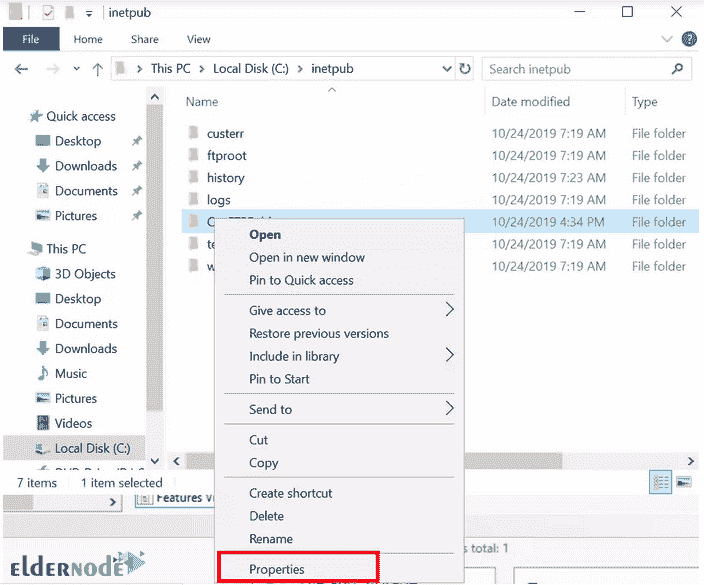

# 教程在 Windows Server 2019 上添加 FTP 站点- Eldernode

> 原文：<https://blog.eldernode.com/add-ftp-site-on-windows-server/>

教程在 Windows Server 2019 上添加 FTP 站点。在 [Windows VPS](https://eldernode.com/windows-vps/) 服务器和 Windows Server 中，为了能够通过 FTP 协议发送或接收信息，必须安装和设置 FTP 服务器。在 Windows 服务器上创建本地用户和 FTP 站点非常重要。

借助 FTP 站点，可以完成 Windows server 与网络中其他系统之间通过 FTP 传递信息的过程。

在服务器上安装 FTP 服务器后，还必须配置 FTP 站点。

为此，在本文中，我们将教你如何在 Windows Server 2019 中添加 FTP 站点。

## 如何在 Windows Server 2019 上添加 FTP 站点

**1。** 第一步，我们要在 C:\inetpub 中创建一个目录。

**2。在输出 FTP 服务器上右击**。然后点击属性选项。

**3。点击所需群组的**以允许访问。在这种情况下是**用户**。

单击编辑。

**4。** 下一步，P **对<组名>** 的权限将激活，如下图所示。

检查完全控制选项。

**5。** 下一步，点击站点，选择添加 FTP 站点。将显示一个添加 FTP 站点向导。

输入站点的首选名称，并选择您刚刚在上面添加的文件夹。然后点击下一个。

*

**6。** 输入您想要的站点名称，选择您刚刚在上面添加的文件夹。

**7。** 点击下一个。

**8。** 在下一个窗口中，您可以将 IP 保留为**所有未分配的**，这意味着 0.0.0.0/0 ，也可以输入服务器的具体 IP。因为我们还没有配置任何 SSL，所以选择无 SSL 。

点击下一个的。

**9。** 我们将使用基本认证，并指定我们添加到服务器的特定用户。为此，我们从授权下拉列表中选择特定角色或用户组。

**10。** 我们将在授权下添加用户，然后检查读写权限。之后点击完成。

**11。** 点击 FTP 站点后，选择 FTP 防火墙支持，点击开放功能。

在打开的窗口中，在防火墙的外部 IP 地址中输入您的 IP 服务器。点击应用。

**

使用 FTP 客户端进行测试

打开你的 FTP 客户端比如 [Filezilla](https://filezilla-project.org/) 。

## **1。** 点击文件，选择站点管理员。

**2。** 点击新建站点。如图所示输入 **IP** 、**用户名**、**端口**和**密码**，然后点击连接。

***

**3。** 没有 SSL 的 FTP 是不安全的，因此有如下提示。点击确定，只要 FTP 站点不远离您的房屋。

**3.** FTP without SSL is insecure hence the prompt below. Click OK as long as the FTP Site is not away from your premises.

**4。** 从密码管理指定的选项中选择适合自己的选项。

**4.** Choose the one that suits you from the options specified for password management.

**5。** 成功登录后，显示如下画面。

**5.** After successful login, the following image is displayed.

**6。** 导航到想要上传到 FTP 的文件/文件夹，**右键**选择上传。

**6.** Navigate to a file/folder you would wish to upload to the FTP, **right-click** and select Upload.

**7。** 去你站点的 FTP 文件夹查看文件上传情况。

看，阿洛:

**尊敬的用户**，我们希望您能喜欢这个[教程](https://eldernode.com/category/tutorial/)，您可以在评论区提出关于本次培训的问题，或者解决[老年人节点培训](https://eldernode.com/blog/)领域的其他问题，请参考[提问页面](https://eldernode.com/ask)部分，并尽快提出您的问题。腾出时间给其他用户和专家来回答你的问题。

好运。

See, Alo:

**Dear user**, we hope you would enjoy this [tutorial](https://eldernode.com/category/tutorial/), you can ask questions about this training in the comments section, or to solve other problems in the field of [Eldernode training](https://eldernode.com/blog/), refer to the [Ask page](https://eldernode.com/ask) section and raise your problem in it as soon as possible. Make time for other users and experts to answer your questions.

Goodluck.