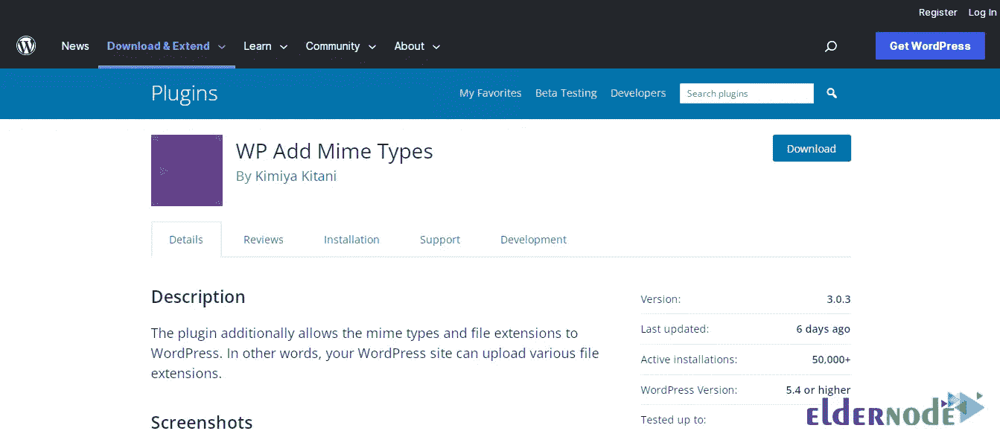
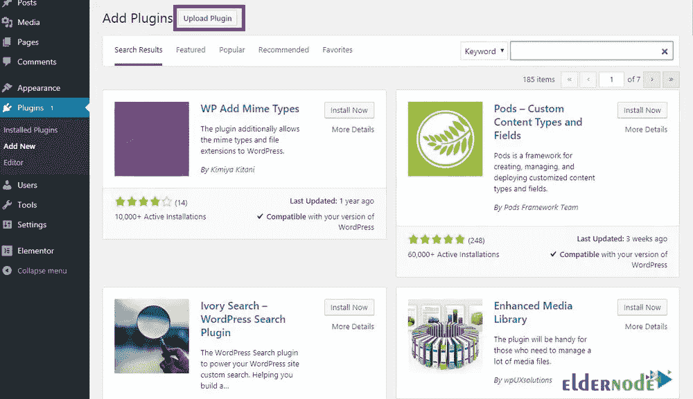
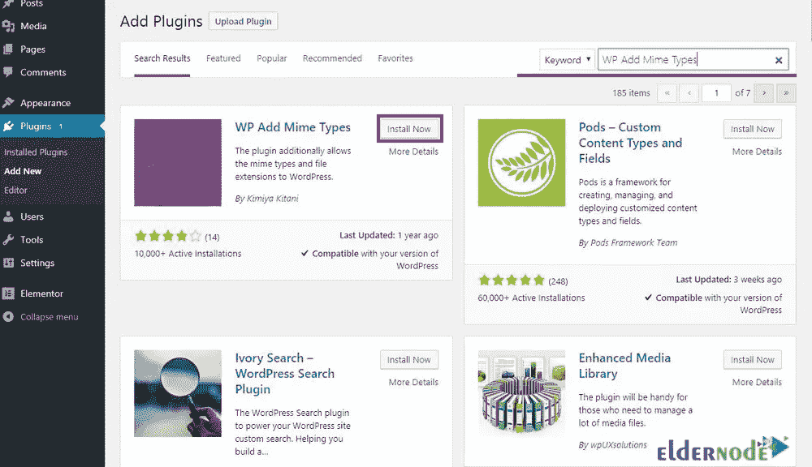
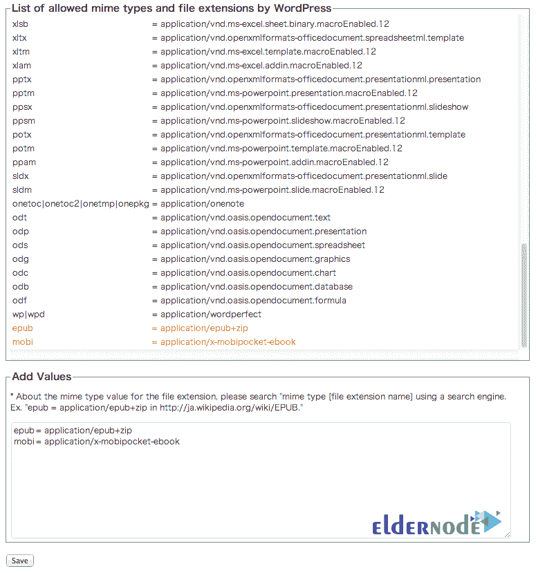

# 如何给你的 WordPress 站点添加模仿类型

> 原文：<https://blog.eldernode.com/add-mimetic-types-to-your-wordpress/>

WordPress 的局限性之一是减少了用户在 WordPress 库中添加不同类型格式的权限。也许你对自己说，当 WordPress 库由于安全问题已经阻止了添加其他格式的可能性时，我怎么能把某些格式添加到 WordPress 站点呢？不要担心，在这个教程中你可以学习如何在你的 WordPress 站点中添加模仿类型。还需要注意的是，你可以访问 [Eldernode](https://eldernode.com/) 网站提供的软件包，在 **[VPS](https://eldernode.com/vps/)** 服务器上建立你的 WordPress 站点。

## **如何在 WordPress 库中添加不同类型的格式**

你一定在 [WordPress](https://blog.eldernode.com/tag/wordpress/) 中遇到了一个错误(出于安全原因，这种类型的文件是不允许的)。当你想从库部分添加一个不同扩展名的文件到你的 WordPress 时，这个错误被显示。基本上，WordPress 创建这样的限制是为了确保其网站的安全性，以防止出现问题。现在，如果你还需要在 WordPress 库中添加不同类型的格式，你可以了解更多关于 WP Add Mime Types 插件的特殊功能。

### **WP 特殊功能添加 Mime 类型插件**

在这一节中，我们将提到 WP 添加 Mime 类型插件的一些最重要的特性:

–非常简单的用户界面

–添加不同格式的能力

–它有大约 90 种不同的格式

–能够定义其他格式

–定期更新

## **安装拟态类型插件到你的 WordPress**

在熟悉了 WP 添加 Mime 类型插件的特性后，我们将安装并设置这个插件，在 WordPress 库中添加不同类型的格式。

有两种方法可以安装这个插件。

第一种方法，可以参考 [WP 添加 Mime 类型插件](https://wordpress.org/plugins/wp-add-mime-types/)的下载页面。然后点击**下载**，如下图所示:

成功下载插件后，打开 **WordPress 仪表盘**。然后，从**插件**菜单中点击**添加插件**。在打开的页面上，点击**上传插件**，然后安装。

第二种方法，你可以再次参考 **WordPress dashboard** 来安装 WP Add Mime Types 插件。然后从**插件**菜单中选择**添加新的**选项。然后从搜索菜单中键入 **WP Add Mime Types** ，如下所示。

显示结果后，点击**立即安装**安装插件:

最后，成功安装 WP 添加 Mime 类型插件后，**激活**它。

### **WP 添加拟态类型设置**

要定制 WP 添加 Mime 类型插件，点击**设置**菜单。您可以在子菜单中看到 **Mime 类型设置**。从现在起，您可以轻松复制所需格式并将其添加到**添加值**部分，然后点击**保存**。

## 结论

用户面临的一个最常见的问题是 WordPress 的局限性，由于安全问题限制了用户，使他们不能向 WordPress 库添加不同的格式。在这篇文章中，你学习了如何在你的 WordPress 站点上添加模仿类型。看完这篇文章，你可以绕过这些限制，解决你在这个领域的问题。如果你在这方面有任何问题，你可以通过评论区与我们分享。