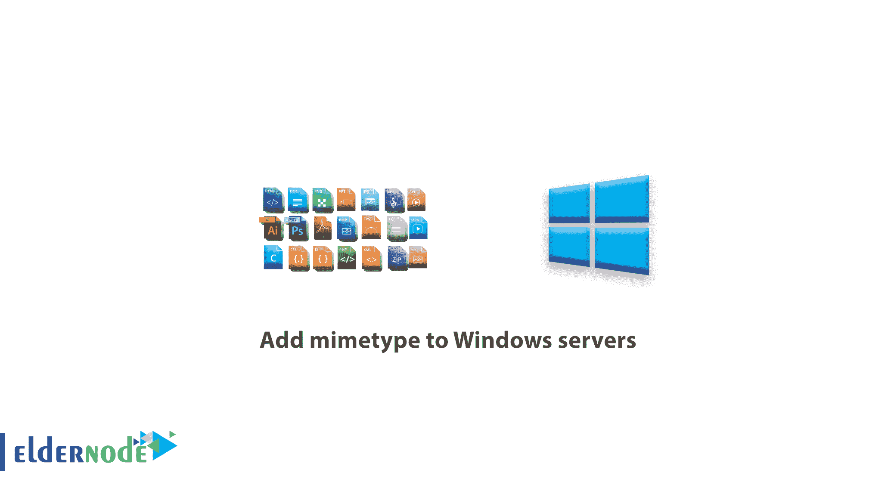

# 如何将 mimetype 添加到 Windows 服务器-教程| Eldernode

> 原文：<https://blog.eldernode.com/add-mimetype-to-windows-servers/>



教程在 Windows 服务器上添加 mimetype。

Mime 是一个文件识别系统。MimeType 是在互联网上识别内容的标准方法，它可以用来定制各种 mime 扩展，以便在您的网站上使用。

每种 Mime 格式都包含一种内容类型( [MimeType](https://en.wikipedia.org/wiki/Media_type) )和一种(子类型)，它指定了文件中存储的数据类型。

### **将 mimetype 添加到 Windows 服务器**

有三种方法可以添加 mime 类型:

*   1) 点击控制面板中的网站选项。
*   2) 点击所需网站的名称。
*   3) 选择与 mime tyoe 相关的页签。
*   4) 点击添加 Mime 按钮。
*   5) 在扩展名部分，输入文件格式和 mimetype。部分，根据列表输入其值。

解决方案 2:通过 iis 添加

*   1)在服务器上打开 Iis。
*   2)选择所需的网站。
*   3)单击 Mime 类型按钮。
*   4)确保 iis 的默认 mime 类型列表中没有相应的 mime 类型。如果没有，请单击添加。
*   5)输入 mimetype 信息。

解决方案 3:添加到 webconfig

1)打开网站的 web 配置文件。

*   2)在标签中输入 mime 类型信息。
*   例如:

如有疑问或问题，可向[提问系统](https://eldernode.com/ask/)咨询，提供指导。

```
<configuration>    <system.webServer>    <staticContent>    <mimeMap fileExtension=".mp4" mimeType="video/mp4" />    <mimeMap fileExtension=".m4v" mimeType="video/m4v" />    </staticContent>    </system.webServer>    </configuration>
```

祝你好运。

Good Luck.