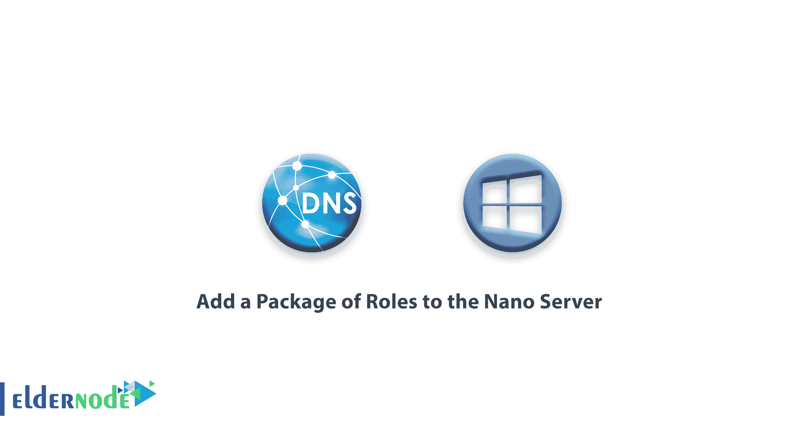

# 如何向纳米服务器添加角色包-教程纳米服务器

> 原文：<https://blog.eldernode.com/add-roles-to-nano-server/>



如何给纳米服务器添加角色包？ 如你所知，要在纳米服务器中安装角色，你必须在准备 VHD 纳米服务器时添加软件包。 如果您还没有添加包，在本文中我们将教您如何将角色包添加到 Nano 服务器。

## 向 Nano 服务器添加角色包

**1。** 通过 [PowerShell](https://docs.microsoft.com/en-us/powershell/scripting/overview#:~:text=PowerShell%20is%20a%20cross%2Dplatform,NET%20objects.) 连接你的 Nano 服务器。

如果使用 PowerShell Direct 连接到您的 Nano 服务器有问题，请使用 [Nano 服务器连接教程](https://eldernode.com/connect-to-nano-server/)。

**2。** 然后输入以下命令将 NanoServerPackage 包添加到您的 Nano 服务器:

```
Install-Module -Name NanoServerPackage -SkipPublisherCheck -force    Install-PackageProvider NanoServerPackage    Set-ExecutionPolicy RemoteSigned -Scope Process    Import-PackageProvider NanoServerPackage
```

**3。** 执行上述命令后，输入以下命令查看完整的已安装和可用的软件包 :

```
Find-PackageProvider -name *
```

**4。** 通过下面的命令收到想要的列表后，安装你的想要的包在线:

```
Install-NanoserverPackage -name *
```

在上面的 命令中，输入所需包的名称，而不是 ***** 。 

**5。** 下面是一个的纳米服务器包列表。

## 纳米服务器包列表

```
Microsoft-NanoServer-BootFromwin-Package
```

```
Microsoft-NanoServer-Guest-Package
```

```
Microsoft-NanoServer-FailoverCluster-Package
```

```
Microsoft-NanoServer-SCVMM-Package
```

```
Microsoft-NanoServer-IIS-Package
```

```
Microsoft-NanoServer-OEM-Driver-Package
```

```
Microsoft-NanoServer-SecureStartup-Package
```

```
Microsoft-NanoServer-DSC-Package
```

```
Microsoft-NanoServer-DCB-Package
```

```
Microsoft-NanoServer-Defender-Package
```

```
Microsoft-NanoServer-DNS-Package
```

```
Microsoft-NanoServer-Host-Package
```

```
Microsoft-NanoServer-SCVMM-Compute-Package
```

```
Microsoft-NanoServer-NPDS-Package
```

```
Microsoft-NanoServer-Containers-Package
```

```
Microsoft-NanoServer-Storage-Package
```

```
Microsoft-NanoServer-ShieldedVM-Package
```

```
Microsoft-NanoServer-Compute-Package
```

**6。** 现在以为例我们要安装 DNS 包。 输入的命令如下:

```
Install-NanoserverPackage -name Microsoft-NanoServer-DNS-Package 
```

**注意 :** 在所有安装步骤中，Nano 服务器必须连接到互联网。

**亦作，见:**

[如何安装 Nano 服务器](https://eldernode.com/install-nano-server)

[如何连接到 Nano 服务器](https://eldernode.com/connect-to-nano-server)

**尊敬的用户**，我们希望您能喜欢这个[教程](https://eldernode.com/category/tutorial/)，您可以在评论区提出关于本次培训的问题，或者想解决[老年人节点培训](https://eldernode.com/blog/)领域的其他问题，请参考[提问页面](https://eldernode.com/ask)部分，并尽快提出您的问题。腾出时间给其他用户和专家来回答你的问题。

好运。