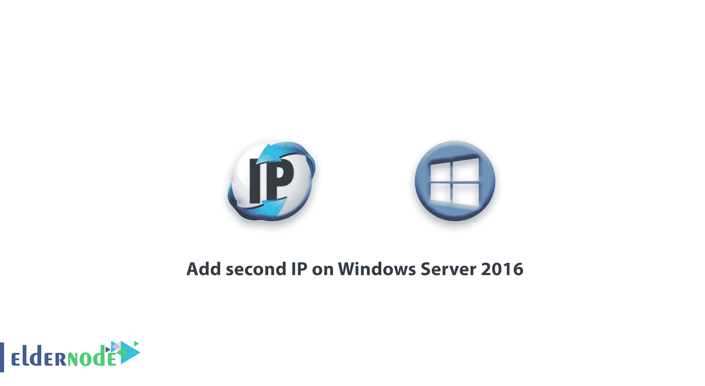
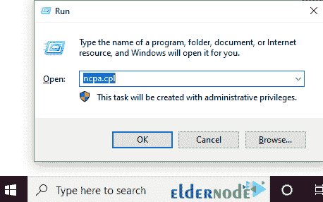
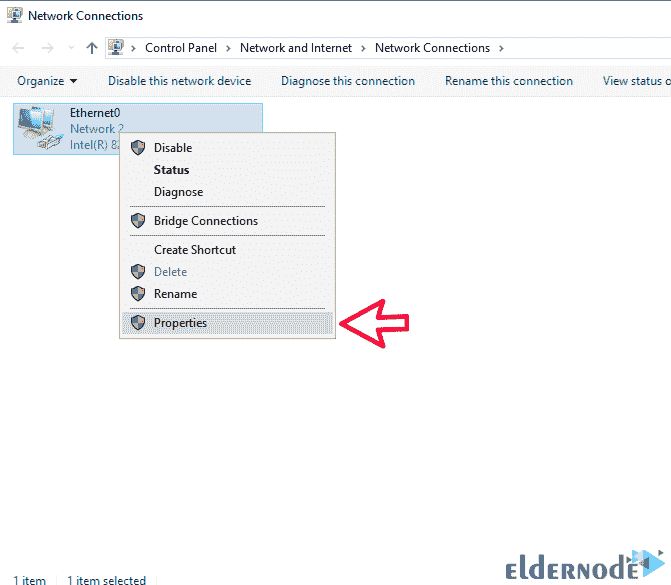
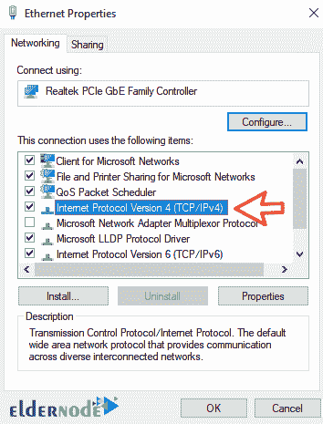
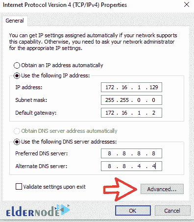
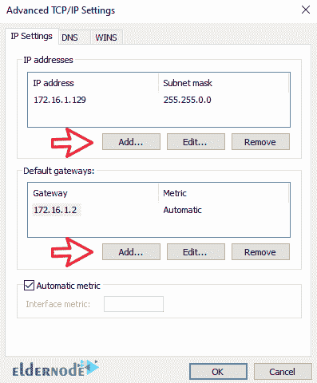

# 如何在 Windows Server 2016 上添加第二个 IP-elder node

> 原文：<https://blog.eldernode.com/add-second-ip-on-windows-server-2016/>

之前你已经知道了在 Ubuntu 和 Debian 上添加第二个 IP。那么我们来回顾一下如何在 Windows Server 2016 上添加第二个 IP。选择您最理想的 [Windows VPS](https://eldernode.com/windows-vps/) 服务器软件包。 

当您的 Windows 服务器连接到两个独立的网络，而这两个网络没有相互路由连接时，需要配置第二个 IP。在这种情况下，您需要在网络设置中添加第二个 IP 地址。

在本教程中，我们将了解如何在网络设置中添加多个 IP 地址。

**注意:** 在 Windows Server 2008、2012 及其家族中可以使用下面的教程。

## 如何在 Windows Server 2016 上添加第二个 IP

**1-** 首先，登录你的 Windows 桌面环境。

**2-** 然后按 Winkey + R 打开 **Run** 窗口。

**3-** 在此窗口中，输入短语 ncpa.cpl 返回**网络连接**窗口。

请注意，打开网络适配器设置的方法是快速访问方法。要访问您的网络接口设置，请执行以下操作:
**a.** 右键单击 **Windows 任务栏中的网络连接b .
**b .**单击打开网络和共享中心
**c.** 从页面右侧选择更改适配器设置**

**4-** **在需要添加第二个 IP 地址的界面上右键**，选择属性。

**5-** 在您服务器的网卡设置窗口中，双击 [互联网协议版本 4](https://en.wikipedia.org/wiki/IP_address) 将其打开。

**6-** 在这个窗口中，你会看到你的 2016 服务器上注册的第一个 IP 地址；点击高级。

**注意:** 只有手动设置第一个 IP 地址，才能设置第二个 IP 地址。

**7-** 进入**高级**环节后，点击添加。输入 IP 地址以及网络的子网掩码，最后点击 OK 。

如有必要，您将能够在同一窗口中添加新的**默认网关**来访问您的新网络。

**8-** 设置完成后，点击确定关闭打开的窗口。

向 Windows Server 2016 添加第二个 IP 的设置已完成。现在，您可以连接到新网络。

**尊敬的用户**，我们希望您能喜欢这个[教程](https://eldernode.com/category/tutorial/)，您可以在评论区提出关于本次培训的问题，或者解决[老年人节点培训](https://eldernode.com/blog/)领域的其他问题，请参考[提问页面](https://eldernode.com/ask)部分，并尽快提出您的问题。腾出时间给其他用户和专家来回答你的问题。

好运。