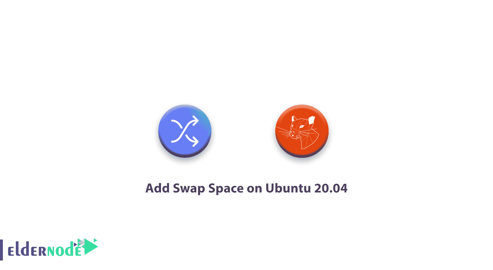

# 如何在 Ubuntu 20 上添加交换空间 Ubuntu 20.04 交换分区

> 原文：<https://blog.eldernode.com/add-swap-space-on-ubuntu-20-04/>



作为管理员，您在应用程序中会遇到内存不足的错误。在这篇文章中，我们将学习如何在 Ubuntu 20.04 上添加交换空间。加入我们来看看在您的服务器上添加了[交换空间](https://www.linux.com/news/all-about-linux-swap-space/)之后，您可以多么容易地防范这个问题。

## 如何在 Ubuntu 20.04 上添加交换空间

### 什么是互换？

虽然 RAM 不能再保存一些数据，但硬盘上有一个区域被指定为操作系统可以临时存储数据的地方。这个区域被称为 Swap。换句话说，当 RAM 中没有足够的空间来保存正在使用的应用程序数据时，您可以增加服务器在其工作“内存”中可以保存的信息量。

虽然写入磁盘的信息会慢一些(比保存在 RAM 中的信息慢)，但操作系统更喜欢将运行的应用程序数据保存在内存中，并使用交换。

### 1-检查系统互换信息

首先，检查系统中是否有可用的交换空间。一个应该足够了，尽管有可能有多个交换文件或交换分区，

要验证这一点，请键入以下命令

```
sudo swapon --show
```

如果您没有收到任何输出，这意味着系统当前没有可用的交换空间。

要检查是否有任何活动的交换，使用 free 实用程序

```
free -h    Output                  total        used        free      shared  buff/cache   available  Mem:          990Mi        36Mi       863Mi       4.0Mi        89Mi       837Mi  Swap:            0B          0B          0B 
```

### 2-检查硬盘分区上的可用空间

要检查当前的磁盘使用情况以确保有足够的空间，请输入以下命令。

```
df -h
```

输出

```
Filesystem      Size  Used Avail Use% Mounted on  udev            488M     0  488M   0% /dev  tmpfs           100M  4.5M   96M   5% /run  /dev/vda1        25G  989M   23G   5% /  tmpfs           499M     0  499M   0% /dev/shm  tmpfs           5.0M     0  5.0M   0% /run/lock  tmpfs           499M     0  499M   0% /sys/fs/cgroup  tmpfs           100M     0  100M   0% /run/user/1001
```

3-创建一个交换文件

### `现在，您可以在您的文件系统上创建一个交换文件，因为您知道您的可用硬盘空间。要创建一个交换文件，使用 fallocate 程序创建一个指定大小的文件。您需要创建一个 1G 的文件，而下例中的服务器有 1G 的 RAM。`

`要验证保留的空间量是否正确，请输入以下命令。`

```
`sudo fallocate -l 1G /swapfile` 
```

`输出`

```
`ls -lh /swapfile`
```

`**[购买 Linux 虚拟专用服务器](https://eldernode.com/linux-vps/)**`

```
`-rw-r--r-- 1 root root 1.0G May 29 17:34 /swapfile`
```

``4-启用交换文件``

### ``虽然该文件具有正确的大小，但是您应该将它转换为交换空间。为了让只有拥有 **root** 权限的用户才能读取内容，锁定文件的权限。``

``使用以下命令，使该文件只能由 root 用户访问，``

``如果您想检查权限更改，请键入下面的命令。``

```
``sudo chmod 600 /swapfil`` 
```

``输出``

```
``ls -lh /swapfile`` 
```

``键入以下命令，将文件标记为交换空间:``

```
``-rw------- 1 root root 1.0G May 29 17:34 /swapfile``
```

``输出``

```
``sudo mkswap /swapfile`` 
```

``您可以在标记文件后启用交换文件，以允许系统开始使用它。``

```
``Setting up swapspace version 1, size = 1024 MiB (1073737728 bytes)  no label, UUID=b591444e-c12b-45a6-90fc-e8b24c67c006f``
```

``要检查交换是否可用，请输入以下命令。``

```
``sudo swapon /swapfile``
```

``输出``

```
``sudo swapon --show`` 
```

``您可以再次检查 free 实用程序的输出来证实您的发现:``

```
``NAME      TYPE  SIZE USED PRIO  /swapfile file 1024M   0B   -2``
```

``输出``

```
``free -h`` 
```

``5-使交换文件永久``

```
 ``total        used        free      shared  buff/cache   available  Mem:          990Mi        37Mi       860Mi       4.0Mi        92Mi       834Mi  Swap:         1.0Gi          0B       1.0Gi``
```

``最近的更改为当前会话启用了交换文件。如果重新启动，服务器将不会自动保留交换设置。要改变这一点，将交换文件添加到您的 /etc/fstab 文件中。``

### ```如果你遇到任何问题，备份 /etc/fstab```

```sudo cp /etc/fstab /etc/fstab.bak```

```使用下面的命令，将交换文件信息添加到您的 /etc/fstab 文件的末尾。```

```6-调整您的交换设置```

```要配置系统将数据从 RAM 交换到交换空间的频率，可以使用 swappiness 参数。您可以看到一个介于 0 和 100 之间的值，代表一个百分比。接近 100 的值会尝试将更多的数据放入交换区，以释放更多的 RAM 空间。```

```
```echo '/swapfile none swap sw 0 0' | sudo tee -a /etc/fstab``` 
```

### ```您可以通过键入以下命令来查看当前的交换度值:```

```输出```

```此外，您可以使用 sysctl 命令将交换度设置为不同的值。```

```
```cat /proc/sys/vm/swappiness``` 
```

``要将交换度设置为 10，您可以键入:``

```
``60``
```

``输出``

``通过将该行添加到您的 /etc/sysctl.conf 文件中，您可以在重启时自动设置该值``

```
``sudo sysctl vm.swappiness=10`` 
```

``此外，您还可以添加:``

```
``vm.swappiness = 10``
```

``**/etc/sysctl.conf**``

```
``sudo nano /etc/sysctl.conf``
```

``完成后，保存并关闭文件。``

```
``vm.swappiness=10`` 
```

``您还可以修改 vfs_cache_pressure ，以配置系统将选择在多大程度上缓存 inode 和 dentry 信息，而不是其他数据。然而，这是关于文件系统的访问数据，查找成本很高，并且经常被请求。再次通过查询 proc 文件系统来检查当前值:``

``输出``

``您可以通过键入以下命令将其设置为更保守的值，如 50:``

```
``cat /proc/sys/vm/vfs_cache_pressure`` 
```

``此外，您可以通过将它添加到我们的配置文件中来更改它。``

```
``100`` 
```

``最后，添加指定新值的行:``

```
``sudo sysctl vm.vfs_cache_pressure=50`` 
```

```
``sudo nano /etc/sysctl.conf`` 
```

``**/etc/sysctl.conf**``

``完成后，保存并关闭文件。``

```
``vm.vfs_cache_pressure=50`` 
```

``亲爱的用户，我们希望你会喜欢这个关于如何在 Ubuntu 20.04 上添加交换空间的教程。你可以在评论区提出关于这个培训的问题，或者解决 [Eldernode 培训](https://eldernode.com/blog/)领域的其他问题，请参考[提问页面](https://eldernode.com/ask)部分并在其中提出你的问题。``

``**同样，参见**``

``[Linux 中如何清除缓存缓冲区和交换内存](https://eldernode.com/how-to-clear-cash-buffer-and-swap-memory-in-linux/)``

``**Also, see**``

``[How to clear cache buffer and swap memory in Linux](https://eldernode.com/how-to-clear-cash-buffer-and-swap-memory-in-linux/)``