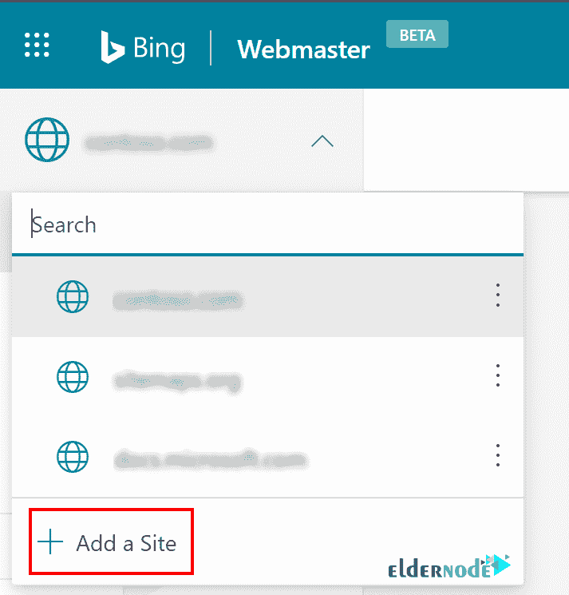

# 教程将网站添加到 Bing 网站管理员 2021 - Eldernode 博客

> 原文：<https://blog.eldernode.com/add-website-to-bing-webmaster/>

搜索引擎一直是网络和互联网不可或缺的一部分。Bing 网站管理员工具是由 Bing 设计的专业 SEO 工具之一，提供给网站管理员来检查和控制他们的网站在 Bing 搜索引擎中的状态。谷歌不是唯一受益于网站管理员工具的搜索引擎。Bing 是世界上第二受欢迎的搜索引擎，它的网站管理员工具有一些功能，其中一些你可能在 Google 网站管理员上找不到。本文介绍**教程添加网站给必应站长**。要购买便宜的 [VPS](https://eldernode.com/vps/) 即时激活，在 [Eldernode](https://eldernode.com/) 上订购你需要的东西。

## **如何给必应站长添加网站**

Bing 网站管理员工具是由微软提供的免费网络服务。它提供谷歌没有的额外免费搜索引擎优化工具(反向链接、关键词研究工具、[搜索引擎优化](https://blog.eldernode.com/tag/seo/)报告)。需要(至少)一个反向链接，Bing 才能找到它。要让你的企业在 Bing 上上市，不需要网站管理员工具，因为它会自动发现、呈现和索引你的网站。但是建议您手动将网站的 URL 提交到 Bing 网站管理员工具，以接触更多的受众。此外，必应发展迅速，其排名算法与谷歌不同，因此，让我们为您的网站带来更多流量。

要**向 Bing 网站管理员工具提交您的网站，**您需要遵循以下步骤。一点也不复杂，只要确保做对就行了。要将您的站点添加到搜索控制台帐户，您需要证明您拥有该站点。此外，当您添加网站时，管理搜索控制台访问 Bing 网站管理员工具将通过访问您的搜索控制台帐户定期验证网站所有权状态。

### **如何从谷歌搜索控制台**导入

为新用户添加网站有两种方式。我们来回顾一下第一种方式。

如果你有一个谷歌搜索控制台的验证帐户，你可以直接将你的用户信息导入 Bing。Bing 网站管理员工具需要**权限** **才能从您的搜索控制台帐户访问信息**，以显示您的谷歌搜索控制台帐户中已验证的网站列表，以及网站地图的数量和每个网站的相应角色。然后，您将能够选择您想要添加到 **Bing 网站管理员工具**的站点，并点击**导入**。如果您没有遇到任何问题，所选网站将被添加到 Bing 网站管理员工具中并自动验证。

### **如何手动给必应站长添加网站**

添加网站的第二种方法是手动完成。

首先，你必须通过你的一个流行浏览器参考 [Bing 网站管理员工具](https://www.bing.com/webmasters/about)。

下一步，您必须**登录您的账户**。

因此，您可以通过在**输入框**中输入 **URL** 并点击**添加**来手动添加您的网站。

如下图所示，对于现有用户，您可以从左侧导航的下拉列表中**添加一个网站**,并继续上述相同的步骤。

当您添加一个网站时，系统需要大约 **48 小时**来生成分析和数据。然而，如果你需要**删除你添加的任何一个网站**，通过更多选项进入左侧导航本身。

到**查看与您的 Bing 网站管理员工具帐户关联的搜索控制台帐户列表**。然后，进入**剖面**部分。您还可以阻止 Bing 网站管理员工具访问您的搜索控制台帐户。为此，您需要选择**档案**部分中账户详情旁边的**断开**选项。

## **如何验证自己网站的所有权**

当你确定一个新的网站被添加到你的帐户，是时候通过证明所有权来验证你拥有这个网站。要完成这个添加，有**四种所有权验证方式**。在下面，你可以回顾所有这四种方法来选择最适合你的网站。

### **1- DNS 自动验证**

在这种方法中，您应该**登录您的 [DNS](https://blog.eldernode.com/install-and-configure-dns-server-on-windows/) 账户**，CNAME 将自动添加到 DNS 账户中。为了自动检测 DNS 提供商并接管 CNAME 插入任务，Bing 网站管理员工具支持域连接标准。由于域名连接应由 DNS 提供商采用，因此只有采用域名连接并与 Bing 合作的 DNS 提供商才能看到验证选项。

只是在某些情况下，向 Bing 网站管理员发送网站所有权信号对于 DNS 提供商来说可能很耗时。否则，在成功登录后，该网站将在几秒钟内在 Bing 网站管理员工具中得到验证。

### **2- XML 文件认证**

第二种方式允许您使用 XML 文件身份验证。为此，您需要**保存定制的 XML 文件**，其中包含您定制的所有权**验证码**。点击 **BingSiteAuth.xml** 保存文件并上传到注册站点的根目录。

### **3-元标签认证**

要使用第三种方法，请遵循以下路径:

_ 将显示的 **< meta / >** 标签和您自定义的所有权验证码复制到**剪贴板**。

_ 在 web 开发环境编辑器中打开您的注册站点的默认页面，并将代码粘贴到 **< head >** 部分的末尾

最后，确保 **<头>** 段后跟一个 **<体>** 标记。然后，**上传**包含新 **< meta / >** 标签的修改后的默认页面文件到你的站点。

### **4-将 CNAME 记录添加到 DNS**

如果网站不支持域连接协议，您将无法看到并使用此方法进行验证。但是如果你可以使用最后一种方法，你必须访问你的**域名账户**，因为你只能在你的账户内编辑 **CNAME 记录**。

保留发送给您的一系列数字和字母(验证码)。一旦您完成编辑，您的网站所有权将得到验证。

## 结论

根据一项协议，必应和雅虎不再是两个独立的平台。它们使用 Bing 开发的一种算法进行合并。所以，如果你把你的网站提交给必应，你就自动为雅虎这么做了。总之，无论 Bing 对什么页面进行索引，Yahoo 都会对相同的页面进行索引。在这篇文章中，你学习了如何将你的网站添加到 Bing 网站管理员中。

[yasr _ visitor _ votes size = " medium "]