# 教程添加网站到 Yandex 站长 2021 - Eldernode 博客

> 原文：<https://blog.eldernode.com/add-website-to-yandex-webmaster/>

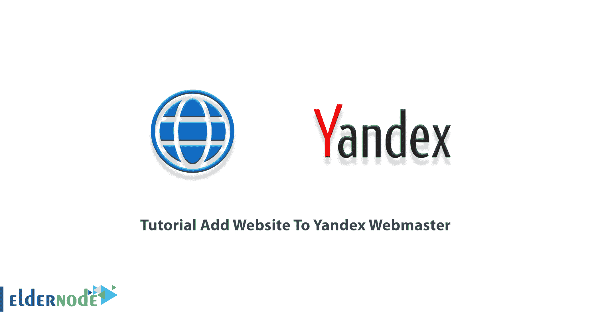

尽管有谷歌这样强大的搜索引擎，但设计新搜索引擎的想法是徒劳的。然而，这些原生搜索引擎的使用统计数据是不可否认的，这表明了这些服务的受欢迎程度和不同的性能。目前，世界上有 200 多个基础设施不同的搜索引擎和超级大国，如谷歌，提供他们独特的服务。Yandex 是俄罗斯人中最受欢迎的搜索引擎。因为它已经能够捕获俄罗斯互联网用户 60%的搜索量。它也被称为世界上第四大最受欢迎的搜索引擎。在本文中，您将学习教程**向 Yandex 站长**添加网站。如果您希望购买 [Buy VPS](https://eldernode.com/vps/) 服务，可以访问 [Eldernode](https://eldernode.com/) 提供的套餐。

## **如何给 Yandex 站长**添加网站

Yandex 是一家俄罗斯公司，它的大部分人气来自同名搜索引擎。该引擎最初只在 yandex.ru 提供，但现在在 yandex.ru 可以找到世界和英语版本。在这篇文章中，我们将教你如何添加一个网站到 Yandex 网站管理员。为此，只需遵循以下步骤。

### **在 Yandex** 开户

要添加网站，您需要在做任何事情之前[创建一个 Yandex 帐户](https://passport.yandex.com/registration)。在打开的页面上，您必须在相关字段中输入所需信息，然后点击**注册**。

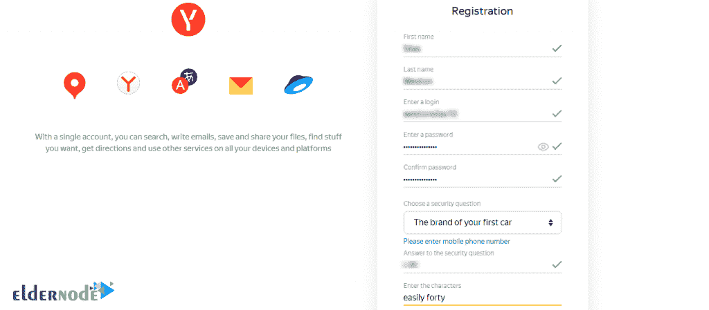

请注意，您可以使用安全问题来代替输入您的手机号码。这是必要的，当你可能需要恢复你的帐户。

## **将您的网站添加到 Yandex 站长**

成功创建账户后，下一步，您应该访问 [webmaster.yandex 网站](https://webmaster.yandex.com/)。

如下图所示，你必须点击**进入**。

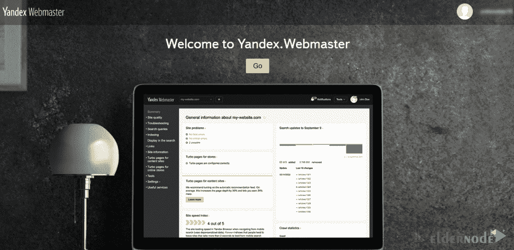

下一步，您需要点击**添加站点**。

现在你需要输入你想要的网站名称，点击**添加**。重要的是在输入 HTTP 或 HTTPS 时要小心。

### **如何在 Yandex 上验证自己的网站**

注册了你想要的网站后，就该验证了。该部分包含三个字段，下面将对每个字段进行解释。

**1) HTML 文件:**使用此部分，您可以将 HTML 文件上传到您站点的主目录，如下所示:

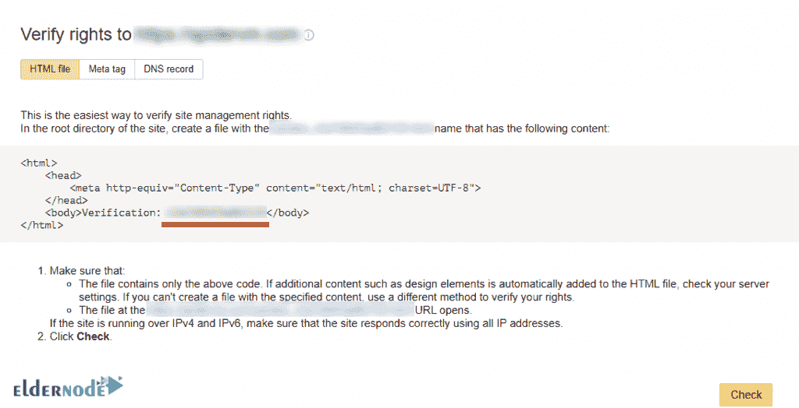

2) Meta 标签:使用这个部分，你可以添加一个 HTML 标签到你的站点的标题部分。

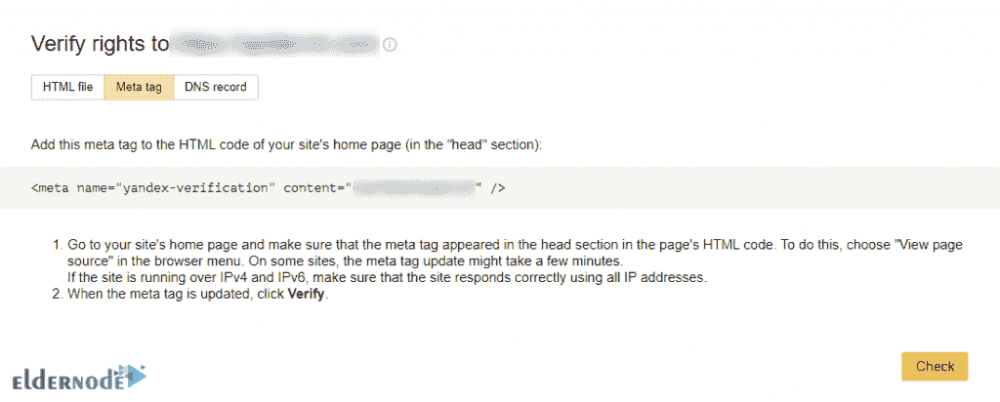

**3) DNS 记录:**最后，您可以使用此部分将 TXT 记录添加到您的 DNS 设置中。

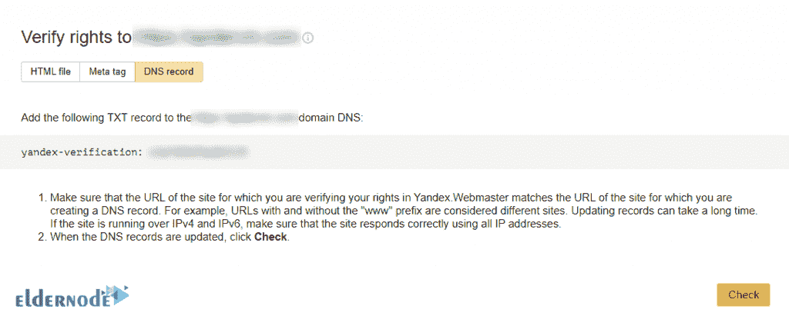

一旦您完全熟悉了本节的描述，您现在就可以简单地将文本复制到内容中，如下所示。然后你需要在你的 SEO 插件中输入它，不管是 **Yoast** 还是 **All in One SEO** 插件。

为此，您必须遵循以下步骤:

第一步，复制所需的**验证码**。

然后转到您的**网站仪表板**。如果你使用的是 **Yoast SEO** 插件，你必须点击**通用**。

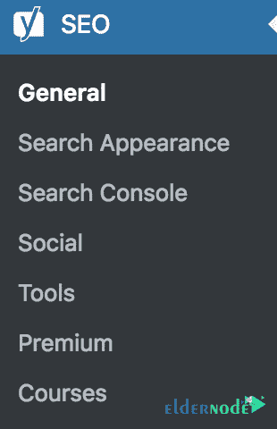

现在你需要将从**网站管理员工具**标签中复制的代码粘贴到 **Yandex 验证码**部分。

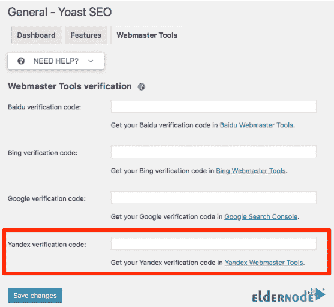

最后，点击**保存** **修改**保存您的设置。

如果你正在使用 **All in One SEO** 插件，你必须点击**通用设置**。然后点击**网站管理员工具**标签，从图片中选择 **Yandex** 。

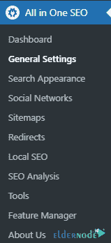

最后，输入相关代码后，点击**保存更改**。

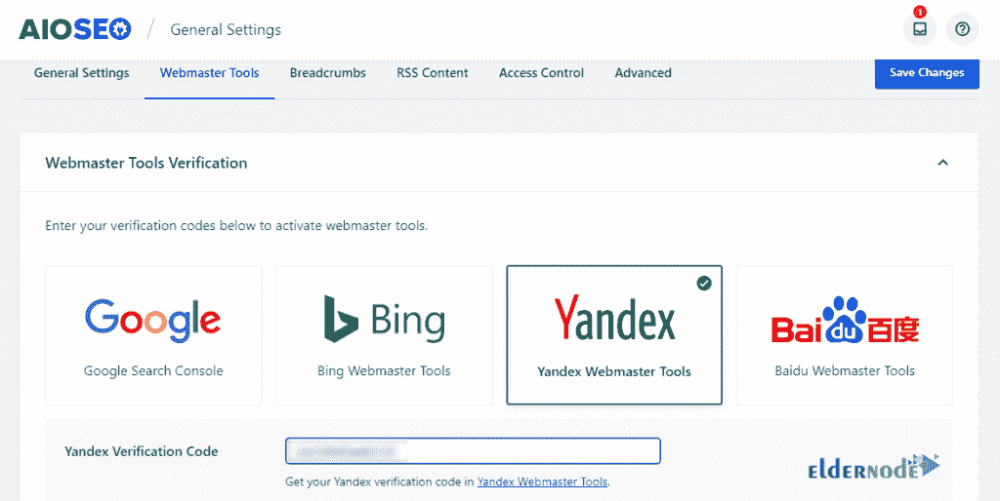

在你成功完成你想要的 SEO 插件中的上述步骤后，你现在应该返回到你复制代码的 **Yandex 网站管理员工具**页面。点击**查看**按钮，在 Yandex 网站管理员中注册您的网站。

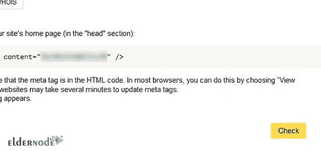

## 结论

Yandex 是一家俄罗斯互联网公司，在全球多个国家开展业务。它是俄罗斯最大的技术公司，为客户提供广泛的产品和服务。Yandex 以拥有俄罗斯最大的搜索引擎而闻名，但它也在科技和互联网的许多其他领域开展业务。在这篇文章中，我们试图一步一步地教你如何添加一个网站到 Yandex 网站管理员。