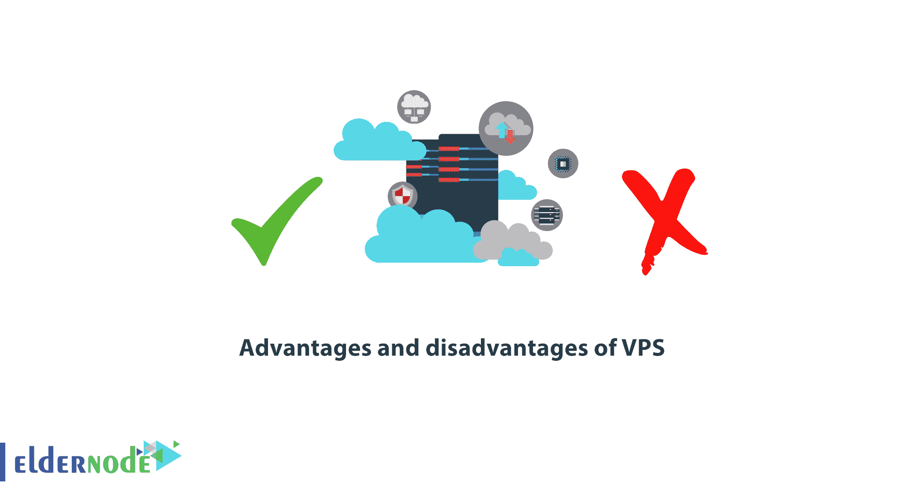

# VPS - ElderNode 博客的利与弊

> 原文：<https://blog.eldernode.com/advantages-and-disadvantages-of-vps/>

[VPS](https://en.wikipedia.org/wiki/Virtual_private_server) 的优缺点。在本文中，我们将介绍 VPS 托管，并考察其**优势**和**劣势**。为了有一个网上业务，虚拟主机对于在服务器上托管网站文件是必不可少的。此外，你的网站应该在互联网上，网络搜索可以找到它。

有许多类型的虚拟主机，每一种都有自己的优点和缺点。选择最佳的主机选项取决于你的情况和需求，了解每种类型主机的特点将有助于你为你的网站和业务做出最明智的决定。

[***elder node 中可用的 VPS 服务器***](https://eldernode.com/vps/)

### 虚拟主机的类型

**1。** 共享托管

**2。** 专门主持

**3。** 虚拟主机或 VPS

#### 1。共享托管

共享主机，顾名思义，在多个网站之间共享所有的服务器资源。所以才更便宜；但是如果这些网站中的一个使用了过多的服务器资源，服务器上的所有网站都将面临速度低和无法在互联网上获得该网站的问题。

还有一个安全问题，因为感染一个站点会感染整个服务器。

用户控制通常较低。

2。专用主机

#### 专用主机将整个服务器专用于一个网站，这就是它如此昂贵的原因。

专用主机也有许多好处，包括速度、更好的控制和更高的安全性。

3。 VPS 虚拟主机

#### VPS 虚拟主机是最近流行的最新类型的虚拟主机之一。VPS 代表**虚拟专用服务器**。

VPS 虚拟主机经常让许多人和企业在为他们的网站寻找虚拟主机选项时感到困惑。这是因为它是一个混合 VPS 或者是共享和专用托管的组合。因此，人们对这个术语感到困惑，不确定这个选项是否适合他们网站托管的目的和需求，这并不奇怪！

跟随我们阅读这篇文章，了解更多关于 VPS 主机及其优缺点的信息。

什么是 VPS 虚拟主机？

### 一个 VPS 服务器是一台被分区的计算机，这样每个**操作系统** **分区**都有自己的磁盘空间和带宽。

位于托管公司数据中心的真实服务器用于托管 VPS 。这个服务器被分成不同的部分，每个部分组成一个 [VPS 服务器](https://eldernode.com/vps/)。

在 VPS 服务器上的主机账户所有者只能看到他们自己的虚拟空间，并且可以重启该空间或者将其用作[专用服务器](http://eldernode.com/dedicated-server/)。

这个虚拟空间就像一个专用服务器，但实际上是真实服务器的一部分。由于这种与专用服务器的相似性，VPS 对于未来可能需要一个专用服务器但还没有准备好的网站来说是一个很好的解决方案。

**注:** VPS 托管是共享托管和私人托管之间的桥梁。

VPS 托管适合哪些网站？

### 许多主机客户更愿意[购买 VPS 主机](https://eldernode.com/vps-hosting/)，因为他们比共享主机对服务器空间有更多的控制权。即使 **VPS 主机**中的所有资源分配不是必需的，共享主机对他们来说也是足够的，拥有额外的控制权是值得的。

对于希望拥有一个专用托管空间但对所需的技术知识持怀疑态度的个人和企业来说， VPS 托管是一个很好的起点，可以积累经验并为专用托管做准备。在这种情况下，他们尝试了 VPS 主机，获得了更多的技能，而不必支付专用主机的高昂成本。

像所有类型的[虚拟主机](https://eldernode.com/linux-hosting/)一样，VPS 主机有它的优点和缺点，并且只适用于某些情况。

***VPS 的优缺点。***

VPS 托管的好处是什么？

### 在 VPS 服务器上托管网站有很多好处，包括:

**——**一个 VPS 托管账户比使用整个真实服务器的完全专用的托管计划要便宜。

**—** 许多 VPS 计划可以根据您的需求定制。

**—** 许多 VPS 托管计划都很容易扩展。你可以从资源最少的网络空间开始，然后随着网站的发展逐渐增加托管计划，以满足你的新需求。在这种情况下，您不必为尚不需要的额外资源付费。

**——**你对虚拟服务器的控制权比共享托管更大。您可以访问 root 用户，并且能够使用共享主机空间中不允许使用的脚本。

**——**对于大多数技术问题，你将获得与共享托管一样多的支持服务。

**—** 您可以选择托管公司为您提供一些站点维护服务的半管理式托管选项。

VPS 托管的缺点是什么？

### 从理论上讲，VPS 托管是一种利用不贵的专用服务器服务的好方法。但是，有问题！

主要的缺点是与 T2 的财政问题有关，因为它比共享主机更贵。对于不需要专用服务器的站点，VPS 服务器的成本非常昂贵。当然，VPS 服务器没有专用服务器贵，但是比共享托管贵！

从**服务的角度来看**、 VPS 虚拟主机可能会有更多的问题！

一些虚拟主机公司提供虚拟主机服务，但不合理地分配服务器资源，如果一个站点使用了所有的资源到允许的限度，这对实际服务器上的站点所有者和其他站点来说可能是一个问题。

**注意:** 如果一台服务器上的站点使用了它们所有的资源，服务器就会出现问题，影响到该服务器上的所有站点。处理这个问题的一个方法是在注册时询问一个服务器上一次有多少个虚拟账户。

VPS 主机为您的网站提供所需的功能和可扩展性。

### VPS 虚拟主机是**共享主机**和**专用主机**之间的一座巨大桥梁。它的主要优势是能够让完全控制托管空间，这类似于专有托管计划，但没有那么昂贵。

**注:** 如果你的托管公司没有妥善管理你的 VPS，你可能会遇到问题。如果你选择 [Eldernode](https://eldernode.com/) 并且有能力支付 VPS 托管费用，VPS 是你的绝佳选择！

**尊敬的用户**，我们希望您能喜欢这个[教程](https://eldernode.com/category/tutorial/)，您可以在评论区提出关于本次培训的问题，或者想解决[老年人节点培训](https://eldernode.com/blog/)领域的其他问题，请参考[提问页面](https://eldernode.com/ask)部分，并尽快提出您的问题。腾出时间给其他用户和专家来回答你的问题。

VPS 的优缺点。

好运。

Goodluck.