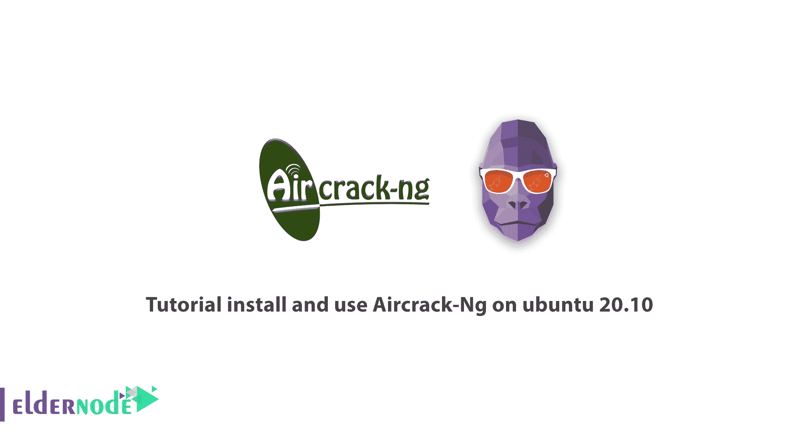
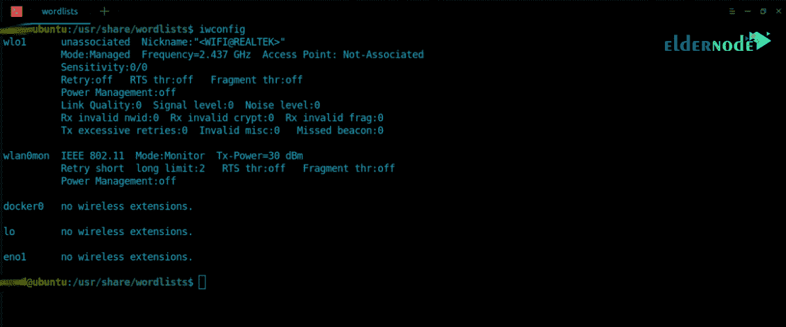
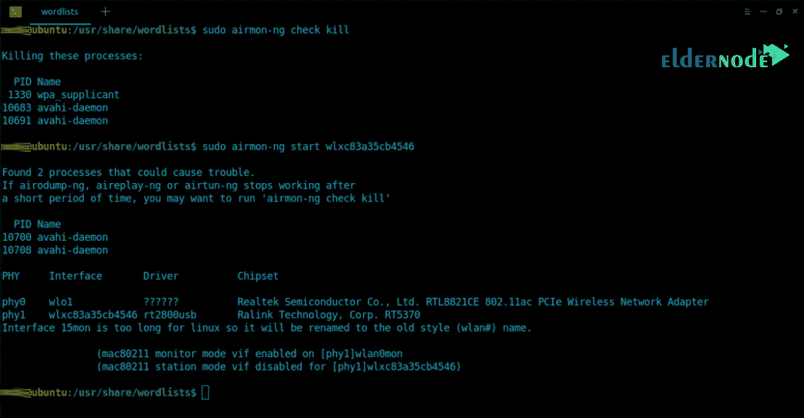
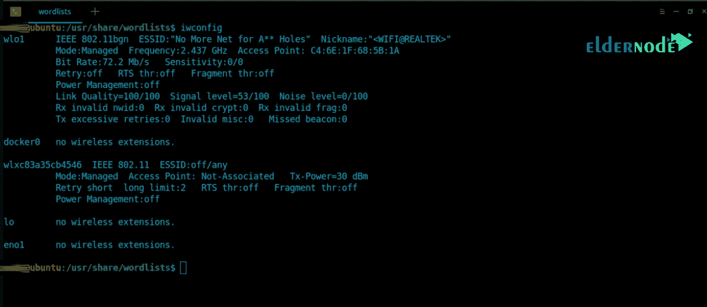
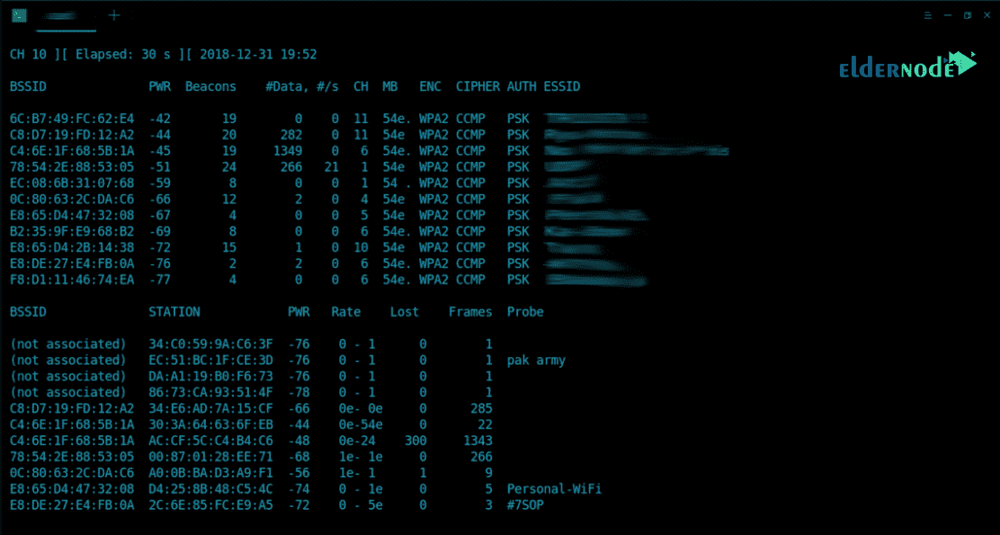
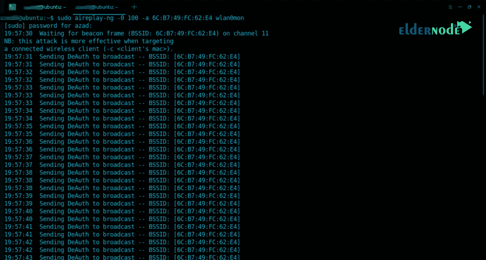
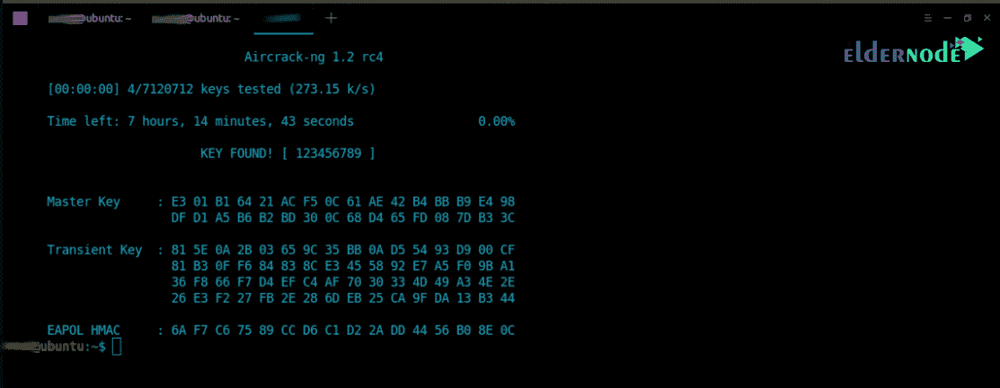

# 教程在 ubuntu 20.10 上安装和使用 air crack-Ng-elder node

> 原文：<https://blog.eldernode.com/aircrack-ng-on-ubuntu-20-10/>



教程**在 ubuntu 20.10** 上安装和使用 Aircrack-Ng。 [Aircrack-ng](https://www.aircrack-ng.org/) 是一个 WEP 和 WPA-PSK 802.11 密码破解程序，可以在攻击足够多的数据包后恢复密码。这种攻击实现了 FMS 标准以及一些优化，如 KoreK 攻击以及一种全新的 PTW 攻击。因此，Aircrack-ng 执行攻击的速度比其他 WEP 破解工具快得多。在这篇文章中，我们将教你如何在 ubuntu 20.10 上安装和使用 Aircrack-Ng。如果你需要[购买 Linux VPS](https://eldernode.com/linux-vps/) 服务器，可以在 [Eldernode](https://eldernode.com/) 中看到可用的包。

### 空气裂解及其应用简介

Aircrack 是一套用于测试入侵 WiFi 网络的安全工具。aircrack-ng 是一套强大的工具，用于检测、记录和分析数据包，并破解 WEP 和 PSK-WPA 密钥。这个工具是十大黑客和安全工具之一。

aircrack-ng 工具可以支持 802.11/a/b/g 等多种标准，该工具不仅具有测试网络上入侵的能力，还具有攻击网络的能力，允许黑客获取网络密码。

**Aircrack 工具包包括以下应用:**

***1。Aircrack-nj 工具:***wpa、psk 和 wep 版本的破解工具

***2。Airdecap-ng 工具:*** 解密 wep 和 wpa 的工具

***3。**air mon-ng tool:*air crack-ng tool 的工具之一，用于监控。将网卡置于监控模式。

***4。air replay-ng tool:***

***5。Airodump-ng 工具:*** 监听数据包的工具

***6。Airtun-ng 工具:*** 创建虚拟隧道的工具

***7。Packetforge-ng 工具:*** 生成加密包注入包的工具

***8。Ivstools 工具:*** 用于合并、转换或绑定的工具

***9。Airbase-ng:*** 包含各种攻击网络技术的工具

***10。air declock-ng tool:***清除 wep 的 aircrack-ng 工具之一

***11。Airolib-ng 工具:*** 是一个管理和存储 essid 和密码列表的工具

***12。Airserv-ng 工具:*** 允许从其他电脑访问无线网卡的工具。

***13。Easside-ng 工具:*** 用于无 wep 密钥通信的工具

***14。Buddy-ng 工具:*** 该工具对之前的工具进行补充，远程运行之前的工具

***15。Tkiptun-ng 工具:*** 该工具用于执行 tkip / wpa 攻击

***16。wessed-ng 工具:*** 该工具具有自动恢复 wep 的能力。

#### air crack-ng 工具的用途是什么？

一般来说，该工具用于 4 个领域:

**1。**测试:检查 wifi 网卡和驱动注入能力

**2。**破解:能够绕过并破解不同的标准和协议，如 wpa、psk 和 wep 版本

**3。**监控:在这种模式下，它接收数据包并准备数据供第三方工具处理。

**4。**攻击:借助封闭注入创建假接入点。

## 如何在 ubuntu 20.10 上安装和使用 air crack-Ng

空调很容易安装。您可以使用以下 apt 命令轻松安装所有 Aircrack-ng 工具:

```
sudo apt-get update  sudo apt-get install -y aircrack-ng
```

下面，为了让你更熟悉这个工具，我们举个例子，告诉你怎么找密码。

第一步，使用 **iwconfig** 命令，您可以列出连接到您系统的所有 Wi-Fi 卡:



***注:*** 本教程中使用了一款名为 *wlxc83a35cb4546* 的无线网卡。

在下一步中，使用 airmon-ng 清除无线网卡上所有正在运行的进程。

```
[[email protected]](/cdn-cgi/l/email-protection):~$ sudo airmon-ng check kill  Start Monitor mode on ‘wlxc83a35cb4546’ by typing  [[email protected]](/cdn-cgi/l/email-protection):~$ sudo airmon-ng start wlxc83a35cb4546
```



您将看到，在下一步中，airmon-ng 已经在无线卡上启动了监控模式。它将显示为不同的名称“ **wlan0mon** ”。您需要再次运行 **iwconfig** 来浏览无线细节:



现在是时候使用 **airodump-ng** 工具查看附近的无线接入点了:



要捕获握手，您需要使用“**–write**”选项保存您的数据包。

***注:*** 握手包含了加密的密码。

```
[[email protected]](/cdn-cgi/l/email-protection):~$ sudo airodump-ng --bssid 6C:B7:49:FC:62:E4   -c 11 wlan0mon --write /tmp/handshake.cap    --bssid : Access Point’s MAC Address    -c : Access Point’s channel [1-13]    --write : Stores captured packets at a defined location
```

使用以下命令，**使用**air replay-ng**实用程序从该接入点取消**其他设备的认证:



握手存储在 **'/tmp/'** 目录中，包含加密密码。为了破解本例中的密码，我们将使用 Aircrack-ng:

```
[[email protected]](/cdn-cgi/l/email-protection):~$ sudo aircrack-ng /tmp/handshake.cap-01.cap -w  /usr/share/wordlists/rockyou.txt  -w : Specify the dictionary location
```

在下一步中，Aircrack-ng 会检查密码，在找到所需密码后，它会显示如下:



最后，您可以使用以下命令停止**监控模式**，然后重启网络管理器:

```
[[email protected]](/cdn-cgi/l/email-protection):~$ sudo airmon-ng stop wlan0mon  [[email protected]](/cdn-cgi/l/email-protection):~$ sudo service network-manager restart
```

## **结论**

分析、渗透和攻击无线网络的最强软件包之一叫做 Aircrack-ng。这个软件包由几个非常有用的工具组成，用于分析、窃听和渗透无线网络。在本教程中，我们在解释了 Aircrack-ng 及其工具和应用程序后，尝试通过一个实际例子来教您如何找到 WiFi 密码。