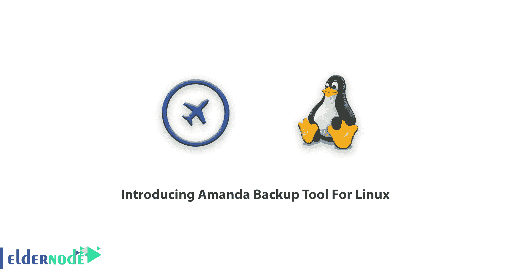
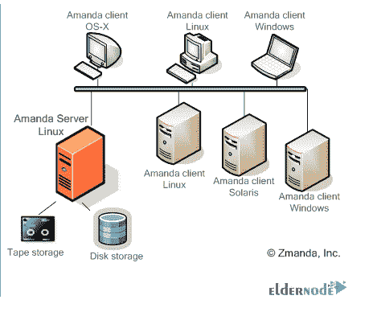
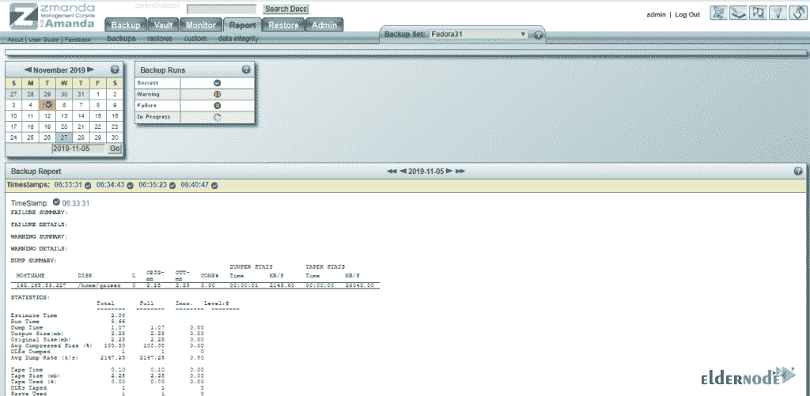

# 介绍 Amanda Linux 备份工具- Eldernode 博客

> 原文：<https://blog.eldernode.com/amanda-backup-tool-for-linux/>

心理学家说“从不”，但程序员说“总是”。回顾过去会让你的生命处于危险之中，但是为你的服务器提供备份是至关重要的。加入我们的文章，介绍用于 Linux 的 Amanda 备份工具。毫无疑问，作为管理员，你理解使用备份软件的紧迫性，而作为用户，你也多次被建议这样做。Amanda 是一款开源备份软件。既然 Amanda 被认为是最受欢迎的存档工具，那么是时候看看它的秘密了！我猜在本教程结束之前，你都会是它的粉丝之一，所以不要错过我们完美的 [Linux VPS](https://eldernode.com/linux-vps/) 软件包，以便能够立即使用 Amanda。

## **Amanda Linux 备份工具**

作为 IT 管理员，**A**advanced**M**aryl 和**A**automatic**N**network**D**ISK**A**archive 帮助您提供单一主备份服务器。可以为网络上的多台主机或多台计算机进行备份。如果您想知道备份到哪里，硬盘、网络存储、光学介质或传统磁带是等待备份的地方。Dump 或 GNU tar 是它的备份格式。这些本机实用程序允许用户选择将文件从一个目录移动到另一个目录的位置，删除文件，并最终保证最正确的行为。使用 Amanda 可以为运行多个版本的 Linux、Unix、Mac OS X 和 Window 的服务器进行备份。此外，如果你使用微软视窗系统，阿曼达能够备份其桌面和用户。由于 Amanda 的工作方式与其他备份程序不同，在最初几天你可能会面临一些根本性的差异，但他们已经尝试在 Amanda 网站上发现并回答新用户的常见问题。在撰写本文时，Amands 最稳定的版本是 3 . 4 . 5，并得到了 BETSOL 公司的支持。

*注意* : Amanda 是开源的备份应用。 *Zmanda* 是赞助 Amanda 发展的公司。

### 阿曼达服务特点

除了上述解释之外，该软件还为您提供了以下好处:

**1-** 用 **C** 和 **Perl** 编写，是自由发布的源代码和可执行文件。

**2-** 虽然 Amanda 能够备份 **32** 和 **64 位** Windows 机器，但它可以备份**multiple**e 机器，并在完成后逐个复制完成的转储。

**3-** 备份所花费的**时间**对于用户来说也是相当可观的。关于 Amanda，您只需要等待大约 **40 分钟**就可以将 41GB 备份到 AIT5，或者不到 **75 分钟**就可以将 30 GB 备份到磁盘上的虚拟磁带。

**4-** 该过程完成后，它会维护一个备份文件及其在介质上的位置的**目录**。

**5-** 阿曼达没有覆盖错误的磁带，但**管理**它。当你决定**恢复**时，你将能够得到阿曼达的帮助，因为它会告诉你你需要什么样的磁带，以及在哪里可以找到它们。

**6-** 使用通用接口，Amanda 将**支持**磁带转换器，并且您可以**将其定制为任何类型的库、传送带、机器人、堆垛机或可以通过 Unix 命令行控制的虚拟磁带。**

**7-****设备 API** 为存储设备提供可插拔接口。并且捆绑驱动**支持**盘上磁带和虚拟磁带，DVD-RW，RAIT，亚马逊 S3。通过这种方式，捆绑的 amvault 可以复制到可移动介质，用于异地存储(D2D2T)或云存储(D2D2C)。

使用 OpenSSH，服务器和客户端之间的**安全**通信也得到 Amanda 的支持，并允许**对 DMZ 或互联网上的机器进行安全备份**。

阿曼达**使用 GPG 或其他软件对其客户端或服务器上的文件进行加密备份。**

**10-** 如果你愿意，你可以以**压缩**、**压缩**或**定制程序**的形式接收备份存档文件。

**11-****Kerberos 5**，包括**加密转储、**由 Amanda 支持。

**12-** 阿曼达**回收**被放下或悬挂的机器。

阿曼达通过电子邮件向您发送所有错误的详细结果。

**14-** 在向您的网络添加磁盘和计算机时，您可以使用它来动态调整备份时间表以保持在限制**内**，而不是手动调整。

**15-** 由不得你**安排**完整和增量备份，由 Amanda 来做。此外，如果确定备份级别对资源来说是最佳的，它会**提升**备份级别。

**16-** 通过预运行**检查程序**检查磁带和服务器主机以及所有客户端主机。您将收到一封电子邮件，查看任何可能导致备份失败的**问题**的报告。

阿曼达对 **IPv6** 很友好。

如果需要，运行 Cron 。

**19-** 对于**的大型备份**，Amanda 会将它们拆分，并自动将碎片放在多个称为跨转磁带的磁带上。

您可以使用应用程序 **API** 为关系数据库或特殊文件系统定制备份。

**21-** 阿曼达执行**用户提供的备份前**-和**备份后脚本**。例如，用于实施数据库参照完整性。

得知 Amanda 是 Linux Journal 读者选择奖的**得主**并不令人惊讶。

## **用阿曼达**在 Linux 上备份 T3

### 阿曼达的要求

使用 Amanda 的先决条件是提供一个可以访问磁盘(本地、NAS 或 SAN)或大容量磁带机或磁带库的主机。Amanda 支持所有现代磁带格式，如 LTO、EB、DAT 或 DLT。您决定备份的所有计算机都是备份客户端主机，服务器主机也可以是客户端主机。使用保留磁盘，Amanda 能够在磁盘上并行运行备份，仅在备份完成时将它们写入磁带。不需要保留磁盘，它可以按顺序运行到磁带驱动器的备份。Amanda 使用更大的存储盘会表现得更好。保留磁盘应该大于最大磁盘分区的转储输出。这意味着，如果您想要备份一些压缩到 500 GB 的 TB 级磁盘，您的保留磁盘上至少需要 500 GB。如果磁盘变得远远大于其大小，Amanda 就会停止。但是，每日报告电子邮件将发送给您，以帮助您预测这些问题并进行配置。

## 结论

在本教程中，您了解了介绍 Amanda Linux Server 备份工具。在您考虑的系统上安装 Amanda backup server 后，它会开始将网络上的主机备份和归档到磁盘、磁带转换器/驱动器或云存储中。如果您有兴趣了解更多信息，请找到我们关于如何在 Centos 7 上安装 Amanda Backup Server 的相关文章[。](https://blog.eldernode.com/install-amanda-backup-server-on-centos-7/)