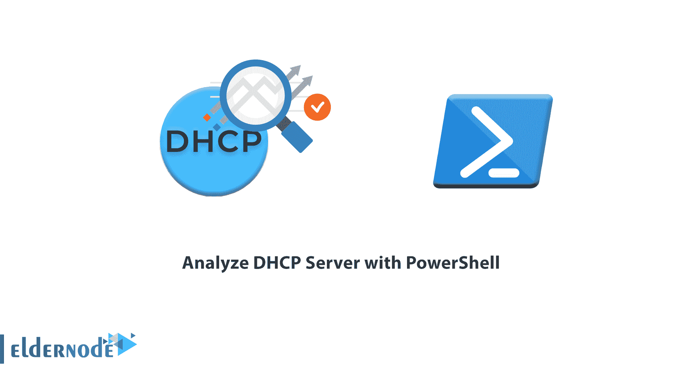
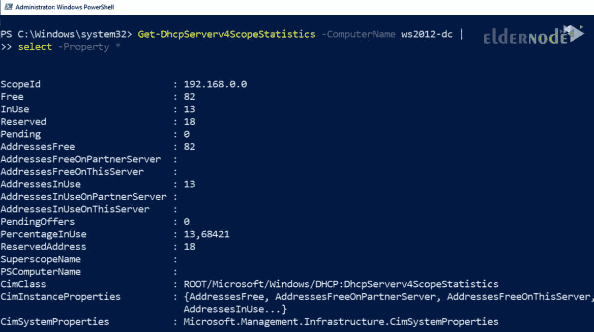
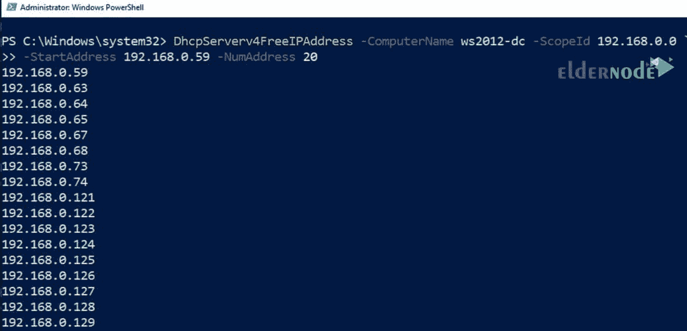
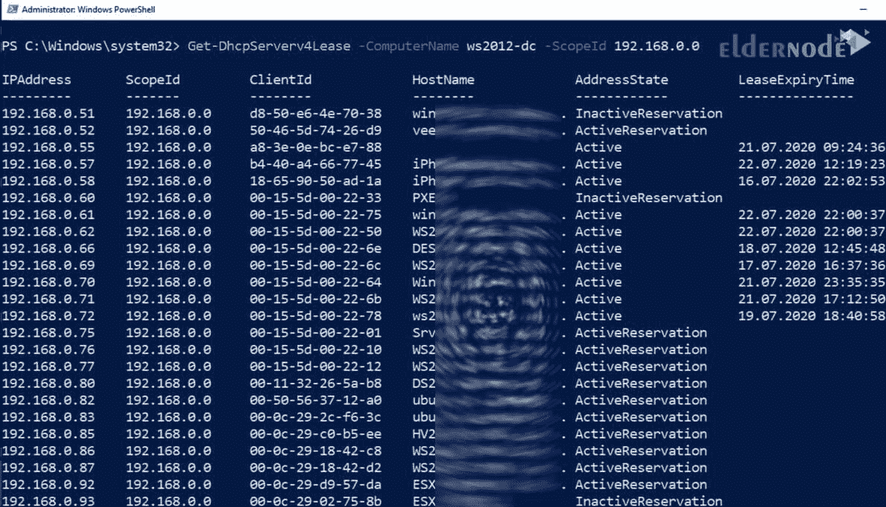

# 如何用 PowerShell - ElderNode 博客分析 DHCP 服务器

> 原文：<https://blog.eldernode.com/analyze-dhcp-server-with-powershell/>



如何用 [PowerShell](http://eldernode.com/tag/powershell-commands/) 分析 [DHCP](https://en.wikipedia.org/wiki/Dynamic_Host_Configuration_Protocol) 服务器？DHCP 是一种**网络管理协议**，它为网络上的每个设备分配一个 IP ，这样它就可以通过网络与其他设备通信。 DHCP 自动集中管理这些设置，网络管理员无需手动为所有设备分配 IP 地址。 DHCP 可以在小型局域网以及大型企业网中**实现**。

当设备在网络中移动时，DHCP 会自动为其分配一个新的 IP 地址。在大多数环境中, DHCP 服务器是 IT 基础设施的关键组件。除了**监控**确保服务的基本可用性之外，您可能还想检查 IP 作用域或租约的状态。 **PowerShell** 为此提供了几个cmdlet。

在本文中，我们将教你如何用 PowerShell 分析 DHCP 服务器。和我们在一起。

***[在 Eldernode](https://eldernode.com/windows-vps/)*** 选择您的完美 Windows 虚拟专用服务器包

管理**基于 Windows 的** DHCP 服务器的命令是 DhcpServer 模块的一部分，可以通过安装 DHCP 的 RSAT 获得。这里提到的cmdlet对于分析出现的问题特别有用。

### 如何识别所有服务器并查询其设置

第**步**是检索向网络提供 DHCP 服务的服务器列表。这对于拥有几个 DHCP 服务器的大型环境尤其重要。

Get-DhcpServerInDC cmdlet 将完成这项工作，并且通常在没有参数的情况下调用。

为了在其他命令中进一步使用，您可以将返回的服务器名称存储在一个变量中:

```
$dhcps = (Get-DhcpServerInDC).DnsName
```

cmdlet 返回在[活动目录](https://eldernode.com/install-active-directory-on-windows-server/)中注册的 DHCP 服务器的列表。这意味着您不会发现在 IT 部门不知情的情况下连接到网络的恶意 DHCP 服务器。

一个 DHCP 服务器的一些基本设置，比如它是否是域的成员以及是否被授权，可以用下面的查询来检索:

```
Get-DhcpServerSetting -ComputerName <MyDHCP>
```

这个 cmdlet 还会告诉您数据是否已经从备份中恢复。关于数据库的这些信息和其他信息也可以从以下查询中获得:

```
Get-DhcpServerDatabase -ComputerName <MyDHCP>
```

随着

```
Get-DhcpServerAuditLog -ComputerName <MyDHCP>
```

您可以发现是否已经为 DHCP 服务激活了日志记录，以及日志文件存储在哪里。

但是，你**不能用这个命令显示**的日志内容。相反，您必须自己评估这个文本文件。

### 【IPv4 和 IPv6 专用 cmdlets】

模块的大部分功能在**两个版本**中都有。

这些函数的名称中都有一个“ 4 或“ 6 ，因为它们分别与 **IPv4** 或 **IPv6** 相关。因此，针对 **IPv4** 的以下示例可以应用于 **IPv6** :

要获得 IPv4 的 DHCP 服务的统计数据，请使用:

```
Get-DhcpServerv4Statistics -ComputerName <MyDHCP>
```

统计数据包含的数字也可以通过评估单个示波器得到，但这里是所有示波器的总数。

```
Getting IPv4-related statistics for a DHCP server using Get-DhcpServerv4Statistics
```

### 如何分析范围

大多数查询，无论是关于可用 IP 地址、已分配租约还是一般统计，都涉及特定的范围。您可以使用 [Get-DhcpServerv4Scope](https://docs.microsoft.com/en-us/powershell/module/dhcpserver/get-dhcpserverv4scope?view=win10-ps) 来枚举它们。

**例如**，如果你想输出 所有 DHCP 服务器的所有作用域，看看它们之间是否有重叠，你可以如下进行:

```
$dhcps = (Get-DhcpServerInDC).DnsName  $dhcps | foreach {Get-DhcpServerv4Scope -ComputerName $_}
```

要获得 DHCP 服务器的 IPv4 作用域的最重要数字的概述，请使用以下命令:

```
Get-DhcpServerv4ScopeStatistics -ComputerName <MyDHCP>
```

这个命令告诉你已经被使用的作用域的百分比，以及有多少地址已经被占用或者仍然可用。



### 空闲、分配和保留地址

空闲地址的**数据**可以通过*Get-DHCP serverv 4 free IP address*获取。

**注:** 如果只是使用 ScopeID 参数进行检索，只会得到下一个空闲地址。

要获取**更多可用地址**，您必须输入 NumAddress 的值:

```
DhcpServerv4FreeIPAddress -ComputerName <MyDHCP> -ScopeId 192.168.0.0 `  -StartAddress 192.168.0.59 -NumAddress 20
```

**这个例子**列出了 20 个空闲地址，从 **192.168.0.59** 开始。



您可能想知道哪些地址已经分配给设备:

```
Get-DhcpServerv4Lease -ComputerName <MyDHCP> -ScopeId 192.168.0.0
```

在这个函数的**输出中，你会发现客户的 MAC 地址和租约的状态作为附加信息。**



除了空闲的和已经分配的地址之外，通常还有为具有固定 IP 的设备保留的**地址**。这些可以按如下方式查询:

```
Get-DhcpServerv4Reservation -ComputerName <MyDHCP> -ScopeId 192.168.0.0
```

**注意:** 如果客户端无法接收地址，您可以查看它是否出现在拒绝列表中:

```
Get-DhcpServerv4Filter -ComputerName <MyDHCP>
```

## 结论

模块 **DhcpServer** 包含总共 121 个命令，这些命令不仅可以查询设置及其状态，还可以配置服务。完整的文档可以在[微软文档](https://docs.microsoft.com/en-us/powershell/module/dhcpserver/?view=win10-ps)上找到。

**亦作，见:**

[mikro tik 中的 IP 设置](https://eldernode.com/ip-settings-in-mikrotik/)

[如何在 Windows Server 2019 上安装和配置 DHCP 服务器](https://eldernode.com/install-and-configure-dhcp-server/)

**尊敬的用户**，我们希望您能喜欢这个[教程](https://eldernode.com/category/tutorial/)，您可以在评论区提出关于本次培训的问题，或者解决[老年人节点培训](https://eldernode.com/blog/)领域的其他问题，请参考[提问页面](https://eldernode.com/ask)部分，并尽快提出您的问题。腾出时间给其他用户和专家来回答你的问题。

如何用 PowerShell 分析 DHCP 服务器？

好运。