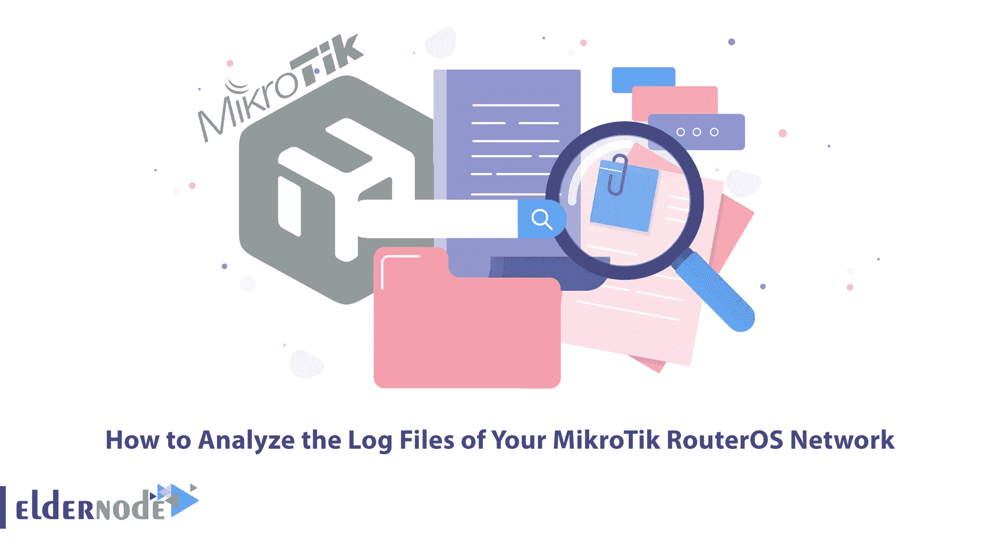

# 如何分析您的 MikroTik RouterOS 网络的日志文件

> 原文：<https://blog.eldernode.com/analyze-the-log-files-of-your-mikrotik/>



日志文件是在特定时间发生的事件，可能包含使其有意义的元数据。日志文件是系统中发生的所有事情的历史记录，包括事务、错误和入侵等事件。这些数据可以以不同的方式传输，可以是结构化的、半结构化的和非结构化的。在本文中，我们将教你如何分析你的 MikroTik RouterOS 网络的日志文件。如果你想购买 [Mikrotik VPS](https://eldernode.com/mikrotik-vps-server/) ，你可以访问 [Eldernode](https://eldernode.com/) 网站上提供的计划。

## **教程分析你的 MikroTik RouterOS 网络的日志文件**

日志是自动生成文件的扩展，包含与某些软件和操作系统相关的事件。它们可以保存很多东西，日志文件经常被用来显示所有与创建它们的系统或程序相关的事件。例如，您的备份程序可能会准确记录备份过程中发生(或未发生)的事情。Windows 为其各种服务保留不同类型的日志文件。

### **创建文件系统**

分析 Mikrotik RouterOS 网络日志文件的第一步是创建文件系统。您可以使用以下命令在 Mikrotik RouterOS 中创建文件系统:

```
/file print file=myFile 
```

```
/file set myFile.txt contents=""
```

### **安装日志解析器**

日志解析器是一个非常强大的工具，用于访问基于文本的数据。这种基于文本的数据包括日志文件、XML 文件和 CSV 文件。您应该注意到，它在窗口中显示关键数据源，如事件日志和注册表。

你要注意的是，你通过文件系统和 [Active Directory](https://blog.eldernode.com/install-active-directory-on-windows-server/) 告诉日志解析器你需要什么信息。你甚至可以决定信息是如何处理的。此外，您的查询结果可以格式化为文本输出。

要安装日志解析器，只需遵循以下步骤。

第一步，你必须参考微软网站 **[下载日志解析器](https://www.microsoft.com/en-us/download/details.aspx?id=24659)** 。在这里，我们将下载路径中的文件(C:\Downloads)。

打开 Log Parser 后，下一步是点击**命令提示符**并打开**命令行**。为此，只需**右击**并选择**以管理员身份运行**。

转到下载文件的路径，在命令行中键入以下命令，然后按 **enter** :

```
MsiExec.exe /i LogParser.msi /qn
```

稍后，您可以通过开始菜单访问日志解析器。

### **配置日志解析器**

分析 Mikrotik RouterOS 网络日志文件的步骤之一是配置日志解析器。Log Parser 是一个强大的工具，它提供对基于文本的数据的通用查询访问，例如日志文件、XML 文件和 CSV 文件，以及 Microsoft Windows 操作系统上的关键数据源，例如事件日志、文件系统和 Active Directory 目录服务。在这个工具的帮助下，您可以使用 SQL 和对 Microsoft SQL Server、MySQL 或 SQLite 数据库进行内联查询。网络代码。

### **创建文件系统进行日志记录**

您应该为日志记录创建一个文件系统，以分析 Mikrotik RouterOS 网络的日志文件。RouterOS 中记录了各种系统事件和状态信息。您可以将日志保存到路由器内存、磁盘、文件、电子邮件，甚至发送到远程系统日志服务器。您可以从/log 菜单打印路由器本地存储器中存储的所有消息。每个条目都包括事件发生的时间和日期、此消息所属的主题以及消息本身。

### **配置日志记录设置**

分析 Mikrotik RouterOS 网络日志文件的最后一步是配置日志记录设置。“系统设置”页面包含一个日志设置选项。您可以记录部署中的选定事件，以便进行故障排除和解决。你所要配置的就是进入**配置> >系统设置> >日志设置**路径，选择你想要的[监控](https://blog.eldernode.com/monitor-traffic-on-mikrotik-routeros/)事件。

## 结论

对操作系统、应用程序和服务进行故障排除和修复的最佳和最专业的方法是检查日志文件。在本文中，我们试图教你如何分析 MikroTik RouterOS 网络的日志文件。如果你有任何问题，可以在评论区和我们分享。