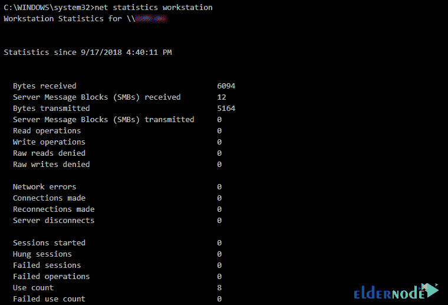
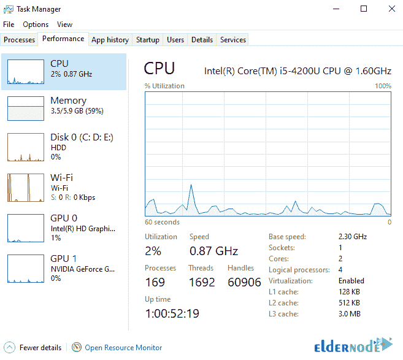

# 教程分析 Windows Server 上的正常运行时间- Eldernode 博客

> 原文：<https://blog.eldernode.com/analyze-uptime-on-windows-server/>


许多人不时需要的一件事是他们的计算机在没有重启的情况下已经运行了多长时间。这个时间称为正常运行时间。在这篇文章中，我们将教你如何分析 Windows 服务器上的正常运行时间。如果你想购买一台 [**Windows VPS**](https://eldernode.com/windows-vps/) 服务器，你可以访问 [Eldernode](https://eldernode.com/) 中提供的软件包。

## **如何分析 Windows 服务器上的正常运行时间**

### **分析正常运行时间简介**

正常运行时间是计算机服务和运行的可用时间。在这种情况下，系统自动保持稳定状态，不会崩溃。此外，不需要为了维护和修理或管理目的而重启系统。

***注:*** 崩溃是指由于硬件故障或软件错误导致系统关机。这个标准经常被用来衡量系统的稳定性和有效性。

有些人想知道在他们的电脑上安装操作系统需要多长时间，并根据这个时间范围和操作系统的稳定性决定重新安装操作系统。

通常，虚拟主机公司报告一年 99%的正常运行时间或服务器可用性。如果一年等于 365 天，即一年最多 3 天，服务器就会停机。明确的原因可能是数据中心网络发生变化，配置服务器时出现问题，攻击服务器，更新服务器硬件或软件包，如内核、web 服务器、PHP、MySQL 等。当服务器或其服务出现问题时，应尽快识别并修复问题。

本文的其余部分，如何分析 Windows 服务器上的正常运行时间将从几个方面进行解释。请加入我们。

## **用网络统计检查分析 Windows 服务器上的正常运行时间**

在这一节中，我们将向您展示如何使用 Net Statistics 分析 Windows Server 上的正常运行时间。为此，只需在第一步中打开**命令行**或 **PowerShell** 。然后，您必须键入并执行以下命令之一:

```
net statistics server
```

或者

```
net statistics workstation
```

需要知道的重要一点是，如果您使用的是 Windows Server 2012 或 2016，建议使用以服务器结尾的命令。此外，如果您运行的是 Windows 8.1 或 10，请在工作站上使用命令 ending。

如下图所示，以“ **Statistics since…** ”开头的一行显示了您的电脑上次启动的时间:



## **用 SystemInfo** 分析 Windows 服务器上的正常运行时间

第二种方法称为 SystemInfo，是使用一个简单的命令提示符命令来查看设备的上次启动时间。在这种方法中，您可以使用以下命令:

```
systeminfo
```

应该注意的是，您可以使用管道并找到一个操作符来减少仅在系统引导时间线中的输出:

```
systeminfo | find “System Boot Time”
```

另一个有趣的地方是，如果您想检查远程服务器上的启动时间，您可以执行以下操作:

```
systeminfo /s remoteservername | find “System Boot Time”
```

### **如何使用 Windows Uptime 命令**

在解释这一点之前，应该指出，最初的 Windows Server Uptime 命令是微软发布的一个名为 Uptime.exe 的程序的一部分。你现在可以从[互联网档案网址](http://web.archive.org/web/20100316211056/http:/download.microsoft.com/download/winntsrv40/install/uptime_1.01/nt4/en-us/uptime.exe)下载这个文件。

一旦你成功下载了文件，只要把它放在 **C:\Windows\System32** 文件夹中。

完成上述步骤后，您现在可以使用以下命令来查找系统正常运行时间:

```
uptime
```

如果您想远程查看服务器或工作站的正常运行时间，可以使用以下命令:

```
uptime remoteservername
```

## **用任务管理器** 分析 Windows 服务器上的正常运行时间

在这个方法中，我们想教你如何通过任务管理器查看和分析系统正常运行时间。为此，只需遵循以下步骤。

第一步是打开任务管理器。为此，你可以右击**任务栏**并点击**任务管理器**。完成后，点击**性能**标签。如下图所示，在左下角的 **CPU 窗口**中，您可以看到正常运行时间:



## 结论

一些客户并不关注正常运行时间，因为其他公司也宣布了相同的正常运行时间。每台主机的实际正常运行时间是不同的，因此本教程中提到的解决方案将对您有所帮助。在本文中，我们试图教你如何分析 Windows Server 上的正常运行时间。