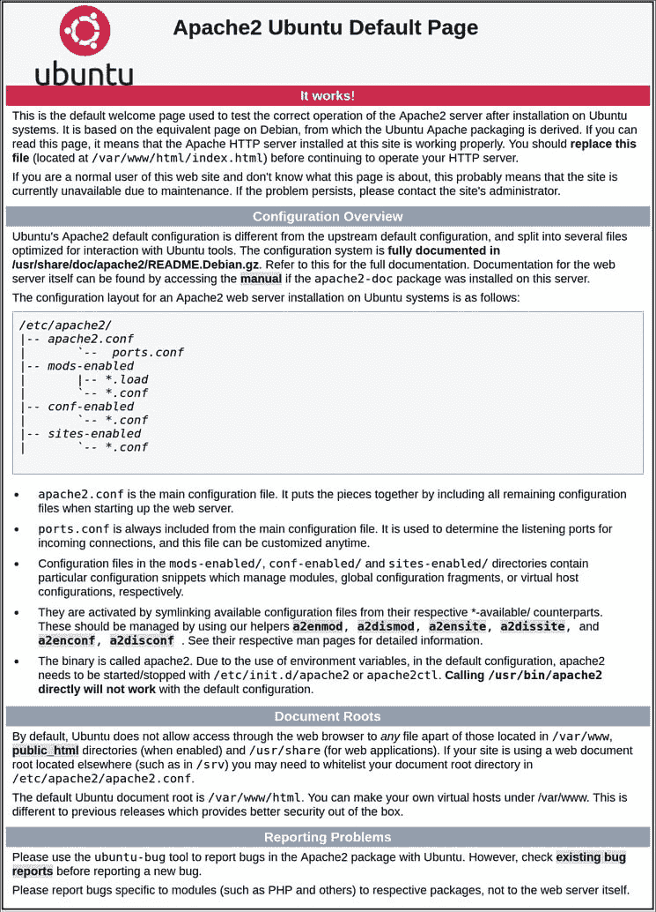

# 如何在 Ubuntu 20.04 - Eldernode 上安装 Apache Web 服务器

> 原文：<https://blog.eldernode.com/apache-web-server-ubuntu-20/>


教程如何在 Ubuntu 20.04 上安装 Apache Web 服务器。Apache HTTP 服务器是世界上使用最广泛的 web 服务器。它提供了许多强大的功能，包括可动态加载的模块、强大的媒体支持以及与其他流行软件的广泛集成。不要浪费时间，买你自己的 [Ubuntu Vps](https://eldernode.com/ubuntu-vps/) 来进行一次真正的安装。

为了让本教程更好地发挥作用，请考虑以下**先决条件**:

## 如何在 Ubuntu 20.04 上安装 Apache Web 服务器

如果你正确地遵循这个指南的步骤，学习如何在 [**Ubuntu 20.04**](https://eldernode.com/how-to-install-lamp-on-ubuntu-20-04/) 上安装 **Apache Web 服务器**会很容易。

### 1-如何安装 Apache

虽然 Apache 在 [Linux](https://blog.eldernode.com/tag/linux/) Ubuntu 的默认软件仓库中可用，但您可以从更新本地包索引开始，以反映最新的上游变化。使得使用传统的[包管理](https://en.wikipedia.org/wiki/List_of_software_package_management_systems)工具来安装它成为可能。

```
sudo apt update
```

然后安装 apache2 包:

```
sudo apt install apache2
```

### 2-如何调整防火墙

在这一步中，在测试 Apache 之前，有必要修改防火墙设置，以允许外部访问默认的 web 端口。假设您遵循了先决条件中的说明，那么您应该配置一个 UFW 防火墙来限制对您的服务器的访问。

注意，在安装过程中，Apache 向 UFW 注册，以提供一些应用程序配置文件，这些文件可用于启用或禁用通过防火墙对 Apache 的访问。

要列出 ufw 应用配置文件，请运行以下命令:

```
sudo ufw app list
```

输出

```
Available applications:    Apache    Apache Full    Apache Secure    OpenSSH 
```

从输出可以清楚地看出，Apache 有三个可用的概要文件:

*   **Apache** :此配置文件仅打开端口 80(正常、未加密的 web 流量)
*   **Apache Full** :此配置文件同时打开端口 80(正常的未加密 web 流量)和端口 443 (TLS/SSL 加密流量)
*   **Apache Secure** :此配置文件仅打开端口 443 (TLS/SSL 加密流量)

**注意** :另外，建议您启用最严格的配置文件，该文件仍将允许您配置的流量。由于我们还没有在本指南中为我们的服务器配置 SSL，我们只需要允许端口 80 上的流量:

```
sudo ufw allow 'Apache'
```

接下来，使用以下命令验证更改。

```
sudo ufw status
```

输出

```
Status: active    To                         Action      From  --                         ------      ----  OpenSSH                    ALLOW       Anywhere                    Apache                     ALLOW       Anywhere                  OpenSSH (v6)               ALLOW       Anywhere (v6)               Apache (v6)                ALLOW       Anywhere (v6)
```

3-如何检查您的网络服务器

### 安装过程结束时，Ubuntu 20.04 会启动 Apache。web 服务器应该已经启动并运行。

您可以通过键入以下命令来确保服务正在运行:

输出

```
sudo systemctl status apache2
```

由于此输出确认，服务已成功启动。然而，测试这一点的最好方法是从 Apache 请求一个页面。

```
● apache2.service - The Apache HTTP Server       Loaded: loaded (/lib/systemd/system/apache2.service; enabled; vendor preset: enabled)       Active: active (running) since Thu 2020-04-23 22:36:30 UTC; 20h ago         Docs: https://httpd.apache.org/docs/2.4/     Main PID: 29435 (apache2)        Tasks: 55 (limit: 1137)       Memory: 8.0M       CGroup: /system.slice/apache2.service               ├─29435 /usr/sbin/apache2 -k start               ├─29437 /usr/sbin/apache2 -k start               └─29438 /usr/sbin/apache2 -k start 
```

您可以通过您的 IP 地址访问默认的 Apache 登录页面，以确认软件运行正常。如果您不知道您的服务器的 IP 地址，您可以从命令行以几种不同的方式获得它。

在服务器的命令提示符下键入以下内容:

您将得到几个用空格分隔的地址。您可以在 web 浏览器中尝试每一种方法，以确定它们是否有效。

```
hostname -I
```

另一种选择是使用 Icanhazip 工具，该工具会提供从互联网上的另一个位置读取的公共 ip 地址:

在浏览器的地址栏中输入服务器的 IP 地址:

```
url -4 icanhazip.com
```

然后你会看到默认的 Ubuntu 20.04 Apache 网页:

```
http://your_server_ip
```



一旦看到这个页面，就意味着 Apache 工作正常。它还包括一些关于重要的 Apache 文件和目录位置的基本信息。

Once you can see this page, it means that Apache is working correctly. It also includes some basic information about important Apache files and directory locations.

### 4-如何管理 Apache 进程

### 您已经准备好学习一些基本的管理命令，因为 web 服务器已经启动并正在运行。

要停止您的 web 服务器:

通过运行下面的命令，在 web 服务器停止时启动它。

```
sudo systemctl stop apache2
```

使用以下命令停止并再次启动该服务。

```
sudo systemctl start apache2
```

如果只是简单地修改配置，Apache 通常可以在不中断连接的情况下重新加载。

```
sudo systemctl restart apache2
```

为此，请使用以下命令:

默认情况下，Apache 被配置为在服务器启动时自动启动。如果这不是您想要的，请通过键入以下命令禁用此行为:

```
sudo systemctl reload apache2
```

键入以下命令以重新启用该服务，使其在引导时启动。

```
sudo systemctl disable apache2
```

Type the command below to re-enable the service to start up at boot.

```
sudo systemctl enable apache2
```

### 5-如何设置虚拟主机(推荐)

### 当使用 Apache web 服务器时，您可以使用虚拟主机来封装配置细节，并从单个服务器托管多个域。你将建立一个名为 **your_domain** 的域名，但是你应该**用你自己的域名**替换它。

Ubuntu 20.04 上的 Apache 有一个默认启用的服务器块，它被配置为提供来自 /var/www/html 目录的文档。虽然这对于单个站点来说效果很好，但是如果你托管多个站点的话，这可能会变得很笨拙。让我们不要修改 /var/www/html ，而是在 /var/www 中为 **your_domain** 站点创建一个目录结构，保留 /var/www/html 作为缺省目录，以便在客户端请求与任何其他站点不匹配时提供服务。

为 **your_domain:** 创建目录

现在，使用 $USER 环境变量分配目录的所有权:

```
sudo mkdir /var/www/your_domain
```

如果您没有修改设置默认文件权限的 umask 值，那么您的 web 根目录的权限应该是正确的。为了确保您的权限是正确的，并允许所有者读取、写入和执行文件，同时只授予组和其他人读取和执行权限，您可以输入以下命令:

```
sudo chown -R $USER:$USER /var/www/your_domain
```

然后，使用 nano 或您喜欢的编辑器创建一个示例index.html页面:

```
sudo chmod -R 755 /var/www/your_domain
```

在内部，添加以下示例 HTML:

```
sudo nano /var/www/your_domain/index.html
```

/var/www/your _ domain/index . html

您现在可以保存并关闭文件。

```
<html>      <head>          <title>Welcome to Your_domain!</title>      </head>      <body>          <h1>Success!  The your_domain virtual host is working!</h1>      </body>  </html>
```

为了让 Apache 提供这些内容，有必要用正确的指令创建一个虚拟主机文件。与其直接修改位于**/etc/Apache 2/sites-available/000-default . conf**的默认配置文件，不如在****/etc/Apache 2/sites-available/**your _ domain**新建一个。conf** :**

**粘贴以下配置块，该配置块与默认配置块相似，但针对我们的新目录和域名进行了更新:**

```
`sudo nano /etc/apache2/sites-available/your_domain.conf`
```

**/etc/Apache 2/sites-available/your _ domain . conf**

****注意**:您已经将**文档根目录**更新到我们的新目录，将**服务器管理员**更新到一个 **your_domain** 站点管理员可以访问的电子邮件。我们还添加了两个指令: **ServerName** ，它为这个虚拟主机定义建立了应该匹配的基本域，以及 **ServerAlias** ，它定义了应该匹配的更多名称，就像它们是基本名称一样。**

```
`<VirtualHost *:80>      ServerAdmin [[email protected]](/cdn-cgi/l/email-protection)      ServerName your_domain      ServerAlias www.your_domain      DocumentRoot /var/www/your_domain      ErrorLog ${APACHE_LOG_DIR}/error.log      CustomLog ${APACHE_LOG_DIR}/access.log combined  </VirtualHost>`
```

**您现在可以保存并关闭文件。**

**使用以下命令通过 **a2ensite** 工具启用文件:**

**禁用 **000-default.conf** 中定义的默认站点:**

```
`sudo a2ensite your_domain.conf`
```

**并测试配置错误:**

```
`sudo a2dissite 000-default.conf`
```

**输出**

```
`sudo apache2ctl configtest`
```

**接下来，重新启动 Apache 来实现您的更改:**

```
`Syntax OK`
```

**到目前为止，Apache 应该已经在为你的域名服务了。您可以通过导航到**http://your _ domain**来测试这一点，您应该会看到类似这样的内容:**

```
`sudo systemctl restart apache2`
```

****

**6-如何熟悉重要的 Apache 文件和目录**

### **至此，您已经知道如何管理 Apache 服务本身，所以应该花几分钟时间熟悉一些重要的目录和文件。**

**内容**

### **/var/www/html :实际的 web 内容，默认情况下只包含您之前看到的默认 Apache 页面，从 /var/www/html 目录提供。这可以通过修改 Apache 配置文件来改变。**

*   **服务器配置**

### **/**etc/Apache 2**:Apache 配置目录。所有的 Apache 配置文件都在这里。**

*   ****/etc/apache 2/Apache 2 . conf**:主 Apache 配置文件。可以对其进行修改，以更改 Apache 全局配置。这个文件负责加载配置目录中的许多其他文件。**
*   ****/etc/apache 2/ports . conf**:这个文件指定了 Apache 将要监听的端口。默认情况下，Apache 监听端口 80，当启用了提供 SSL 功能的模块时，还会监听端口 443。**
*   ****/etc/Apache 2/sites-available/**:可以存放每个站点虚拟主机的目录。Apache 不会使用在这个目录中找到的配置文件，除非它们被链接到 **站点启用的** 目录。通常，所有服务器块配置都在该目录中完成，然后通过使用 **a2ensite** 命令链接到另一个目录来启用。**
*   ****/etc/Apache 2/sites-enabled/**:存放已启用的每站点虚拟主机的目录。通常情况下，它们是通过链接到 **站点可用** 目录中的配置文件来创建的，带有 **a2ensite** 。Apache 在启动或重新加载以编译一个完整的配置时，会读取这个目录中的配置文件和链接。**
*   ****/etc/Apache 2/conf-available/**、**/etc/Apache 2/conf-enabled/**:这些目录与**sites-available**和**sites-enabled**目录的关系相同，但用于存储不属于虚拟主机的配置片段。**conf-available**目录下的文件可以用 **a2enconf** 命令启用，用 **a2disconf** 命令禁用。**
*   ****/etc/Apache 2/MODS-available/、/etc/Apache 2/MODS-enabled/**:这些目录分别包含可用和启用的模块。文件以结尾**。load** 包含加载特定模块的片段，而文件以结尾。conf 包含这些模块的配置。可以使用 **a2enmod** 和 **a2dismod** 命令启用和禁用模块**
*   **服务器日志**

### ****/var/log/apache 2/access . log**:默认情况下，对 web 服务器的每个请求都记录在这个日志文件中，除非 Apache 被配置为不这样做。**

*   ****/var/log/Apache 2/error . log**:默认情况下，所有错误都记录在这个文件中。Apache 配置中的 **LogLevel** 指令指定了错误日志将包含多少细节。**

**结论**

## **在本文中，您了解了如何在 Ubuntu 20.04 上安装 Apache Web 服务器。既然您已经安装了 web 服务器，那么您就有了许多选择，包括可以提供的内容类型和可以用来创建更丰富体验的技术。如果你对这个主题感兴趣，可以找到更多关于[如何在 Debian 10](https://blog.eldernode.com/install-apache-web-server-debian/) **上安装 Apache Web Server 和** [如何在 Ubuntu 20.04](https://blog.eldernode.com/install-wordpress-apache-ubuntu-20/) 上安装带有 Apache 的 WordPress 的文章。**

**In this article, you learned How To Install The Apache Web Server On Ubuntu 20.04\. Now that you have your web server installed, you have many options for the type of content you can serve and the technologies you can use to create a richer experience. In case you are interested in this subject, find more articles on [How to install Apache Web Server on Debian 10](https://blog.eldernode.com/install-apache-web-server-debian/) **AND** [How to install WordPress with Apache in Ubuntu 20.04](https://blog.eldernode.com/install-wordpress-apache-ubuntu-20/).**