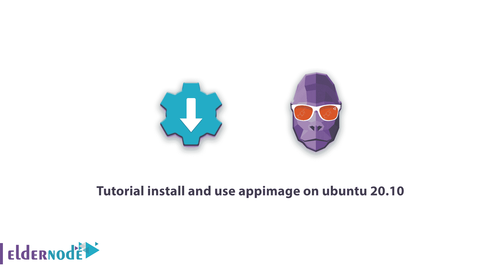
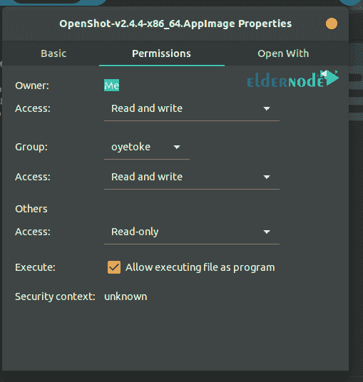

# 教程在 ubuntu 20.10 | Eldernode 上安装和使用 appimage

> 原文：<https://blog.eldernode.com/appimage-on-ubuntu-20-10/>



教程如何**在 ubuntu 20.10 Linux 上安装使用 app image**。许多 GNU/Linux 操作系统用户一直需要像 Windows 和 Mac 操作系统用户一样下载软件，并在任何类型的 [Linux](https://blog.eldernode.com/tag/linux/) 发行版上运行，而没有任何顾虑。除了普通用户之外，该操作系统的开发人员一直希望有一种结构，只编写一次他们的软件，然后针对不同的发行版发布，而不再需要根据每个发行版的需要对软件进行更改。AppImage 是一个满足 Linux 社区用户需求的工具，您将在下面了解到更多关于它的功能。在本文中，我们试图首先向您介绍 AppImage，然后教您如何在 ubuntu 20.10 上安装和使用 appimage。如果你想购买 Linux VPS 服务器，你可以使用 [Eldernode](https://eldernode.com/) 的软件包。

## 如何在 ubuntu 20.10 上安装和使用 app image

AppImage 允许开发者以专有的 [AppImage](https://appimage.org/) 格式发布他们的 Linux 软件，使其兼容所有常见的 **GNU/ Linux** 发行版。所以这个以“开发一次，然后在每个发行版中运行”为口号的工具已经能够满足大多数普通 Linux 发行版用户的需求，您将熟悉这个工具的一些最常见的特性:

***1。**易用性*

AppImage 的基本思想是，每个应用程序相当于一个文件，每个文件包含一个应用程序，其中包含运行该应用程序所需的所有文件。换句话说，每个可执行文件没有其他依赖关系。就像码头工人一样。

***2。安全***

AppImage 格式允许用户从主要开发者那里获得他们需要的应用程序，并且该平台消除了任何接口。这将增加文件的安全系数。

***3。易于安装***

运行 AppImage 格式不需要 root 权限，此外，该工具的专有格式无需安装即可实现。

### 使用 appimage 有什么好处？

该网站开发的方法非常方便实用。要使用一个软件，你所要做的就是下载 appimage 文件，然后点击一下就可以在任何发行版上运行它。

事实上，这个站点所做的就是将一个应用程序需要运行的所有文件和库放在一个 appimage 文件中。这就是为什么 appimage 程序不需要任何文件就可以在操作系统上运行，因此是可移植的，您可以在几乎所有的 Linux 发行版上运行它们。

**使用 appimage 的好处如下:**

**1-** 不需要安装 appimage 形式的应用程序。

**2-** 程序运行不需要 root 权限。

**3-** 运行程序不会改变系统中的任何文件或设置。

**4-** 程序运行不需要操作系统中的任何文件。

**5-** 下载一次程序，在所有 Linux 发行版上使用。

**6-** 应用程序是可移植的。

**7-** 如果你是开发者，你可以很容易地将自己编写的程序转换成 appimage 格式，送给用户。

### 教程在 ubuntu 20.10 上安装并运行 app image

关于 AppImage 有趣的事情是，你不需要安装应用程序。但是您可以轻松运行它。在下面，我们将教你如何以两种方式运行 AppImage。

#### 如何使用属性运行 app image

**1。**第一步，下载 AppImage app。

**2。**然后右击它，点击**属性**。

**3。**点击**权限**选项卡。

**4。**勾选**允许文件作为程序执行**。

**5。**现在**关闭****属性**窗口，双击**运行**程序。



#### 如何使用终端运行 app image

运行 AppImage 的第二种方法是使用终端。为此，打开您选择的**终端**，转到应用程序映像目录并运行以下命令:

```
chmod u+x <AppImageFile>
```

现在，您可以双击 AppImage 来运行它。

## **结论**

在本文中，我们试图教你如何在 ubuntu 20.10 上安装和使用 appimage，这样你就可以用它在任何发行版上运行软件，只需点击一下，无需安装。