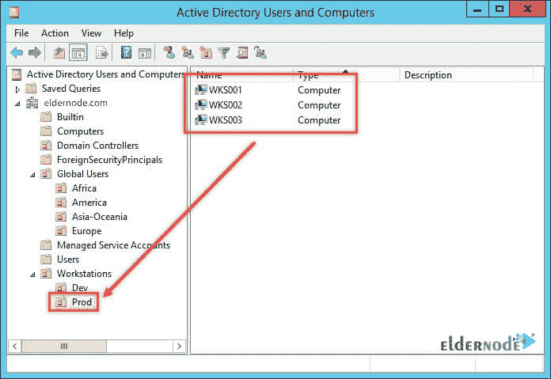

# 了解如何将组策略应用到 Active Directory 中的计算机

> 原文：<https://blog.eldernode.com/apply-group-policy-to-a-computer-in-active-directory/>

【更新日期:2021-01-29】如你所知，GPO 正在应用于计算机。最常见的方法是将计算机的 [GPO](https://en.wikipedia.org/wiki/Group_Policy) 链接到计算机 OU。默认情况下，策略适用于包含 OU 的所有计算机。如果只有少数特定计算机有特定的策略，那么这些计算机应该在 Active Directory 计算机组中。在本文中，我们将**学习如何在 Active Directory** 中对计算机应用组策略。你可以访问 [Eldernode](https://eldernode.com/) 中提供的包来购买 [Windows VPS](https://eldernode.com/windows-vps/) 服务器。加入我们来学习这个教程。

## **教程将组策略应用到 Active Directory 中的计算机**

在本教程中，我们将了解如何将 **GPO** 应用到 Active Directory 中的计算机组。这种方法比为想要这样做的计算机创建一个新的 OU 要有效得多。

### **将组策略应用到 Active Directory 中的计算机**

在本例中，计算机位于名为 asaputra.com 的域中，域控制器安装在 r 2 版的 Windows Server 2012 上。所有客户端计算机都安装了 Windows 10，并处于生产阶段。名为“安全计算机策略”的策略已经创建并链接到名为“Prod”的 OU。

***

### **如何过滤安全计算机策略以应用于 WKS002 和 WKS003**

以下分步说明显示了如何过滤适用于 **WKS002** 和 **WKS003** 的安全计算机策略。

#### **创建群组**

该组应建立在策略所链接的 OU 中。在 **Active Directory** 用户和计算机控制台上打开 **OU** 。

右键点击页面的空白区域，选择**新建** > > **组**。

输入组名。

在**全局范围**部分，选择**全局**。

从**组类型**部分，选择**安全**。

点击**确定**保存设置并创建群组。如下所示，组必须显示在 OU 中。

**添加目标电脑为群组成员**

#### 双击**组名**打开设置。选择**成员**选项卡，点击**添加**按钮。

将打开以下窗口。点击**对象类型**并确保计算机已勾选。

***

现在用分号**(；)**把它们分开。然后点击**查看姓名**。如果键入正确，名称将如下所示显示，下面有一个破折号。

确保所有目标计算机都是该组的成员，然后单击 **OK** 确认。

**更改 GPO 安全设置**

#### 登录到组策略控制台。选择您想要更改的策略，然后进入**范围**选项卡。

在**安全过滤**部分，选择**认证用户**，点击**移除**。

在同一个**安全过滤**区域，点击**添加**按钮。

输入在上一步中创建的组的名称。点击**检查姓名**确保输入的姓名正确，然后点击**确定**。

确保该组已添加到列表中。

如何检查正确应用的策略

### 我们可以确保政策得到正确应用。在客户端计算机上，以管理员身份运行 **cmd** 并输入命令 **gpresult / r / SCOPE COMPUTER** 。在属于 **SECURED_COMPUTER** 组(即 WKS002 和 WKS003)的计算机上，您会看到结果被正确应用。

但是在组外的计算机上，结果显示没有应用任何策略。

请记住，将 GPO 应用于计算机组有点令人困惑。如果您看到一个 GPO 尚未应用到作为目标组成员的计算机，那么该计算机可能还没有意识到它是该组的成员。要检查您的计算机成员资格，请使用上面的命令并向下滚动查看下面的信息。

结论

## 在本文中，我们试图全面解释如何使用 Windows Server 2012 中的映像将组策略应用于 Active Directory 中的计算机。如何筛选安全计算机策略以应用于 WKS002 和 WKS003 也是一步一步教授的。最后，对 CMD 环境下的工作结果进行了评估。

In this article, we tried to fully explain how to apply Group Policy to a computer in Active Directory using images in Windows Server 2012\. How to filter Secured Computer policy to apply to WKS002 and WKS003 was also taught step by step. Finally, the results of the work in the CMD environment were evaluated.