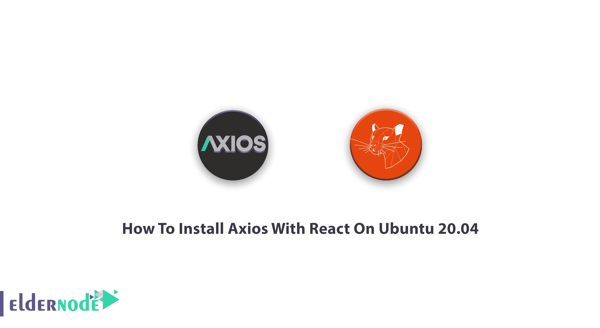

# 如何在 Ubuntu 20.04 上安装带有 React 的 Axios-elder node 博客

> 原文：<https://blog.eldernode.com/axios-with-react-on-ubuntu/>



了解如何在 Ubuntu 20.04 [Linux](https://blog.eldernode.com/tag/linux/) 上**安装带有 React 的 Axios。让我们看看这个美国新闻网站是什么，以及如何和为什么你可以使用它！你可能很有兴趣知道这个网站的名字是基于希腊语(áxios)，意思是“有价值的”！你的时间和金钱也是值得的。所以，看看我们最好的 [Ubuntu VPS](https://eldernode.com/ubuntu-vps/) 服务器操作系统包，享受我们的服务吧。**

## 什么是 Axios？

成立于 2016 年，类似于 Fetch API，用于执行 HTTP 请求。这个轻量级 HTTP 客户端基于 XMLHttpRequests 服务。大多数 Axios 文章都很容易浏览，因为它们不到 300 个单词，使用了要点，并且通常都很简短和就事论事。

## 教程如何在 Ubuntu 20.04 上安装带有 React 的 Axios】

当您决定运行一个动态项目时，它需要在某个时候与 RESTFUL API 接口，使用 Axios 是一种简单的方法。您可以使用 Axios 作为库来帮助您向外部资源发出 HTTP 请求。在 React(也称为 React.js 或 ReactJS)应用程序中，您需要从外部 API 检索数据，以便可以在它的网页上显示这些数据。如果你已经看到人们使用 Javascript *Fetch* API 来检索外部数据，但是它有一些限制。因此，正如您所知，Axios 是为处理 HTTP 请求和响应而设计的，这是执行此操作的更好、更受欢迎的方式。

要创建和运行 React 应用程序，您的系统中需要 Node.js。找到我们的文章在 Ubuntu 20.04 上安装 [Node.js。](https://blog.eldernode.com/install-and-config-node-js-on-ubuntu-20-04/)

### 如何将 Axios 添加到项目中

**首先**，打开您的终端，将目录切换到您的项目，将 Axios 添加到项目中:

```
cd eldernode-tutorial
```

然后，使用下面的命令和 npm 来安装 Axios :

```
npm install axios
```

或者你可以用 bower:

```
bower install axios
```

你可以通过运行纱线来安装:

```
yarn add axios 
```

### `如何移除 Axios 包`

`要从 node_modules 中卸载或删除程序包，请使用以下命令:`

```
`sudo npm uninstall axios`
```

`然后，您应该查看 node.js 安装的版本。否则，通过运行以下命令，使用 **curl** 从主目录中检索安装文件:`

```
`cd ~ curl -sL https://deb.nodesource.com/setup_14.x -o setup_node.sh`
```

`然后，用 sudo 运行下载的脚本:`

```
`sudo bash setup_node.sh`
```

`这样，PPA 将被添加，缓存将自动更新。因此，键入:`

```
`sudo apt-get install -y nodejs`
```

`通过在系统中添加 node.js 和 npm，也可以通过运行 **node -v** 查看系统中 node.js 的版本来确认。现在用下面的命令安装 **create react app** :`

```
`sudo npm install -g create-react-app`
```

`要检查版本，请运行以下命令:`

```
`create–react–app—version` 
```

`就是这样！现在，您已经准备好创建一个应用程序并开始开发。`

## `结论`

`在本文中，您已经了解了如何在 Ubuntu 20.04 上安装带有 React 的 Axios。您可以使用 React 来构建用户界面。如果你有兴趣阅读更多内容，可以找到我们关于如何在 Windows 上安装 React JS 的文章。`