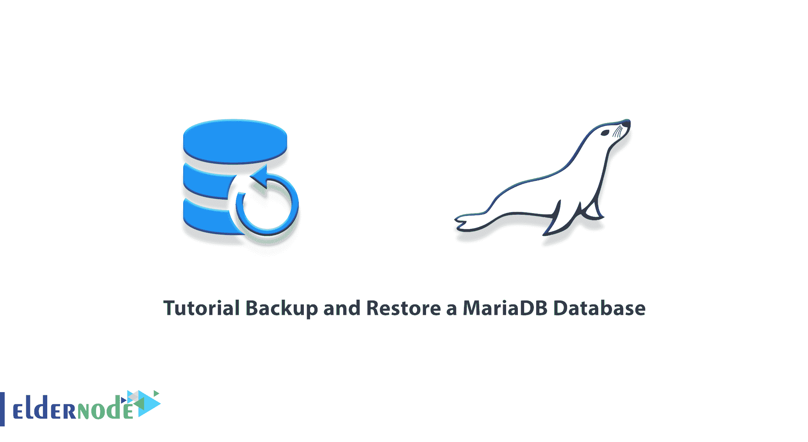

# 教程备份和恢复一个 MariaDB 数据库- Eldernode 博客

> 原文：<https://blog.eldernode.com/backup-and-restore-a-mariadb-database/>



MariaDB 是最流行的开源关系数据库之一。这个数据库是由最初的 MySQL 开发人员创建的，并保证保持开源。MariaDB 是 MySQL 分支的 DBMS 或数据库管理系统，使用 MariaDB 存储引擎。在这篇文章中，我们将教你如何备份和恢复一个 MariaDB 数据库。如果你想购买一台 [VPS 服务器](https://eldernode.com/vps/)，你可以访问 [Eldernode](https://eldernode.com/) 中提供的软件包。

## **如何备份和恢复一个 MariaDB 数据库**

### **什么是 MariaDB 数据库？**

MariaDB 是世界上最流行的数据库服务器之一。这项服务的重要用户包括谷歌、维基百科和脸书。如前所述，MariaDB 是作为一个开源的关系数据库开发的，它提供了一种用于访问数据的 SQL 接口。MariaDB 的最新版本还包括 GIS 和 JSON 功能。

从网站到银行应用，这个数据库实际上将数据转换成广泛应用的结构化信息。MariaDB 被认为是 MySql‌.的可行替代品因为这项服务非常快速、可扩展且功能强大。通过提供插件、存储引擎和其他工具的强大生态系统，它还可以用于广泛的主题。

MariaDB 的功能包括:

**1。该数据库的热门客户**

受欢迎的大客户能给一个品牌最大的信任。MariaDB 拥有谷歌、维基百科、WordPress 等知名客户端，增加了这个数据库的可信度。

**2。存储引擎**

存储引擎在 MariaDB 中得到了很好的发展，可以为用户提供新的功能。在存储中，引擎是 XtraDB 和 Aria。

**3。数据库安全**

尽管 MariaDB 被认为是 MYSQL 数据库的一个子集，但似乎数据库安全的原则在其开发中受到了更多的关注。所以在使用 MariaDB 时不要担心安全问题。

## **备份一个 MariaDB 数据库**

MariaDB 数据库的备份有两种方式。逻辑备份和物理备份。在本文的其余部分，我们将教您备份 MariaDB 的两种方法。请加入我们。

### **如何对 MariaDB** 进行逻辑备份

在本节中，我们将教您如何对 MariaDB 进行逻辑备份。为此，您必须按顺序执行以下步骤。首先，可以使用以下命令进行逻辑备份:

```
mysqldump -u root -p inventory > /backup/inventory.dump
```

上述命令的参数解释如下:

**root:** 该参数显示连接到 MariaDB 进行备份的用户名。

**-p:** 使用该参数指定该用户的密码请求。

**清单:**该参数显示选择备份的数据库。

**/backup/inventory.dump:** 指定备份文件的路径。

需要记住的一点是，要对所有数据库进行逻辑备份，必须使用-all-databases 选项，如以下命令所示:

```
mysqldump -u root -p --all-databases > /backup/mariadb.dump
```

***注:*** 要知道一个逻辑备份的输出是一系列 SQL 语句是很有意思的。

### **如何对 MariaDB** 进行物理备份

在这一节中，我们将教您如何对 MariaDB 进行物理备份。为此，您必须按顺序执行以下步骤。应该注意，有几种工具可用于物理备份。在下文中，我们将向您展示使用 LVM 备份 MariaDB 的过程。

首先，使用以下命令验证 MariaDB 文件存储:

```
mysqladmin variables | grep datadir
```

**输出:**

```
| datadir | /var/lib/mysql/ |
```

然后，您需要运行以下命令来检查哪个逻辑卷托管这个位置:

```
df /var/lib/mysql
```


现在，您可以通过运行以下命令来确认快照的可用空间量:

```
vgdisplay vg0 | grep Free
```

您需要通过运行以下命令连接到 MariaDB，拖动磁盘上的表并锁定它们:

```
mysql -u root -p
```

在下一步和另一个终端会话中，您需要使用以下命令创建 LVM 快照:

```
lvcreate -L20G -s -n mariadb-backup /dev/vg0/mariadb
```

需要知道的重要一点是，LVM 快照必须足够大，以便从数据库解锁的那一刻起一直到数据库备份完成时都可以更改。因为当存储空间已满，备份失败时，快照就失效了。

现在，在主 MariaDB 会话中使用以下命令打开这些表:

```
MariaDB [(none)]> UNLOCK TABLES;
```

请注意以下命令，并运行它们以在所需位置安装快照:

```
mkdir /mnt/snapshot
```

```
mount /dev/vg0/mariadb-backup /mnt/snapshot
```

在最后一步中，备份后应使用以下命令删除备份快照:

```
umount /mnt/snapshot
```

```
lvremove /dev/vg0/mariadb-backup
```

## **如何恢复一个 MariaDB 数据库**

正如我们在 MariaDB 备份部分中告诉您的，有两种物理和逻辑方法可以做到这一点。恢复备份有两种逻辑和物理方法。请继续关注本文的其余部分。

您可以很容易地使用以下命令来执行**逻辑恢复**:

```
mysql -u root -p inventory < /backup/mariadb.dump
```

您还必须按照以下步骤执行物理恢复。首先，您需要运行以下命令来验证 MariaDB 文件的存储位置:

```
mysqladmin variables | grep datadir
```

**输出:**

```
| datadir | /var/lib/mysql/ |
```

这里重要的一点是，要执行物理恢复，您必须停止使用 MariaDB 子例程命令:

```
systemctl stop mariadb
```

最后，您需要使用以下命令删除实际内容:

```
rm -rf /var/lib/mysql/*
```

## 结论

MariaDB 的核心是 Mysql 版本 5，在引擎性能上有一些差异。其实最重要的两个安全问题和调优 MariaDB 已经很努力了，它的生产力比 Mysql 好很多。在本文中，我们试图教您如何备份和恢复一个 MariaDB 数据库。如果愿意可以参考文章[教程 Ubuntu](https://blog.eldernode.com/mariadb-installation-on-ubuntu/) 上的 MariaDB 安装。