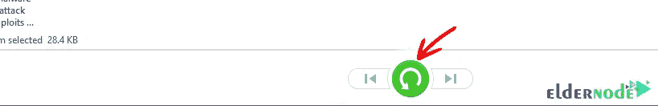

# Windows 10 RDP 管理员- Eldernode 博客上的教程备份文件

> 原文：<https://blog.eldernode.com/backup-files-on-windows-10-rdp/>

备份文件是用户应该做的基本任务之一，以便能够在紧急情况下使用它并恢复他们的数据。这将防止损坏，并且您可以在出现问题时恢复和保存丢失的信息。在不同版本的 Windows RDP 管理中，备份 Windows 文件及其结构是相同的。您可以备份安装在操作系统上的应用程序和文件。在这篇文章中，我们将教你如何在 Windows 10 RDP 管理员上备份文件。如果你想购买 **[Windows 10 RDP 管理员](https://eldernode.com/windows-10-rdp/)** ，可以查看 [Eldernode](https://eldernode.com/) 网站上提供的套装。

## **如何在 Windows 10 上备份文件 RDP 管理员**

在文件历史的帮助下，如果文件丢失或不可用，您可以恢复文件的以前版本。文件历史自动将特定文件夹保存在备份设备上。它仅备份特定文件夹中的文件，如文档、音乐、图片、视频和桌面，以及存储在您 PC 上的离线 OneDrive 文件，并且您不能将其他文件夹添加到组合中。

要备份未存储在默认文件夹中的文件，您可以将它们添加到上面提到的命名文件夹中，或者考虑第三方备份程序，该程序具有比文件历史记录更多的选项和更大的灵活性。

### **如何登录 Windows 10 RDP 管理员**

首先，进入**开始菜单**，输入**远程桌面**:

在这一步，你应该键入你的 **IP 地址**，然后点击**连接**。

然后，你要输入你的**用户名**和**密码**。

现在，您将收到以下消息。选中**不要再询问我是否连接到这台计算机**框，然后点击**是:**

最后，您应该会连接到您的 **Windows 10 RDP 管理员**:

在本文的续作中，从 [Windows Server](https://blog.eldernode.com/tag/windows/) 教程系列开始，我们将一步步教你如何在 Windows 10 RDP 管理上备份文件。

## **备份 Windows 10 上的文件**RDP 管理员

您可以在 RDP 服务器上设置**文件历史**来备份文件。首先，点击**开始**，进入**设置**。然后你应该选择**更新&安全**部分:

在接下来的页面中，选择**备份**，点击**使用**文件历史**在备份下添加一个驱动器**。如果您连接了一个可用的备份设备，Windows 将显示它们的列表。现在，您应该选择备份的位置:

您已经启用了**文件历史记录**，但是它没有备份任何文件。然后设置一些参数。你可以从**的【更多选项】中做到这一点，所以点击**:

在这一步中，单击备份我的文件并选择您希望备份文件的频率。然后，您必须从保留我的**备份**部分选择您想要保留备份文件的时间:

现在，“文件历史记录”开始备份一组默认文件夹。如果您想从默认文件夹中移除一些文件夹，只需选择文件夹并点击**移除**。您可以通过点击【T2 添加文件夹】将任何文件夹添加到默认列表中。

最后，单击 **Backup now** 开始备份备份集中包含的文件夹和文件。

完成备份后，您可以看到备份的总大小以及日期和时间:

### **如何在 Windows 10 RDP 管理中恢复文件**

如果您丢失或损坏了重要文件，您可以使用文件历史备份来恢复它。

首先，进入**设置**菜单，选择**更新&安全:**

然后点击**备份**并选择**更多选项:**

在此步骤中，在“更多选项”页面打开后，向下滚动找到“从当前备份中恢复文件”并点击它:

现在，您可以看到文件历史记录备份的所有文件夹。你应该双击你想要的文件夹并打开它。然后找到你的文件并双击它。选择所需文件后，单击绿色按钮恢复文件:

**注意:**如果原始文件丢失，Windows 会自动恢复到原来的位置。如果文件还在，Windows 会让您替换它。

您可以更改备份目标，但首先，您应该停止使用当前驱动器。再次转到**备份**部分，选择**更新&安全**。然后点击**更多选项**，在当前页面向下滚动，找到**停止使用驱动器**并点击它:

返回上一页，单击**添加驱动器**，使用新的备份目标重新开始该过程。通过这样做，您可以**使用新的备份目的地重启**该过程:

如果您不想再停止文件历史，请转到备份屏幕，关闭自动备份我的文件开关:

就是这样！

结论

## Windows 10 RDP 管理有一个文件历史功能，允许您将重要文件自动备份到外部位置。在这篇文章中，我们教你如何备份文件在 Windows 10 RDP 管理使用文件历史。此外，我们解释了如何在 Windows 10 RDP 服务器上恢复文件。我希望这篇文章对你有用。

Windows 10 RDP Admin has a File History feature that allows you to backup important files automatically to an external location. In this article, we taught you how to backup files on Windows 10 RDP Admin using File History. Also, we explained how to restore files on the Windows 10 RDP server. I hope this article was useful for you.