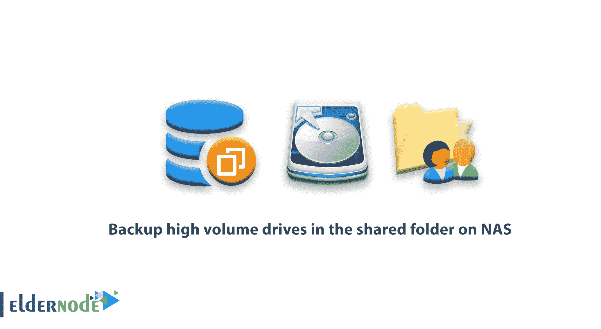
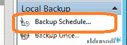
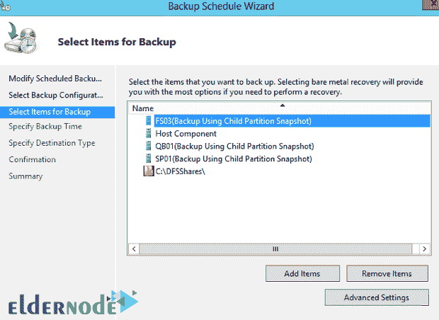
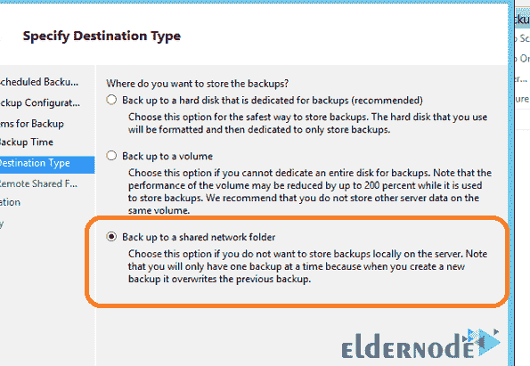
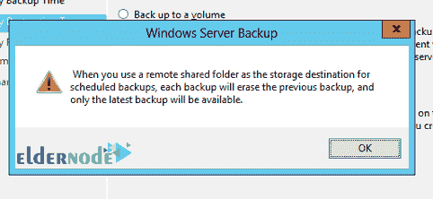
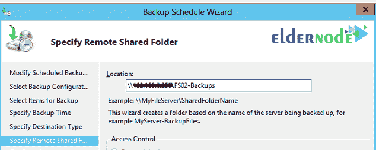
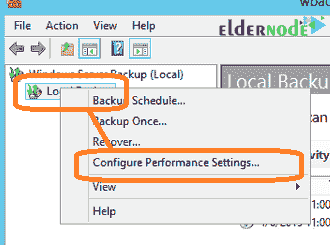
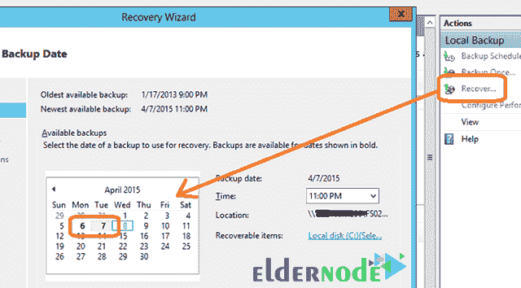

# 备份 NAS - Eldernode 上共享文件夹中的高容量驱动器

> 原文：<https://blog.eldernode.com/backup-high-volume-drives-in-the-shared-folder-on-nas/>

在本文中，您将学习如何备份 [NAS](https://en.wikipedia.org/wiki/Network-attached_storage) 上共享文件夹中的大容量驱动器。由于使用了 UEFI 和 GPT 技术，你可以在 [Windows Server 2012](https://eldernode.com/category/tutorial/) 中存储大量数据。这些海量数据的主要问题是备份。如果没有财务或预算问题，可以使用第三方软件，备份多台服务器。但是，如果您的组织在 IT 预算方面比较薄弱，Windows Server 2012 是合适的解决方案。

## 备份 NAS 上共享文件夹中的高容量驱动器

许多有财务意识的 IT 经理使用 2012 服务器来备份 USB 驱动器。大容量 USB 驱动器存在每个扇区限制 4096 字节的问题。当您备份 3tb 或 4tb 大小的 USB 驱动器时，备份会失败。那么，如何在不花费大量资金的情况下备份大容量驱动器呢？

一个很好的解决方案是使用 [**NAS**](https://www.synology.com/en-global/knowledgebase/DSM/help/DSM/AdminCenter/file_share_create) ，运行**增量备份**。市场上有许多不同的 NASs，其中之一是希捷品牌。

### 如何备份 windows server 中的大容量驱动器

首先，在 NAS 中创建一个可从 Windows Server 获得的**共享文件夹**。然后在 Windows Server 上安装**备份功能**，选中它，然后选择**备份时间表**。

选择要备份的选项:

在**备份目的地**部分，选择**备份到共享网络文件夹**选项。

当您在**共享文件夹**中收到**完全备份**消息时，点击**确定**。

接下来，输入 NAS 中的共享文件夹路径。

然后右键单击 **MMC** 中的**本地备份**图标，然后在菜单中选择**配置性能设置**。

选择**更快的性能设置**选项，将备份作为**增量备份**运行。备份完成几天后，返回并选择恢复选项。通过选择此选项，您应该会在备份日历中看到几天以粗体显示，这表明增量备份正在正常工作。

结论

## 在本文中，我们试图完整地讲述在 NAS 上的共享文件夹中备份大容量驱动器的步骤。

在本文中，我们试图完整地讲述在 NAS 上的共享文件夹中备份大容量驱动器的步骤。