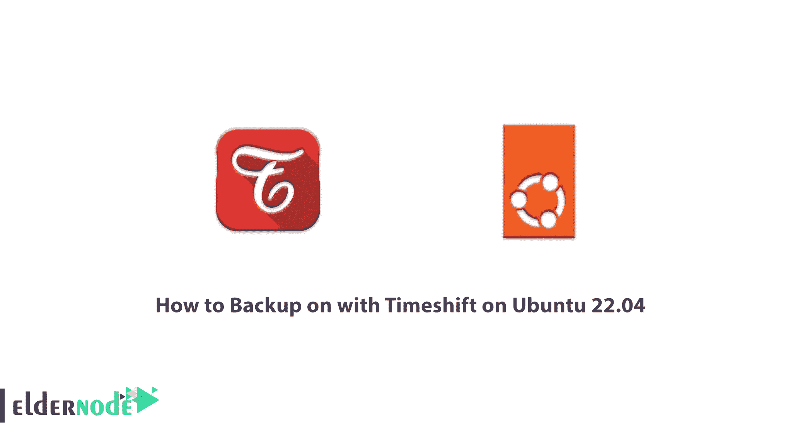
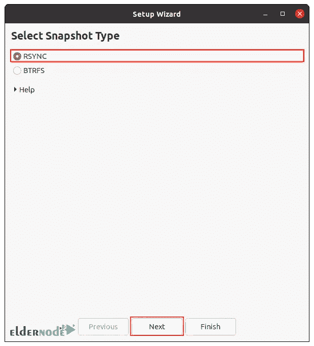
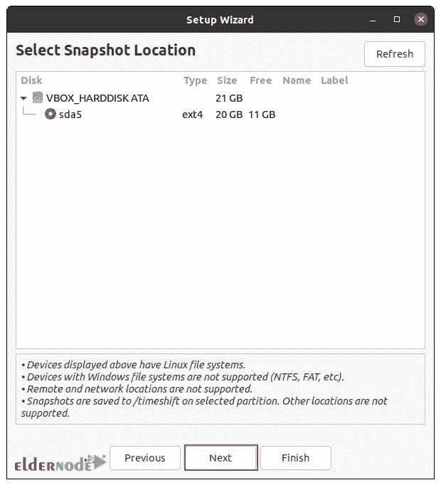
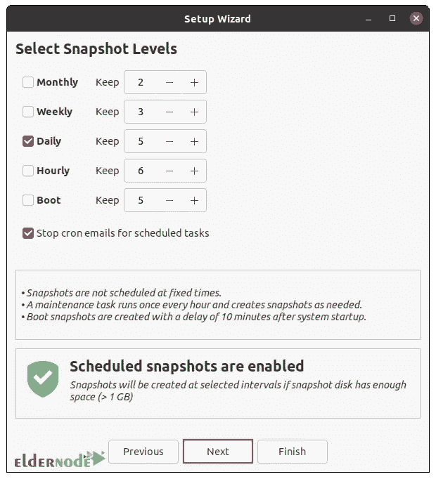
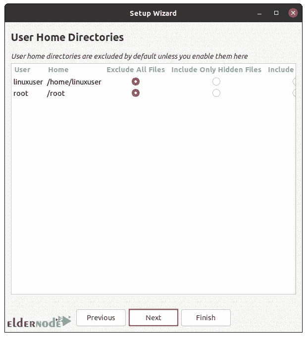
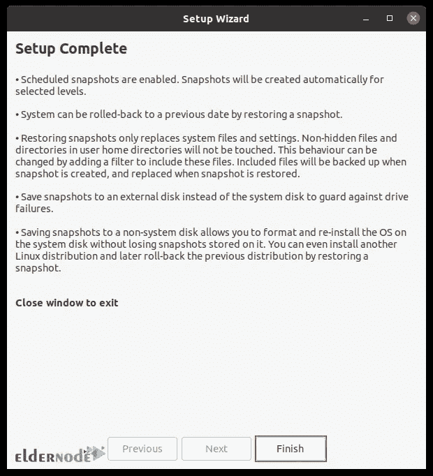
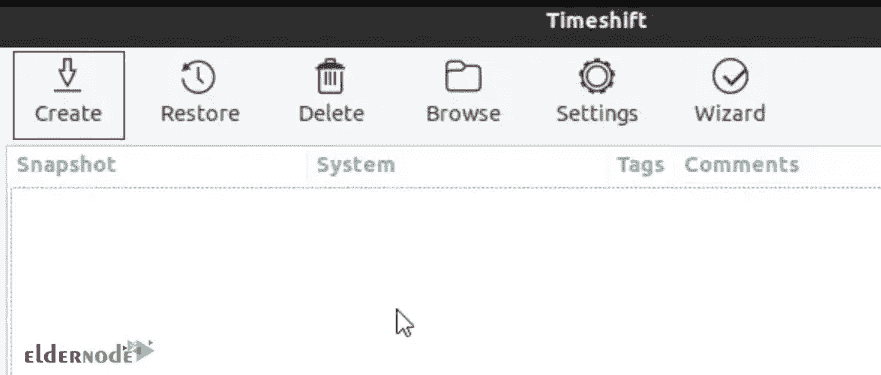
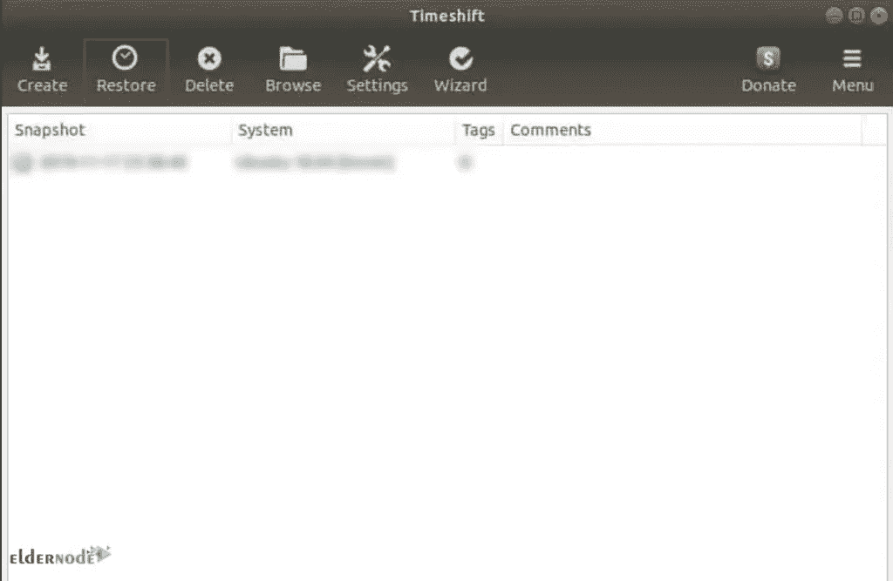
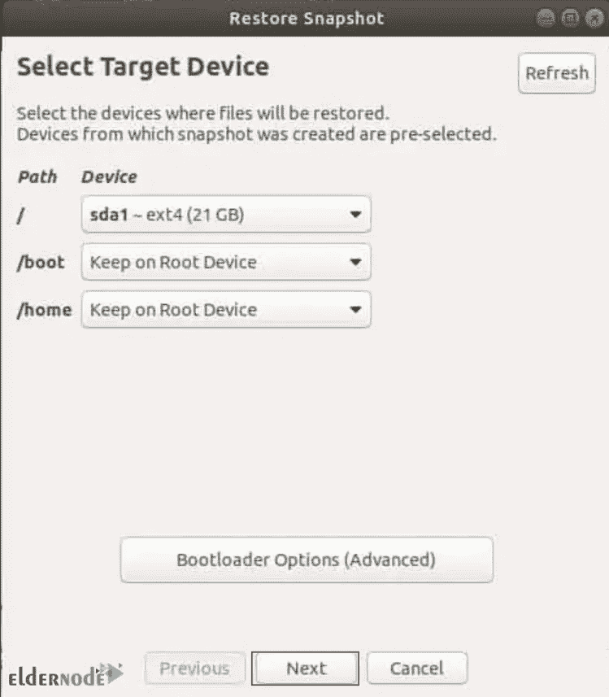
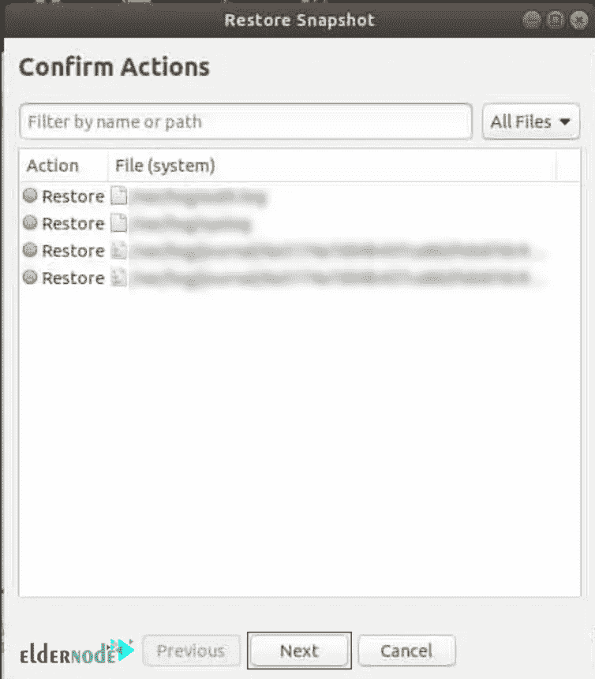

# 如何在 Ubuntu 22.04 上使用 Timeshift 备份

> 原文：<https://blog.eldernode.com/backup-on-with-timeshift-on-ubuntu-22-04/>



有时你需要在你的操作系统上备份一些文件。Windows 有一个名为“系统还原”的工具，您可以用它将 Windows 还原到以前的状态。但是 Linux 发行版通常没有用于这个目的的默认应用程序。在本教程中，我们将教你如何在 Ubuntu 22.04 上使用 Timeshift 进行备份。如果您想购买一台 [**Ubuntu VPS**](https://eldernode.com/ubuntu-vps/) 服务器，我们建议您访问 [Eldernode](https://eldernode.com/) 网站上提供的软件包。

## **Ubuntu 22.04 上带 Timeshift 的教程备份**

### **什么是时移？**

Timeshift 是一款软件，它提供的功能类似于 Windows 上的系统还原或 Mac 上的 Time machine。Timeshift 通过定期拍摄快照来保护您的系统。可以恢复这些快照，并将系统恢复到记录时的准确状态。

该软件在某些方面类似于 rsnapshot、Backln Time 和 Timevault，但方法不同。该程序仅用于保护系统文件和系统设置，不包括文档、照片和音乐等用户文件。

*Timeshift 使用两种模式创建文件系统的快照:*

**1) BTRFS** :在这种模式下，使用 BTRFS 文件系统拍摄快照。

**2) RSync** :在这种模式下，使用 RSync 和硬链接拍摄快照，并且在快照之间共享公共文件以节省磁盘空间。Rsync 也可以在任何地方存储数据。

跟随我们这篇文章，一步步教你如何在 [Ubuntu](https://blog.eldernode.com/tag/ubuntu/) 22.04 上安装 Timeshift。


### **如何在 Ubuntu 22.04 上安装 Timeshift**

首先**使用以下终端命令更新您的系统**:

```
sudo apt update
```

```
sudo apt upgrade -y
```

您不需要添加额外的存储库来安装 Timeshift，因为它的包已经存在于 Ubuntu 的默认系统存储库中。因此，**使用以下命令开始安装**:

```
sudo apt install timeshift
```

要有最新的稳定版本，还有另外一个安装 Timeshift 的选项，就是使用**发射台** **PPA** 。为此，首先**使用以下命令进入 PPA** :

```
sudo add-apt-repository ppa:teejee2008/timeshift -y
```

然后执行以下**更新**以反映新添加的 PPA:

```
sudo apt-get update
```

现在运行以下命令来**安装最新版本的 Timeshift** :

```
sudo apt install timeshift
```

这就完成了 Timeshift 的安装。您可以在以下路径中找到该软件:

**活动>展示应用>时移**

## **如何使用 Timeshift** 创建备份

您可以使用以下两种方法来备份 Ubuntu 22.04 系统:

–> Timeshift 图形用户界面(GUI)

–> Timeshift 的命令行

### **使用 Timeshift GUI 创建备份**

设置 Timeshift 后，您有两种选择:

–>使用 **Rsync** 协议作为主要备份工具。

–>使用**brtf**内部文件系统功能。

在本教程中，我们将研究如何使用 **Rsync** 进行备份。为此，只需遵循以下步骤。第一步是**运行时移**。

然后，选择 **RSYNC** 并点击**下一步**:



Timeshift 在检查文件系统分区后，会为备份文件的位置提供适当的选项。选择后点击**下一个**:



现在选择您希望备份系统的频率，这将根据选定的快照级别自动创建快照，然后选择**下一步**:



如下图所示，默认情况下，主目录已被删除。选择是否要备份主目录，然后点击**下一步**:



您的初始设置现在已经完成。点击**结束**:



点击**创建**按钮，让 Timeshift 开始创建备份快照:



现在，您应该会在列表中看到您的第一个备份快照。选择需要恢复的**备份快照**，点击**恢复**按钮:



Timeshift 为您提供了如何从备份中恢复的选项。点击下一个的**进入默认设置:**



Timeshift 提供了从备份中恢复所需的更改列表，以确保在此过程中不会丢失任何数据。选择**下一个**按钮后，系统将恢复:



### **使用 Timeshift 的命令行创建备份**

您可以使用以下命令轻松创建备份:

```
sudo timeshift --create
```

**输出**将如下所示:

```
First run mode (config file not found)  Selected default snapshot type: RSYNC  Mounted /dev/sda2 at /media/root/359151f5-efb9-483d-a738-894d57e2d8c8\.  Selected default snapshot device: /dev/sda2  ------------------------------------------------------------------------------  Estimating system size...  Creating new snapshot...(RSYNC)  Saving to device: /dev/sda2, mounted at path: /media/root/359151f5-efb9-483d-a738-894d57e2d8c8  Synching files with rsync...  Created control file: /media/root/359151f5-efb9-483d-a738-894d57e2d8c8/timeshift/snapshots/2020-02-19_18-32-36/info.json  RSYNC Snapshot saved successfully (39s)  Tagged snapshot '2022-02-23_18-32-36': ondemand
```

**用下面的命令列出系统备份截图**:

```
sudo timeshift --list
```

**输出**将是这样的:

```
Device : /dev/sda2  UUID : 359151f5-efb9-483d-a738-894d57e2d8c8  Path : /media/root/359151f5-efb9-483d-a738-894d57e2d8c8  Mode : RSYNC  Device is OK  1 snapshots, 197.7 GB free
```

```
Num Name Tags Description   ------------------------------------------------------------------------------  0 > 2022-02-23_18-32-36 O
```

您可以使用以下命令**恢复备份快照**:

```
sudo timeshift --restore --snapshot "2022-02-23_18-32-36"
```

您可以使用以下命令**删除选定的备份快照**:

```
sudo timeshift --delete --snapshot '2022-02-23_18-32-36'
```

## 结论

在本文中，您了解了 Timeshift，这是 Ubuntu 22.04 中备份文件的最佳工具之一。我们还研究了如何在 Ubuntu 22.04 上连接 Timeshift 并使用有益的方法备份文件。如果你对这篇文章有任何问题，请在评论区发表。