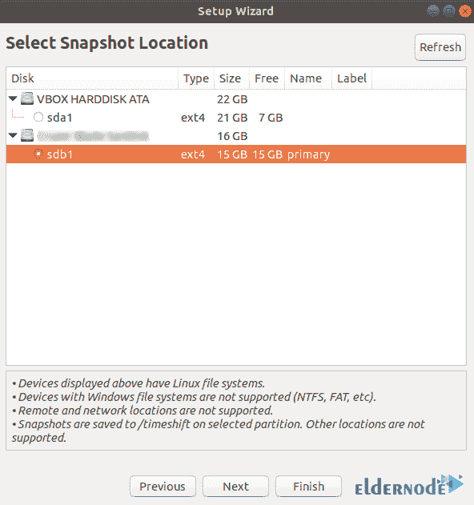

# 如何在 Ubuntu 20.04 上使用 Timeshift 备份- Eldernode 博客

> 原文：<https://blog.eldernode.com/backup-on-with-timeshift-on-ubuntu/>


Timeshift，一个备份程序，用 Ubuntu 的简单性给了我们和 Acronis 或者 Time Capsule 一样的能力。目前有许多使用备份工具的选择，但是，很少有显示是初学者的理想解决方案。在本文中，我们将一步一步地教你如何在 Ubuntu 20.04 上用 Timeshift 备份。如果你想购买一台 **[Ubuntu VPS](https://eldernode.com/ubuntu-vps/)** 服务器，你可以访问 [Eldernode](https://eldernode.com/) 中提供的软件包。

## **Ubuntu 20.04 上带 Timeshift 的教程备份**

鉴于操作系统备份的重要性，我们正尝试在 Ubuntu 20.04 上使用 Timeshift 来完成这项工作。在下一节中，我们将向您介绍 Timeshift。然后我们将解释如何安装 Timeshift。最后，我们将一步一步教你如何使用 Timeshift 进行备份。请加入我们。

### **什么是时移？**

timeshift 程序对于备份系统非常有用。TimeShift 软件，除了有简单的图形界面，还可以通过终端使用。默认情况下，该程序不提供用户个人文件的快照，但如果需要，您可以添加个人文件夹和 URL。

TimeShift 根据常规时间表构建快照。您也可以随时手动创建快照。您可以为它设置每小时、每天、每周和每月的计划，并告诉它不时删除旧快照。它甚至有一个“启动快照”选项，可以在每次系统重启后对其进行快照。

在这篇文章的后续部分，加入我们来教你如何在 Ubuntu 20.04 上使用 Timeshift 进行备份。

## **如何在 Ubuntu 20.04 上安装 Timeshift**

在我们开始讨论如何使用 Timeshift 进行备份之前，您需要安装 Timeshift。由于 TimeShift 并没有正式托管在 Ubuntu 库上，您应该使用下面的命令**添加一个 PPA** :

```
add-apt-repository -y ppa:teejee2008/ppa
```

然后，您需要使用以下命令来更新系统包:

```
apt update
```

您现在可以使用以下命令在 Ubuntu 20.04 上轻松地安装 Timeshift(T0 ):

```
apt install timeshift
```

## **在 Ubuntu 20.04 上用 Timeshift 备份**

在上一节中成功地在 Ubuntu 20.04 上安装了 Timeshift 之后，我们现在想使用 Timeshift GUI 创建一个备份。第一步是使用应用程序菜单搜索 **Timeshift** 应用程序并启动它。


您将看到系统要求您输入管理员密码。输入密码后，必须点击**认证**。


在下一步中，您必须从可用选项中选择**快照类型**，并点击**下一步**。


然后，您需要选择备份的目标驱动器，然后单击下一步的**。**



在确定快照级别的下一步中，您可以选择所需的选项。您可以每月、每周、每天或每小时选择这些级别。最后，点击**完成**。


成功完成上述步骤后，您现在应该单击“**创建**按钮，开始在**下一个窗口**上创建快照。应该注意的是，通过这样做，系统开始创建快照。


如下图所示，屏幕上会显示一个快照:


## 结论

Timeshift 对于备份系统非常有用。Timeshift 还具有自动备份功能。在这篇文章中，我们试图教你如何在 Ubuntu 20.04 上备份 Timeshift，在定义并安装 Timeshift 之后。如果你愿意，可以参考文章[介绍 Acronis Backup And Recovery For Linux](https://blog.eldernode.com/acronis-backup-and-recovery-for-linux/)。