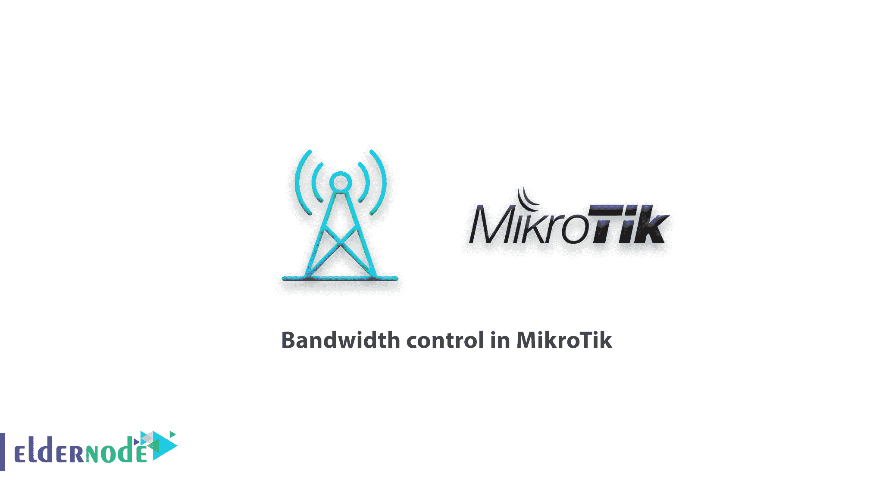
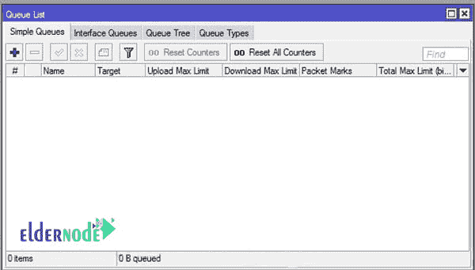
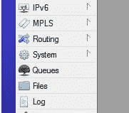
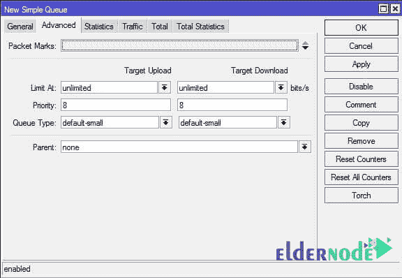
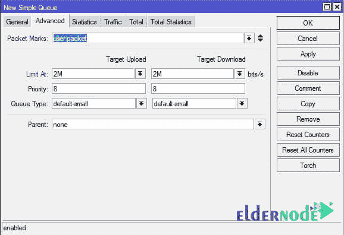

# MikroTik - Tutotial - ElderNode 博客中的带宽控制

> 原文：<https://blog.eldernode.com/bandwidth-control-in-mikrotik/>

[MikroTik](https://blog.eldernode.com/tag/mikrotik/) 中的带宽控制；虽然带宽有限且昂贵，但限制用户的互联网带宽可能是一种具有成本效益的解决方案。另一方面，这种限制也可以让带宽变得公平。

**队列**功能在 MikroTik 中执行带宽控制。

在这个[教程](http://eldernode.com/category/tutorial/)中，我们将看看**的简单队列**特性，尽管队列树特性在 MikroTik 中更加完整，但不是 **MTCNA** 标题的一部分。然而，简单的队列可以满足小型网络的大部分需求。

要从 **winbox** 的左侧菜单创建队列命令，选择 Queue 打开如下所示的窗口。然后转到**简单队列**选项卡，通过**添加**选项添加一个新命令。

在**常规**选项卡中输入队列的自定义名称。

在**目标**部分，我们需要输入源 IP 地址(实际上是我们想要设置速度限制的设备的 IP 地址)。请注意，此部分不接受 IP 范围，您必须输入一个或多个 IP。

##### MikroTik 中的带宽控制

在**夏令时**字段中输入目的地地址。例如，您希望带宽限制仅在用户连接到特定 IP 时应用。通过省略这一部分，带宽限制适用于所有目的。

在**最大限制**部分，您还可以发送和接收目的地址的最大带宽量。

[突发](https://wiki.mikrotik.com/wiki/Manual:Queues_-_Burst)功能使网页浏览速度很高，但当用户下载量大时速度会降低。

在**时间**字段中，您可以指定队列命令有效的时间。

在**高级**选项卡中，您可以将您检查过的数据包交给 **[MikroTik](http://eldernode.com/mikrotik-vps-server/)** 。另外，你可以优先考虑卷。优先级可以从 1 到 8 中选择。一个是最高优先级，八个是最低优先级。事实上，第一个带宽专用于高优先级队列。

### **mikro tik 中的带宽控制示例:**

要控制带宽，只需进入**简单队列**中的**高级**选项卡。选择标记名的**数据包标记**部分，并应用下载和上传限制。

MikroTik 中的带宽控制:

祝您好运