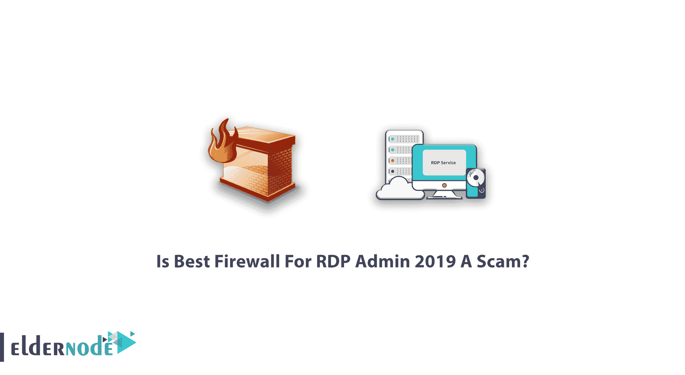
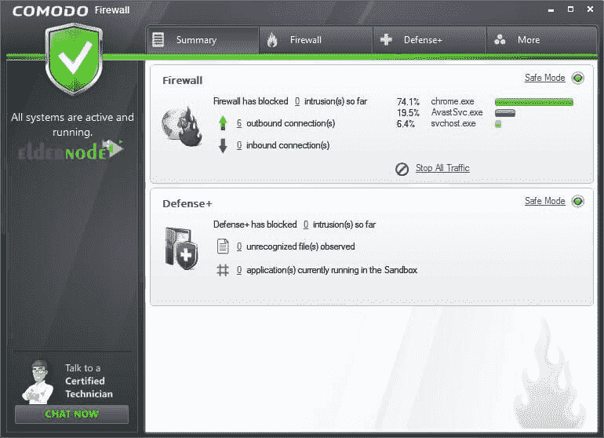
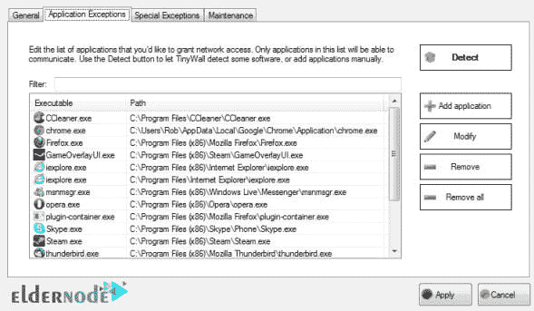
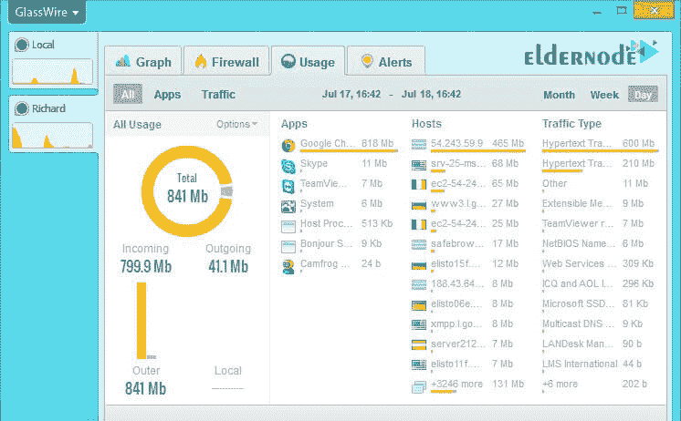
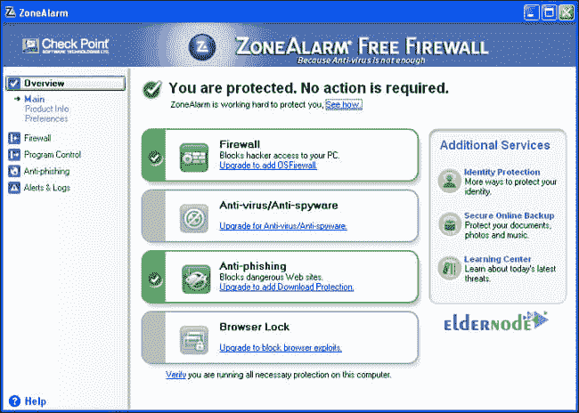
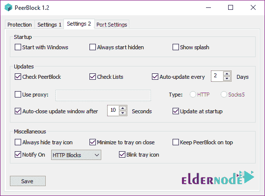

# RDP 政府 2019 年最佳防火墙简介[安全] - Eldernode

> 原文：<https://blog.eldernode.com/best-firewall-for-rdp-admin-2019/>

RDP 管理 2019 视窗最佳防火墙。随着互联网的普及和恶意软件的增多，人们比以往任何时候都更需要防火墙软件。事实上，防火墙是任何网络安全中最重要的部分，因为它充当了内部和外部网络之间的屏障。防火墙的主要用途是阻止黑客攻击以及木马和病毒的进入。通过打开用户计算机上的端口，特洛伊木马可以秘密地传输他们的信息，sniffer‌或数据包分析器可以检测计算机连接中的漏洞，并利用用户的网络。

## Windows RDP 管理 2019 最佳防火墙

在本文中，我们打算介绍 RDP 管理 2019 最佳防火墙。如果您需要[购买 rdp](https://eldernode.com/buy-rdp/) ，您还可以在 [Eldernode](https://eldernode.com/) 中查看可用的包。

尽管这些年来在反病毒和恶意软件检测方面取得了显著的进步，但是对计算机用户来说，使用防火墙软件仍然是必要的；因为不仅网络安全威胁没有停止；相反，它们变得更加现代。

虽然使用正确的防病毒软件肯定可以防止计算机上的恶意操作，但恶意软件可能会通过连接权限欺骗软件，并在网络上创建未经授权的连接。这种不安全的连接可能被滥用来从用户的计算机传输信息。这是防火墙显示其真正价值的地方；因为通过屏蔽某些连接互联网的权限，他们屏蔽了安全攻击对用户系统的渗透。

## RDP 管理 2019 最佳防火墙简介

在本文的后续部分，您将更加熟悉 5 种免费且有用的防火墙，以及它们各自的性能和优缺点。请继续关注我们的这篇文章。

### 1。Commodo 防火墙

防火墙包括虚拟互联网浏览器、广告拦截器、自定义 DNS 服务器、游戏模式和虚拟信息亭，允许用户在进入或退出网络时轻松阻止任何进程或应用程序。这个软件的一个很好的特点是用户可以很容易地将任何程序添加到允许或禁止的程序列表中。此外，Comodo Firewall 通过搜索应用程序的名称，而不是花费数小时与其他智能应用程序识别端口等。当然，如果你需要，这种防火墙也将允许用户使用特殊和高级设置。

Comodo Firewall 还有另一个功能，叫做等级扫描，允许你扫描系统中的所有进程，并检查每个进程的可靠性。当您怀疑系统中有恶意软件时，此功能尤其有用。这款防火墙的另一个高级功能是一个名为 Comodo KillSwitch 的部分，它显示了所有正在运行的程序的列表，用户可以轻松阻止或限制任何他们不需要的程序，并通过该窗口监控所有正在运行的软件和服务。

**优势**

**–**产品价格合理，并针对网络安全领域不专业的人进行了简化。

**–**兼容安全的 Comodo Dragon 浏览器。

**缺点**

**–**自动沙盒系统默认禁用。

**–**易受恶意代码攻击。

[***下载魔岛防火墙***](https://personalfirewall.comodo.com/)

### 2。TinyWall

与其他防火墙软件不同，TinyWal 保护用户的计算机，而不会显示成千上万的通知和查询。该防火墙包括一个扫描程序，在扫描计算机后，将安全程序移动到安全程序列表中。此外，用户可以手动、永久或临时启用进程、服务或文件的防火墙设置。

此外，该防火墙中还提供了一个名为“**自动学习**的模式。在这种情况下，用户学习如何允许应用程序访问网络。因此，它会识别此模式下的程序，并在退出自动学习模式后立即将所有这些程序移到安全程序列表中。

此外，名为 Connections Display 的应用程序会显示所有连接到互联网的活动进程和端口。与在线防病毒软件一样，用户可以通过右键单击任何连接来立即限制该进程或隔离全部病毒。这种防火墙可以检测和阻止病毒和补贴蠕虫的已知隐藏位置，并保护 [Windows](https://blog.eldernode.com/tag/windows/) 防火墙不被更改。

该防火墙的其他用途包括保护密码和主机文件免受不必要的更改。

**优势**

**–**在这款软件中，没有其他防火墙常见的恼人问题。

**–**使用自动学习功能，您可以轻松地从阻止程序列表中排除您想要的程序。

**缺点**

**–**易受恶意代码攻击。

**–**需要互联网连接才能使用的应用程序必须从防火墙设置中排除。

[***下载 TinyWall***](https://tinywall.pados.hu/)

### 3。玻璃丝

这个防火墙有一个非常简单的用户界面，所有程序都运行良好。顶部窗口是一个名为 Graph 的程序，允许用户查看连接到网络的所有程序以及它们消耗的流量类型。在 GlassWire 中，还可以查看连接程序的时刻和过去一个月的连接历史，用户可以观察和查看每个程序第一次连接到网络的情况。在另一个名为防火墙的窗口中，它实际上列出了所有正在运行和正在运行的程序，用户确切地知道每个程序连接到哪个主机。如果它想要阻止该应用程序，单击左侧的图标，该应用程序将立即永久断开互联网连接。

“使用情况”窗口显示数据使用量的确切详细信息，换句话说，就是每个应用程序每天、每周和每月的传入和传出互联网流量。此外，它可以查看所有节目的消费在一起或过滤特定的节目以及流量消费的类型(如 HTTPS 或 mDNS 或 DHCP)。

遗憾的是，免费版的 GlassWire 防火墙没有启用网络窗口；但用户可以通过购买软件来管理所有连接到网络的设备，如果有新设备连接到网络，防火墙会检测并警告它。

警报部分实际上是 GlassWire 防火墙提供给用户的所有警报的收集中心。例如，关于特定应用程序何时以及通过哪个主机首次连接到网络的警告。通过选择软件菜单中的匿名选项，用户可以阻止将所有流量分配给特定应用程序或返回正常模式设置，并通过选择暂停选项，在 24 小时内禁用所有通知。也可以在启动系统时启用防火墙，或者启用和禁用一些通知，如超频带宽警报和代理设置或 DNS 服务器的更改以及 ARP 欺骗警报。

**优势**

**–**用软件工作非常简单。

**–**一键即可屏蔽一个程序。

**缺点**

**–**不幸的是，并不是防火墙的所有部分都是免费的。

**–**不可能同时阻止所有程序。

**–**无法进行高级定制，例如设置阻塞端口的规则。

[***下载玻璃丝***](https://www.glasswire.com/)

### 4。ZoneAlarm Free 防火墙

此防火墙是防病毒软件的初始版本，ZoneAlarm 防火墙已从其防病毒程序中删除。当然，如果用户愿意，他可以在以后添加杀毒程序。安装软件时，用户有两种选择，自动学习和最高安全。第一个选项根据用户的表现应用所需的改变；但是第二个选项允许用户手动控制应用程序的设置或所有设置。

该防火墙可以防止对主机文件的任何恶意更改。通过进入游戏模式部分，用户可以自动管理所有通知，以便不必要的通知不会打扰系统。它还可以防止对密码设置的未经授权的更改，甚至可以向用户的电子邮件发送安全状态报告。用户可以使用 ZoneAlarm 防火墙幻灯片设置轻松定义所有公共或私有网络的安全设置。此外，允许用户在三个非防火墙、中等保护和高安全性选项之间进行选择，在高安全性模式下，这些选项不连接到任何网络，可用于某些目的，如禁止文件共享或打印机。

***注意:*** 安装时，选择自定义安装选项，这样就不会安装除 ZoneAlarm Free Firewall 之外的其他程序。

**优势**

**–**这款防火墙为用户提供了高达 5gb 的免费云存储空间。

**–**它可以很好地兼容许多其他安全软件。

**缺点**

**–**在严格保护模式下，所有应用程序都受到保护，甚至是安全软件。

**–**易受恶意代码攻击。

[***下载中警免费防火墙***](https://www.zonealarm.com/software/free-firewall)

### 5。PeerBlock

这款防火墙与其他防火墙有着本质的区别；因为它不是阻止应用程序，而是阻止所有具有特定属性的 IP 地址。该过程显示防火墙用来阻止用户访问入站和出站连接的所有 IP‌地址的列表。

换句话说，任何列出的不能访问用户计算机的地址都不能通过这些地址连接到网络。**例如**，您可以在该防火墙中创建一个预建列表来阻止各种 IP 地址，如 P2P、商业和培训 ISP、广告或间谍软件。甚至可以屏蔽所有国家和组织。

用户可以在该软件中创建一个自定义地址列表，或者使用 I-BlockList 部分提供的免费目录。用户创建并添加到 PeerBlock 防火墙的列表会定期自动更新，不会受到干扰。

**优势**

**–**这个防火墙可以通过一个按钮轻松打开或关闭。

**–**阻止网站上的大多数广告和弹出窗口。

**缺点**

**–**无售后服务和更新。

**–**用户需要基本的 IT 知识来初始激活防火墙。

[***下载 peer block***](https://www.softpedia.com/get/Internet/File-Sharing/PeerBlock.shtml)

## 结论

防火墙是阻止对计算机的访问并控制网络通信的软件或硬件。防火墙实际上是一种安全工具，可以是软件程序，也可以是专用的网络设备。由于防火墙的重要性，我们试图在本文中为 2019 年 RDP 管理员展示 5 款优秀的防火墙。