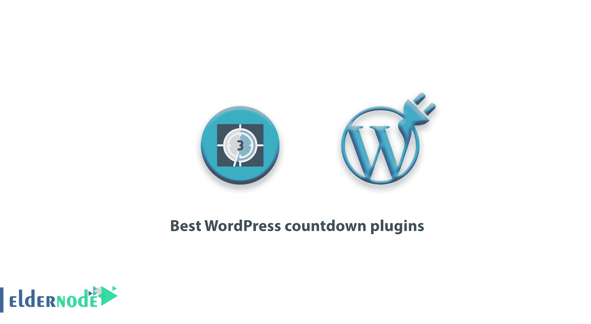
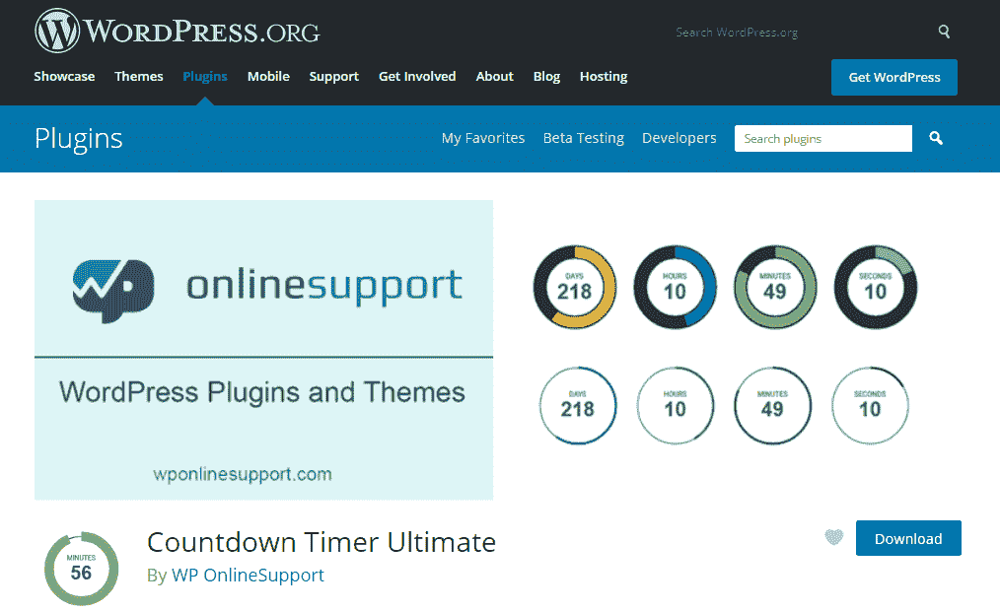
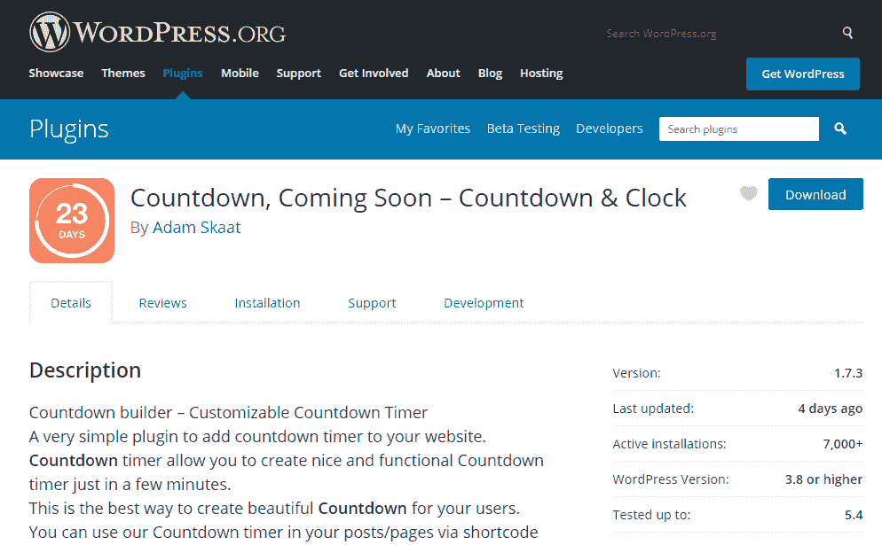
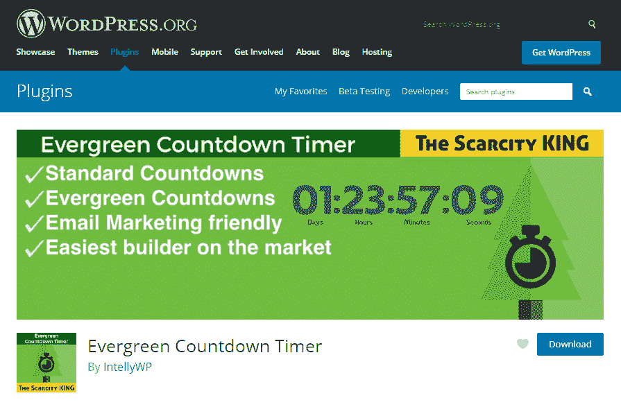

# 最佳倒计时插件

> 原文：<https://blog.eldernode.com/best-wordpress-countdown-plugins/>

介绍最好的 WordPress 倒计时插件，偶尔你可能想在你的网站上给用户制造兴奋感，并把用户的意见集中在一个特定的主题上。你可以用多种方法做到这一点。其中一个方法是在网站上放一个倒计时插件。在 [WordPress](https://eldernode.com/category/wordpress/) 中有许多插件可以在很短的时间内完成这项工作。

倒计时插件有很多，但问题是用哪个，哪个才是我们最好的选择？今天我们将向你介绍一些最好的和最有用的倒计时插件，并告诉你它们的要点和功能，所以加入我们吧。

WordPress 倒计时插件

## 请注意，我们在这篇文章中介绍的所有插件都是完全免费的，你可以通过你的 WordPress 网站或你的 WordPress 知识库轻松下载并激活它们。

**倒计时计时器终极**

我们想为你回顾的第一个插件是[倒数计时终极版](https://wordpress.org/plugins/countdown-timer-ultimate/)，到目前为止已经有超过 20，000 个活跃安装。这个插件的界面非常简单，甚至初学者也可以在自己的网站上轻松使用。

**倒计时**

倒计时也是一个固定的倒计时定时器，让你在尽可能短的时间内建立一个定时器，使用这个插件很容易操作，你不会面临任何困难。这个插件有几个预先设计的风格，如圈数，时钟或翻页很快等。，您可以自定义并在您的站点上使用它。

**长青倒计时器**

这个[插件](https://eldernode.com/category/wordpress/plugins/)与我们已经介绍过的其他插件有一个主要的不同，它是常青树。如上所述，在这个插件的帮助下，你可以向特定的观众显示倒计时。当然，这并不意味着你不能有一个常规计时器，因为[常青树倒计时器](https://wordpress.org/plugins/intelly-countdown/)也可以创建一个常规计时器。

成为老人..

Be Eldernode..