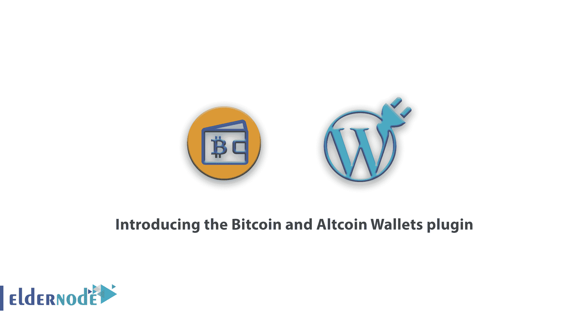

# 介绍比特币和 Altcoin 钱包插件- Eldernode

> 原文：<https://blog.eldernode.com/bitcoin-and-altcoin-wallets-plugin/>

如果你正在为数字货币市场建立一个网站，你肯定需要选择 WordPress 数字货币插件。也许一个插件就足够了，或者你可能需要两个甚至三个插件。虽然一些数字货币的 WordPress 模板有许多适合数字货币的特性，但是其他的可能需要其他插件。在本文中，我们将向您介绍比特币和 Altcoin 钱包插件。如果需要购买[比特币 VPS](https://eldernode.com/bitcoin-vps/) 服务器，还可以在 [Eldernode](https://eldernode.com/) 中看到可用的包。

### 数字货币简介

随着对数字货币的需求不断增加，不仅每个人都在谈论 BTC 和 Altcoin，而且许多网站都在向接受数字货币支付的方向发展。除了通常的模板和插件，数字货币模板和插件也在不断扩展，以满足大量用户的需求。

总之，创建一个虚拟货币行业的网站比你想象的要容易。有了这些工具，你的商业想法将在最短的时间内实现。有了比特币和 Altcoin 钱包插件，你可以轻松拥有一个独特的数字货币网站，探索在线世界。你可以利用这个神奇的比特币和数字货币插件，创建伟大的 WordPress 网站。

## 推出比特币和 Altcoin 钱包插件

比特币和替代币钱包是一个免费的插件，允许你买卖比特币、替代币和其他数字货币。比特币和替代币钱包是一个免费的 WordPress 插件，允许你买卖比特币、替代币和其他数字货币。有了这个插件，你要为你的用户账户负责，dashed-slug.net 不承担这方面的任何责任。这个插件有很高的安全性，但是它的完全安全性取决于你的站点的安全性。因此，作为站点管理员，你必须采取所有必要的措施来保护你的 WordPress 站点。

### 比特币和 Altcoin 钱包插件有什么特点？

比特币和 Altcoin 钱包插件的重要功能包括:

**1。**编码简单。使用短代码，您可以显示前端用户界面，并允许用户执行以下操作:

**–**查看交易历史

**–**转到外部区块链地址

**–**向其他用户转账的能力

**–**来自 Blackchin 的存款

**2。**允许事务的备份和恢复。

**3。**允许您配置电子邮件。

**4。**可以通过管理界面确认交易。

**5。**访问拥有钱包的用户的功能以及他们所做的事情。

**6。**通过管理可以对用户进行计费。

7 .**。**允许您通过 PHP 编程接口进行交易。

**8。**它具有可扩展的架构，因此可以安装一个适配器硬币来使用其他数字货币。

你可以通过访问[比特币和比特币钱包插件下载](https://wordpress.org/plugins/wallets/)链接，在你的 WordPress 网站上轻松使用这个插件。

## 结论

加密货币的用户需要各种插件来增加隐私，在浏览器中进行数字货币支付，并查看这些货币在市场上的价格。与您的财务问题相关的数字货币插件。所以在安装这样的插件之前，最好做好必要的安全措施。这个领域最安全的插件之一就是比特币和 Altcoin 钱包。在这篇文章中，我们试图向您简要介绍 BTC 和 Altcoin 钱包插件的功能。