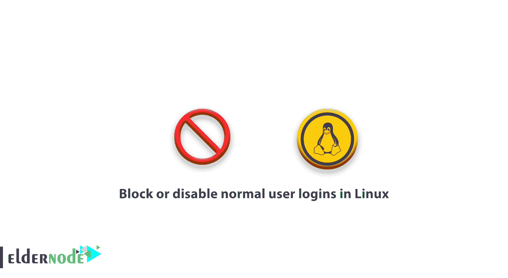

# 如何在 Linux - Eldernode 中阻止或禁用普通用户登录

> 原文：<https://blog.eldernode.com/block-disable-user-logins-linux/>



一个 Linux 系统管理员需要知道一些 Linux 技巧。在本文中，您将学习如何在 Linux 中阻止或禁用普通用户登录。您可能会遇到问题，并执行计划的系统维护。在这里，您可以防止非 root(普通)用户连接到系统。所以跟着这个教程来复习一下 Linux 中的 **/etc/nologin** 文件和 **nologin** shell 阻止非 root 用户的功能。此外，您需要知道应该设置什么消息来帮助用户了解实际发生了什么。

**您可能会感兴趣:**

[在 Ubuntu 20.04](https://eldernode.com/enable-root-login-via-ssh-in-ubuntu-20/) 中通过 SSH 启用 Root 登录

[教程 linux 上连接 ssh](https://eldernode.com/tutorial-connect-to-ssh-on-linux/)

[如何暂时或永久禁用 SELinux](https://eldernode.com/disable-selinux-temporarily-permanently/)

## 如何在 Linux 中阻止或禁用普通用户登录

让我们来看一下您可以在 Linux 服务器上**阻止或禁用**用户无法登录的方法。

### 如何使用/etc/nologin 文件阻止用户登录

显示消息是 **/etc/nologin** 文件的主要功能，用于关机过程中试图登录系统的用户。每当用户查看此消息时，他们将无法登录系统。因此，要通过手动创建来阻止用户登录，请使用下面的命令。

```
vi /etc/nologin 
```

如果要向试图登录系统的用户显示，可以将下面的消息添加到文件中。

```
The Server is down for a routine maintenance. We apologize for any inconvenience caused, the system will be up and running in 1 hours time. For more information, contact the system admin **[[email protected]](/cdn-cgi/l/email-protection)**.
```

### 

[购买虚拟私服](https://eldernode.com/vps/)

### 如何使用 nologin Shell 阻止用户登录

因为这种方法只阻止一个用户访问 shell，所以它的工作方式略有不同。该功能的方式是用户可以通过诸如 **ftp** 之类的程序登录到系统，这些程序不一定要求用户使用外壳来连接到系统。这种方法的另一个特性是，您可以允许在特殊情况下阻止特定用户访问 shell。

#### 上 RHEL/CentOS/Fedora

此时，您看到您可以将 **/etc/passwd** 文件中的用户 shell 从/ bin/bash 或 /bin/sh 更改为/sbin /nologin，意思是拒绝登录，使用**chsh**([**change shell**](https://linuxhandbook.com/change-shell-linux/))命令。

```
chsh -s /bin/nologin noodi 
```

#### 在 Debian/Ubuntu 上

以下命令的作用是将用户 **eldernode 的** shell 更改为 /bin/false ，表示不做任何事情。

```
sudo chsh -s /bin/false noodi
```

如果你需要更多的阅读，请跟随 [Linux 窍门](https://eldernode.com/tag/linux-tricks/) 。

亲爱的用户，我们希望你喜欢这个教程，你可以在评论区提出关于这个培训的问题，或者解决 [Eldernode](https://eldernode.com/) 培训领域的其他问题，请参考 [提问页面](https://eldernode.com/ask) 部分并在其中提出你的问题。