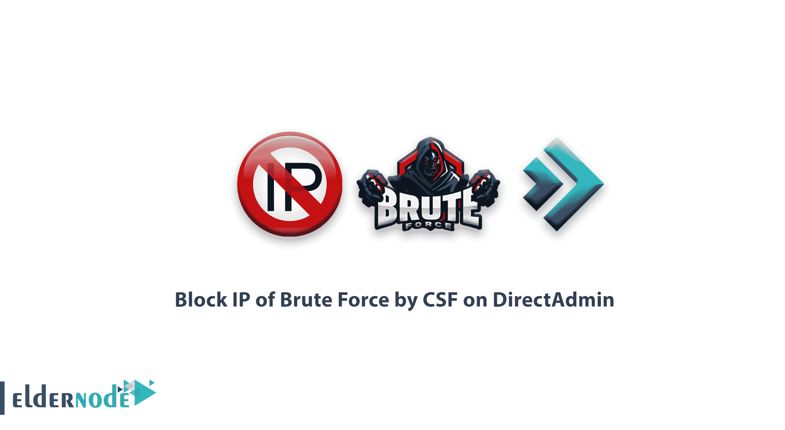

# 如何在 DirectAdmin | Eldernode 上用 CSF 屏蔽暴力破解 IP

> 原文：<https://blog.eldernode.com/block-ip-of-brute-force-by-csf/>



在本文中，我们将在 [**Linux VPS**](https://eldernode.com/linux-vps/) 服务器和[专用](https://eldernode.com/dedicated-server/) Linux 服务器上，通过 [DirectAdmin](https://eldernode.com/directadmin-vps-server/) 自动教程**拦截暴力破解 IP。**

## 在 DirectAdmin 上通过 CSF 阻止暴力 IP 的教程

对于 [CFS](https://download.configserver.com/csf/) 的暴力自动 IP 拦截，执行以下步骤:

1。首先转到下面的路径:

```
cd /usr/local/directadmin/scripts/custom/ 
```

2。开始之前，按照以下说明备份 block_ip.sh 和 unblock_ip.sh 文件:

```
cp block_ip.sh block_ip.sh.bak  cp unblock_ip.sh unblock_ip.sh.bak 
```

上述文件可能不存在于“usr/local/direct admin/scripts/custom”路径中，在这种情况下，您会遇到以下错误。显示错误不会在过程的继续中引起任何问题。

```
cp: cannot stat `block_ip.sh': No such file or directory  cp: cannot stat `unblock_ip.sh': No such file or directory 
```

3。使用以下命令下载适当的版本:

```
cd /usr/local/directadmin/scripts/custom/  wget -O block_ip.sh http://files.plugins-da.net/dl/csf_block_ip.sh.txt  wget -O unblock_ip.sh http://files.plugins-da.net/dl/csf_unblock_ip.sh.txt  wget -O show_blocked_ips.sh http://files.plugins-da.net/dl/csf_show_blocked_ips.sh.txt  chmod 700 block_ip.sh show_blocked_ips.sh unblock_ip.sh 
```

4。使用以下命令在根路径中创建名为 blocked_ips 和 exempt_ips 的文件:

```
touch /root/blocked_ips.txt  touch /root/exempt_ips.txt
```

到目前为止，IP 没有被 CSF 自动阻止，只有一个按钮在暴力监视器中为管理员创建，以阻止所需的 IP。为了让 IPs 自动拦截，您需要安装以下脚本，并遵循以下步骤。

5。进行自动 IP 拦截并运行以下命令:

```
cd /usr/local/directadmin/scripts/custom  wget -O brute_force_notice_ip.sh http://files.directadmin.com/services/all/brute_force_notice_ip.sh  chmod 700 brute_force_notice_ip.sh
```

6。为了不使用 CSF 覆盖 iptables 的角色和作用，在服务器上借助以下命令关闭该服务的执行。

```
chkconfig iptables off  chkconfig ip6tables off    mv /etc/init.d/iptables /etc/init.d/iptables~moved  echo -e '#!/bin/bash\nexit 0;' > /etc/init.d/iptables  chmod 755 /etc/init.d/iptables    chkconfig iptables on  chkconfig ip6tables on  service iptables start
```

7 .。完成后，确保 IP 被正确阻止。尝试以下命令:

```
csf –g IP
```

如有疑问或问题，可向[提问系统](https://eldernode.com/ask/)咨询，提供指导。