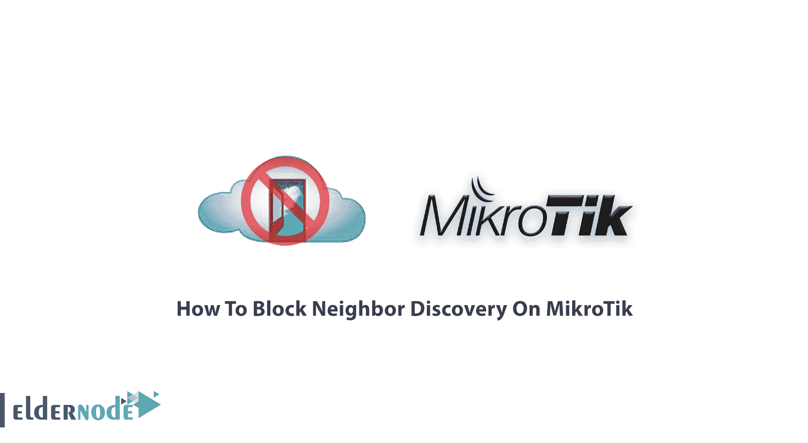
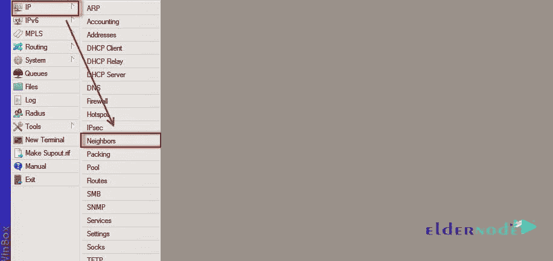
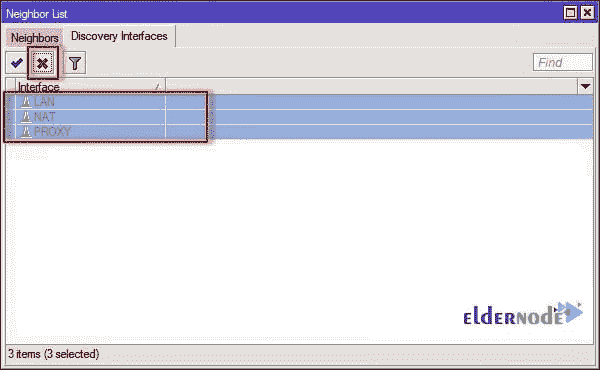

# 如何阻止 MikroTik - Eldernode 博客上的邻居发现

> 原文：<https://blog.eldernode.com/block-neighbor-discovery-on-mikrotik/>



在为 Mikrotik 使用 Winbox 时，您会发现邻居是它的功能之一。**M**ikro tik**N**eighbor**D**is covery**P**rotocol(MNDP)负责探索 Mikrotik，帮助你在网络中轻松找到你的 Mikrotik。加入我们这篇文章，看看为什么你需要阻止它和如何！为了让本指南更好地发挥作用，请购买您自己的 [Mikrotik VPS](https://eldernode.com/mikrotik-vps-server/) 服务器服务。一旦你准备好了你的简历，我们的团队就可以回答你的问题。您还可以在 [Mikrotik 教程](https://blog.eldernode.com/tag/mikrotik/)页面上获得所有基本指南。

## 如何在 MikroTik 上阻止邻居发现

邻居发现用户面临的主要挑战是，当他们在互联网上有一个 Mikrotik 时，这意味着每个人都能够通过邻居发现访问它。正如你所猜测的，这似乎有点可怕，因为你的 Mac 地址和 Mikrotik 信息很容易被黑客窃取。

**解决办法是什么？**

很明显，您需要**禁用**该协议，以防止您的 Mikrotik 通过 Winbox 被发现，并且邻居发现部分只能通过输入您的 [IP 地址](https://blog.eldernode.com/ip-settings-in-mikrotik/)来连接它。

## 在 Mikrotik 上阻止邻居发现的方法

有两种**方法**可以在您的 Mikrotik 上阻止邻居发现。

**1)** 通过 **WinBox** 阻止邻居发现

**2)** 通过 **Mikrotik 终端**阻止邻居发现

让我们看看您应该如何使用这些解决方案，以及它们是如何工作的。

### 阻止通过 WinBox 发现邻居

在本部分中，您将了解 Mikrotik 上阻止邻居发现的第一种方法。让我们回顾一下完整学习所需的以下步骤。

首先，你应该通过 Winbox 连接到你的 mikrocontroller 来阻止 MNDP。

**2)** 从 IP 菜单中点击邻居。



**3)** 现在，转到“发现接口”选项卡。

**4)** 在最新的步骤中，您可以选择任何一个您想要禁用 MNDP 协议的接口，方法是单击如下所示的禁用图标。

*注意*:如果你想永久禁用 MNDP 协议，你应该**禁用**所有可用的接口。



### **闭塞(ND)通过**端子

现在，让我们回顾一下 Mikrotik 上阻止邻居发现的第二种方法是什么。再次注意下面的路径。

**步骤 1** :打开 Mikrotik 终端，输入以下命令:

```
ip neighbor discovery set ether1 discover=no
```

**注意**:用 **ether1** 替换你的接口名

**步骤 2** :要检查接口发现的状态，请键入:

```
ip neighbor discovery print
```

就是这样！邻居发现现已被阻止！

## 结论

在本文中，您了解了如何在 MikroTik 服务器上阻止邻居发现。使用上述方法有助于禁用 MNDP 协议。您可以确保您的微控制器不再能够发现其他相邻的微控制器。另外请注意，一旦阻止邻居发现，您将无法再访问其他设备。