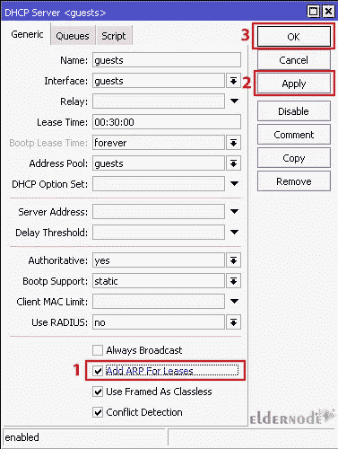
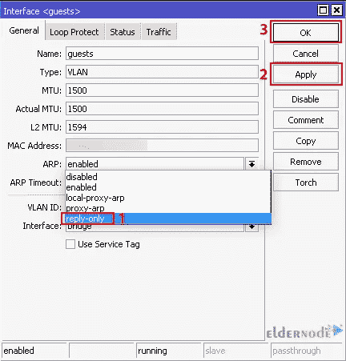

# 教程拦截 MikroTik 路由器上的静态 IP 用户

> 原文：<https://blog.eldernode.com/block-static-ip-users-on-mikrotik-routers/>

MikroTik 是一个基于 Linux 内核的服务器，您可以在普通计算机上以完全稳定的方式安装和维护它。MikroTik 拥有完善的防火墙系统来增加其网络的安全性。一般来说，它是任何 MikroTik RouterOS 最重要的部分之一，允许您设置网络和 IP 的访问。如果需要屏蔽静态 IP 用户，可以使用 MikroTik RouterOS 的防火墙系统。本文将教你如何在 MikroTik 路由器上拦截静态 IP 用户。如果你打算购买一台 **[Mikrotik VPS](https://eldernode.com/mikrotik-vps-server/)** 服务器，你可以查看一下 [Eldernode](https://eldernode.com/) 网站上提供的套装。

## **如何在 MikroTik 路由器上拦截静态 IP 用户**

### **什么是静态 IP？**

网络管理员应该建立网络安全。开始这个过程最简单也是最重要的一步是阻止静态 IP 用户。Mikrotik 拥有强大的防火墙，可帮助您阻止 IP 用户。这样做的原因是防止用户绕过您的队列。不能更改使用静态 IP 地址的设备。不能更改使用静态 IP 地址的设备。但是大多数设备使用动态 IP 地址，这些地址是在连接时由网络分配给它们的，并且会随着时间而变化。

## **拦截 MikroTik 路由器上的静态 IP 用户**

首先，进入 **Winbox** 双击你的 IP，选择 **DHCP 服务器**。然后，您应该选中**为租赁添加 ARP 的**框:

现在你所要做的就是回到 **Winbox** 并导航到**界面**部分。双击运行 DHCP 服务器的接口。它可以是一座桥，也可以是一座 VLAN。最后，在 ARP 部分的下拉菜单中，选择**仅回复**并点击**应用**:

以上就是关于在 Mikrotik 路由器上拦截静态 IP 用户的全部内容！

## 结论

为了确保网络安全，网络管理员应该阻止用户使用静态 IP 地址。在本文中，我们教您如何在 Mikrotik 路由器上拦截静态 IP 用户。我希望这篇教程对你有用，并且能帮助你阻止使用静态 IP 地址的用户。如果您有任何问题或建议，可以在评论区联系我们。