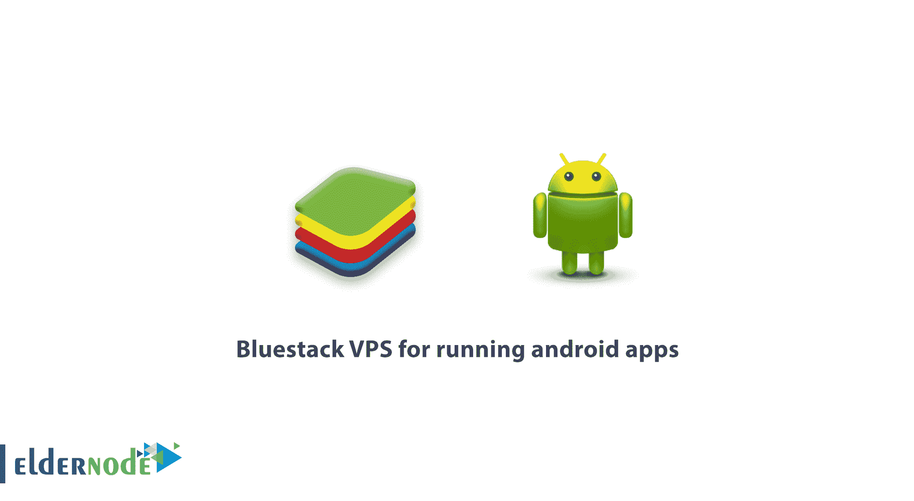

# 运行 android 应用的 blue stack VPS-elder node 博客

> 原文：<https://blog.eldernode.com/bluestack-vps-for-running-android-apps/>

如何**购买 Bluestack VPS 用于运行 android 应用**,[**blue stack VPS 服务器**](https://eldernode.com/bluestacks-vps/) 是为需要 VPS 服务器与 Android 模拟器一起工作的用户准备的。您可以查看 [Eldernode](https://eldernode.com/) 中提供的包来购买 Bluestack VPS 服务器。

为什么要买 Bluestack VPS 来运行 android 应用？

通过购买 BlueStacks [**VPS 服务器**](https://eldernode.com/vps/) 你可以很容易地运行非常高速 VPS 的 BlueStacks Android 模拟器软件。

运行 Bluestacks 所需的配置:

该 Bluestack 服务的最低系统要求是 2 GB 内存的 Windows VPS 2012 R2。

您可以从以下地址订购 Bluestack VPS:

[**订单现在**](https://my.eldernode.com/cart.php?gid=8)