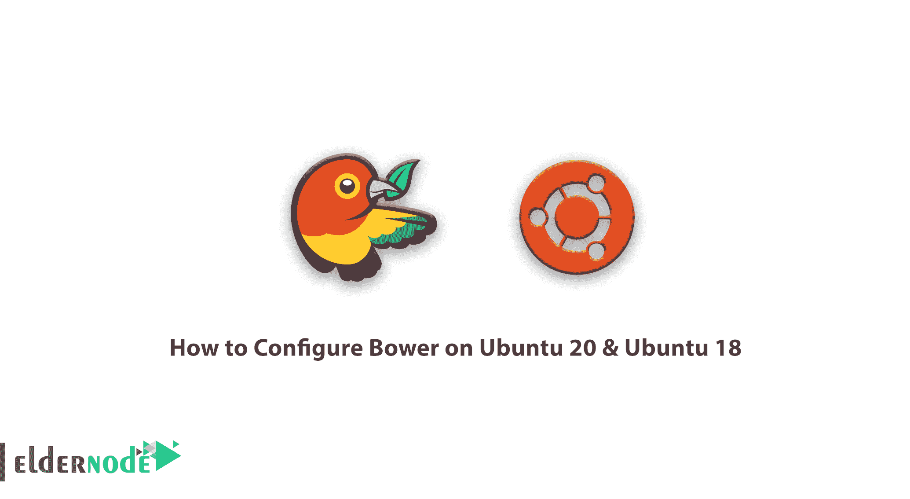

# 如何在 ubuntu 20 ubuntu 18 - Eldernode 上配置 Bower

> 原文：<https://blog.eldernode.com/bower-on-ubuntu-20-ubuntu-18/>



一步步学习**如何在 ubuntu 20 ubuntu 18 Linux** 上配置 Bower。由于 web 的不断增长和编程的不断发展，人们越来越需要工具来自动安装、更新和管理项目中使用的库和外围设备。Bower 是用来帮助解决这个问题的工具之一。Bower 是客户端技术的包管理器。它也有能力安装，搜索和删除 Javascript，HTML，CSS 库。在这篇文章中，我们试图教你如何在 ubuntu 20 ubuntu 18 上配置 **Bower。你可以在 [Eldernode](https://eldernode.com/) 看到可以购买 [Ubuntu VPS](http://eldernode.com/ubuntu-vps/) 服务器的包。**

## 凉亭有什么好处？

**1。**用一个命令行安装工具和库！

**2。使用 Bower 在尽可能短的时间内跟踪不同站点上的库版本并检查是否有更新，而不是这样。**

**3。**离线安装:当第一次安装一个库时，它将被缓存，下一次它将使用缓存安装相同的库，当然还有相同的版本，除非用户已经显式清空缓存。

**4。**安装依赖库:如果一个库依赖于其他库(比如 jQuery 上的 Twitter Bootstrap 依赖)，依赖项会自动安装。

在安装 Bower 之前，必须在系统上安装 [Nodejs](https://blog.eldernode.com/install-and-config-node-js-on-ubuntu-20-04/) 和 Git 工具。

### 如何**安装节点。JS on Ubuntu**20&Ubuntu 18

在安装 Bower 之前，必须先安装 Node.JS. Install Node。使用以下命令在 Ubuntu 20 或 18 上运行 JS:

```
sudo apt-get install python-software-properties  curl -sL https://deb.nodesource.com/setup_12.x | sudo -E bash -  sudo apt-get install nodejs
```

检查**节点。JS** 和 **NPM** 版本使用以下命令来确保它们被正确安装:

```
node --version
```

```
npm --version
```

## **如何在 ubuntu 20 上安装 Bower Ubuntu 18**

在 Ubuntu 上成功安装 node.js 和 npm 之后，现在可以使用以下命令安装 Bower 了:

```
sudo npm install -g bower
```

执行上述命令后，Bower 将成功安装在您的 Ubuntu 系统上。您可以使用以下命令找到 Bower 版本:

```
bower --version    1.8.8
```

## 教程在 ubuntu 20 ubuntu 18 上配置 Bower

最后，您可以使用以下命令修改目录配置权限:

```
sudo chown -R $ (whoami): $ (whoami) ~ / .config
```

您可以使用以下命令来了解关于 Bower 的更多信息:

**用法:**

鲍尔[] []

***命令:***

缓存管理 bower 缓存

帮助显示关于鲍尔的帮助信息

主页在您最喜欢的浏览器中打开软件包主页

特定包的信息信息

init 交互创建一个 bower.json 文件

安装在本地安装软件包

链接符号链接一个包文件夹

列出本地软件包和可能的更新

使用 GitHub 进行登录验证并存储凭证

按名称查找单个包的 URL

清理会删除本地无关包

挂号邮寄包裹

搜索按名称搜索包

更新更新本地包

卸载删除本地软件包

取消注册从注册表中删除软件包

版本碰撞包版本

***选项:***

-f，–force 使各种命令更加有力

-j，–json 输出可消耗 JSON

-l，–log level 报告什么级别的日志

-o，–脱机时不要访问网络

-q，–quiet 仅输出重要信息

-s，–silent 不输出任何内容，除了错误

-V，–verbose 使输出更加详细

–allow-root 允许以 root 用户身份运行命令

-v，–版本输出 Bower 版本

–无色禁用颜色

有关特定命令的更多信息，请参见 **bower help** 。

## 结论

Bower 是一个客户端管理工具，使用它，您可以通过一个简短的命令轻松地在您的项目上安装各种 HTML、CSS、Javascript 库或任何框架。在 Bower 中，您可以使用任何带有简短命令行的工具。您可以轻松地升级使用此软件包管理器添加的工具或升级到更高版本。安装完库和其他工具后，下次就不需要互联网连接了。Bower 执行缓存步骤，你可以让你想要的库离线。在本文中，我们试图教你如何在 Ubuntu 18 和 20 上安装和配置 Bower。