# 如何在 Windows VPS 上的 IIS 上建立站点- Eldernode 博客

> 原文：<https://blog.eldernode.com/build-site-on-iis-on-windows-vps/>

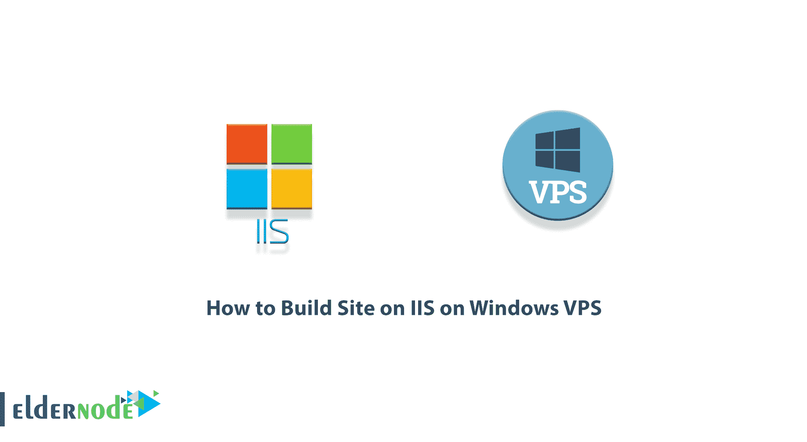

网络管理员的任务不是设计和构建，而是网站管理和如何可用。每个网站都由文件组成，这些文件被设计为传送给安装了 IIS 的服务器。所以在收到文件后，你需要把它们放在你的网络驱动器上。将文件复制到 web 服务器的驱动器后，您可以进行以下培训。在这篇文章中，我们打算教你如何在 Windows VPS 上的 IIS 上构建站点。你可以从 [Eldernode](https://eldernode.com/) 中可用的包中访问 [**Windows VPS**](https://eldernode.com/windows-vps/) 服务器。

## **教程在 IIS 上构建站点在 Windows VPS 上**

### **IIS 简介**

IIS 代表互联网信息服务。Microsoft Web 服务器安装在 Windows 操作系统上。安装这个 web 服务器后，包括 HTTP 和 HTTPS (web 显示协议)FTP 和 FTPS(文件传输协议)等 Web 协议，以及 SMTP，使用 ASP Classis、ASP.NET 和 PHP 等服务器端编程语言，可以让用户使用 MS SQL 和 MySQL 等数据库以及许多其他功能。

安装此 web 服务器后，Microsoft 编程协议和语言(ASP.NET)等一些功能将成为默认程序。需要注意的是，数据库、PHP 编程语言等功能要在安装 webserver 之后再安装在上面。

继续和我们一起教你如何一步一步地在 windows VPS 上的 IIS 上创建一个网站。

## **如何在 Windows VPS 上的 IIS 上创建网站**

在这一节中，我们想一步一步地教你如何在 Windows VPS 上的 IIS 上构建一个站点。为此，只需遵循以下步骤。

第一步是登录到 **Windows VPS 服务器**。所以在你的[窗口](https://blog.eldernode.com/tag/windows/)，从**开始菜单**，搜索**远程桌面连接**然后打开。在打开的窗口中，输入服务器的 IP 并点击**连接**。您将看到您成功地进入了服务器环境。

第一步是通过在搜索栏中键入“ **IIS** ”来打开**互联网信息服务** (IIS)。

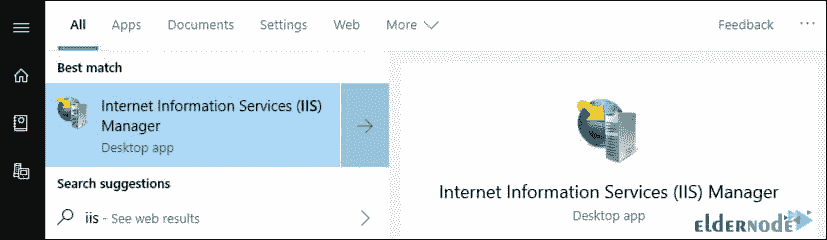

然后你必须右击目录列表中的**站点**，然后选择**添加网站**。

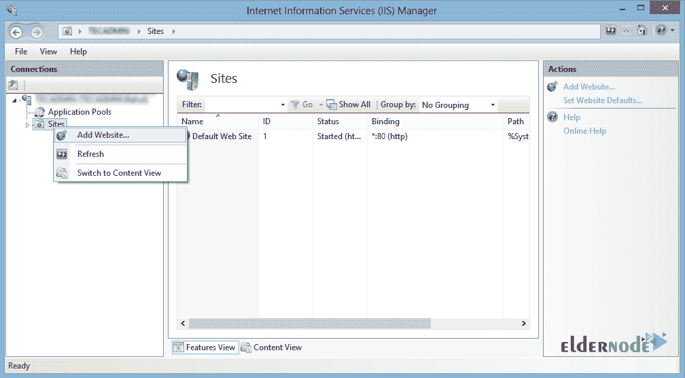

现在，在打开的窗口中，您必须首先在**站点名称**字段中添加网站名称。

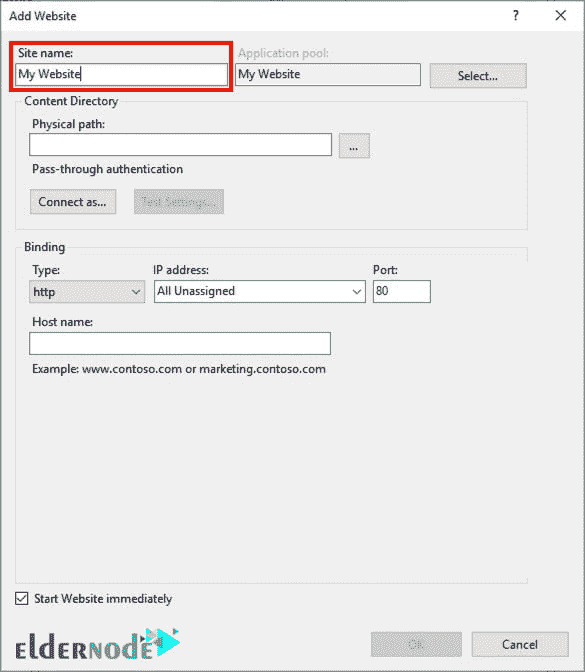

在**物理路径**字段，您必须为您的网站文件指定一个目录。

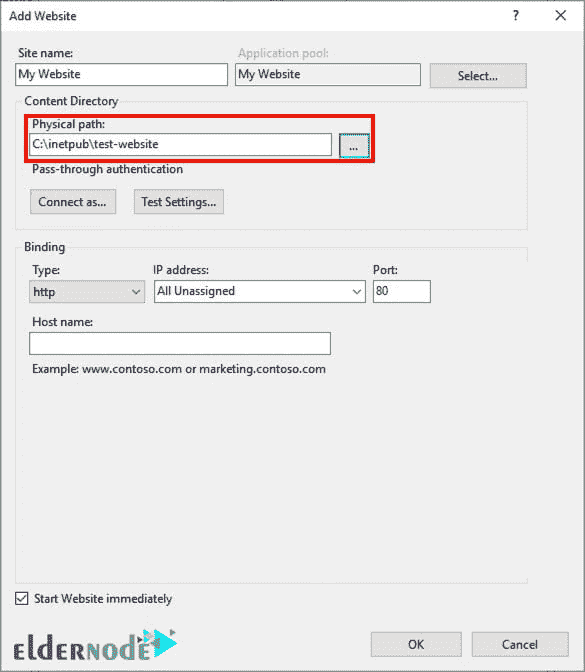

在**绑定**部分，您必须选择**类型** (HTTP 或 HTTPS)、 **IP 地址**、**端口、**和**主机名**，如下图所示。

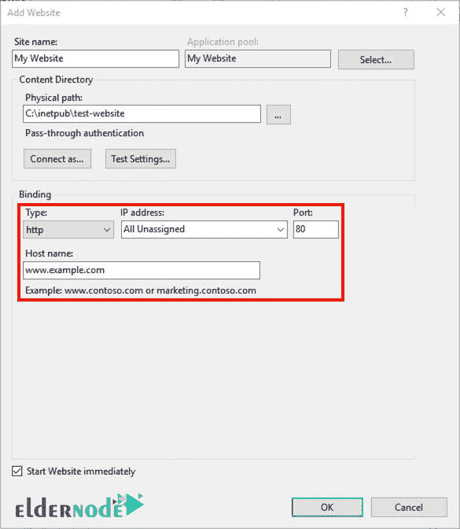

建立或不建立网站时要考虑的重要事情。请注意，如果您想立即启动网站，您必须选择**立即启动网站**复选框。否则，取消选中它。

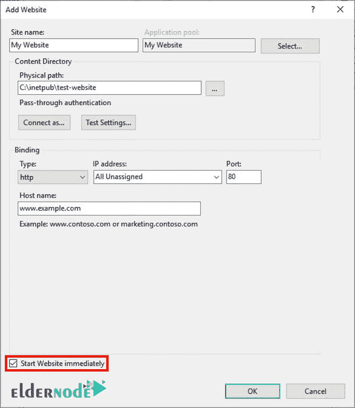

最后，点击 **Ok** ，网站建设过程完成。

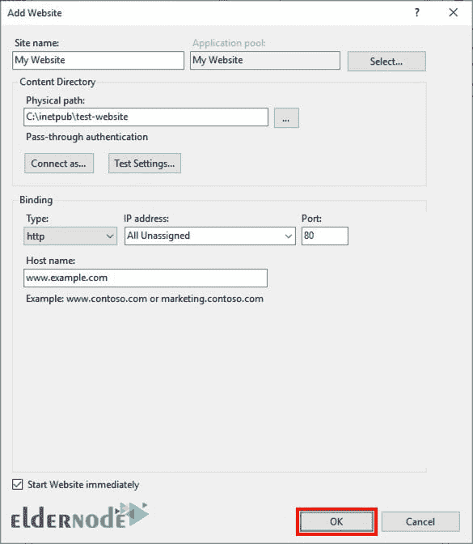

成功完成上述所有步骤后，在**添加网站**窗口关闭后，您将在网站列表中看到您的新网站。

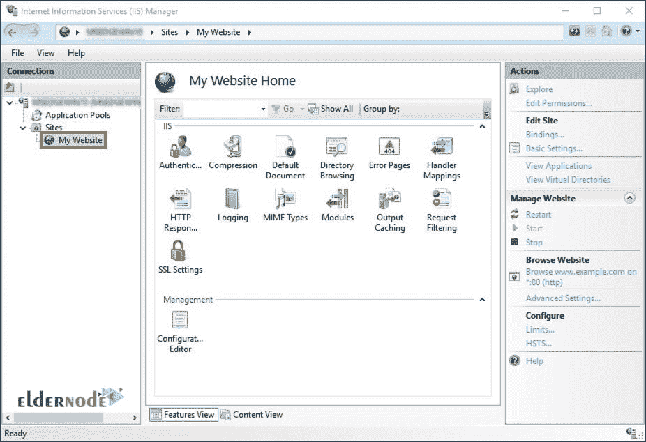

### **如何添加网站别名**

在上一节学习了如何在 Windows VPS 上的 IIS 上创建一个网站之后，我们现在想教你如何绑定。如果您想添加网站别名，如“**www.eldernode.com**”，您可以选择您的网站，然后点击右栏中的**绑定**，如下所示。

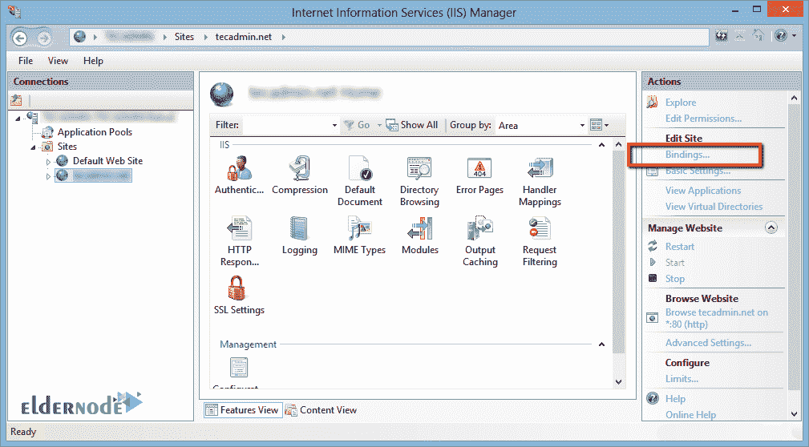

在打开的窗口中，点击**添加**打开站点绑定框。

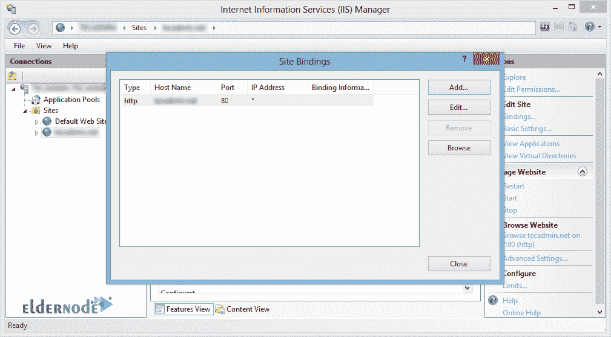

正如您在**主机名**字段中看到的，您可以输入您的站点别名，如 demo.eldernode.com 和**等等。最后，点击**确定**。**

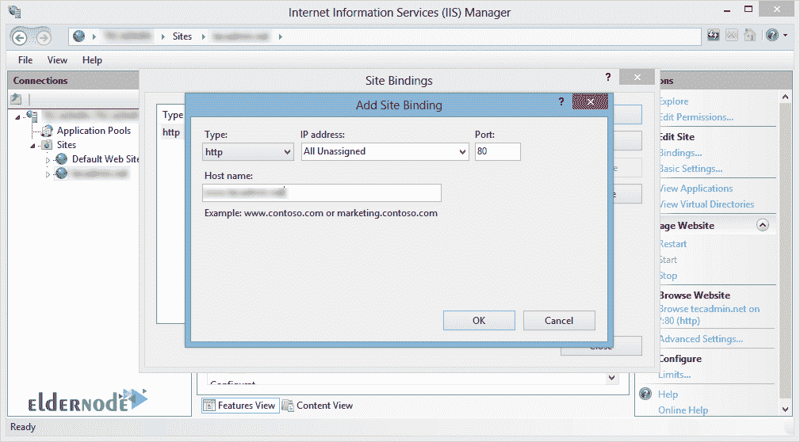

## 结论

对于访问网站的用户来说，网站必须托管在某种 web 服务器上。如果要使用 ASP.NET 创建网站或 web 应用程序，您可能需要在本地设备上安装 Internet 信息服务(IIS)以进行开发和测试。在本文中，我们试图在介绍 IIS 之后，一步一步地教你如何在 Windows VPS 上构建一个基于 IIS 的站点。