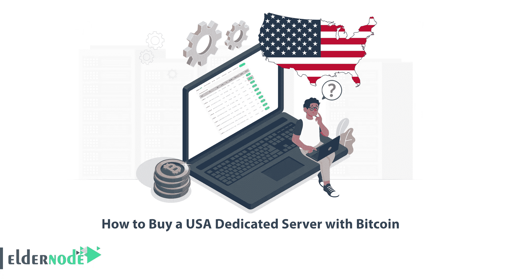
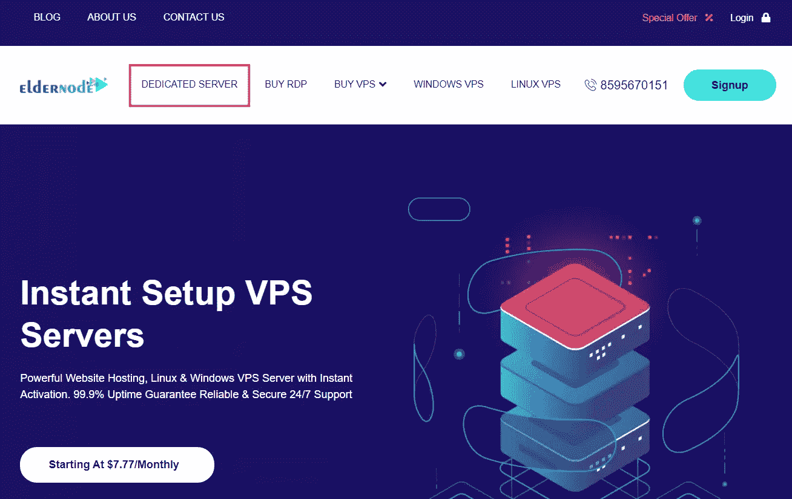
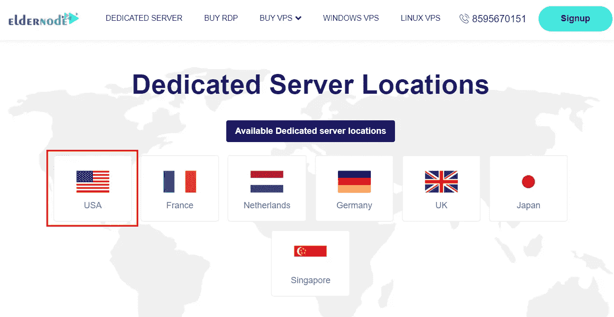
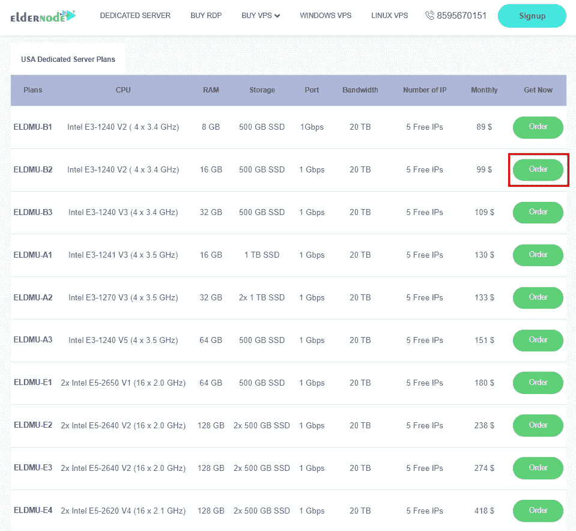
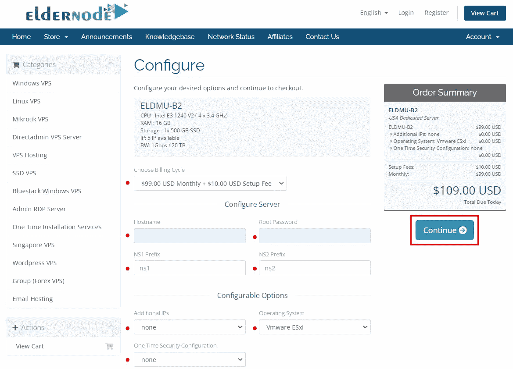
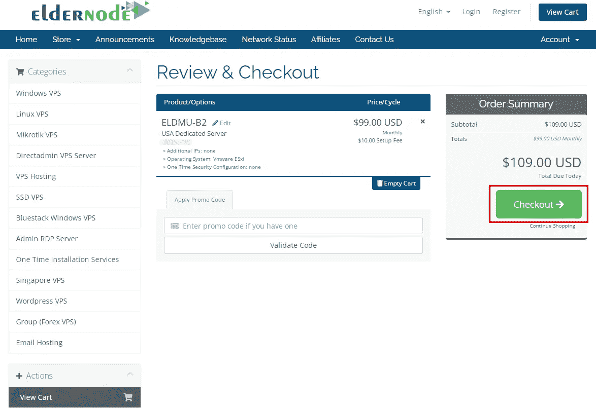
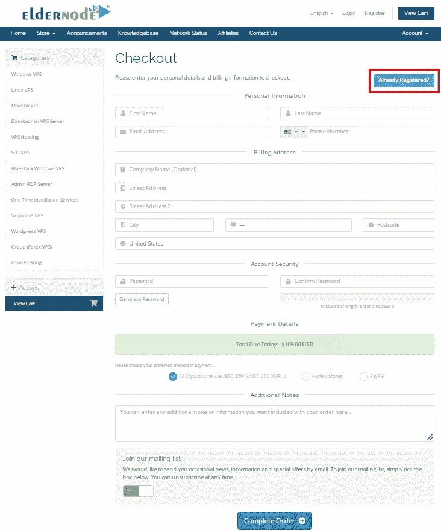
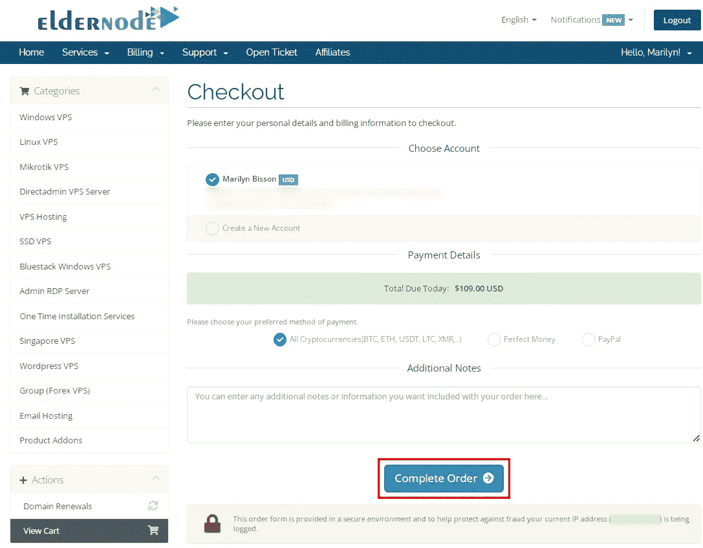
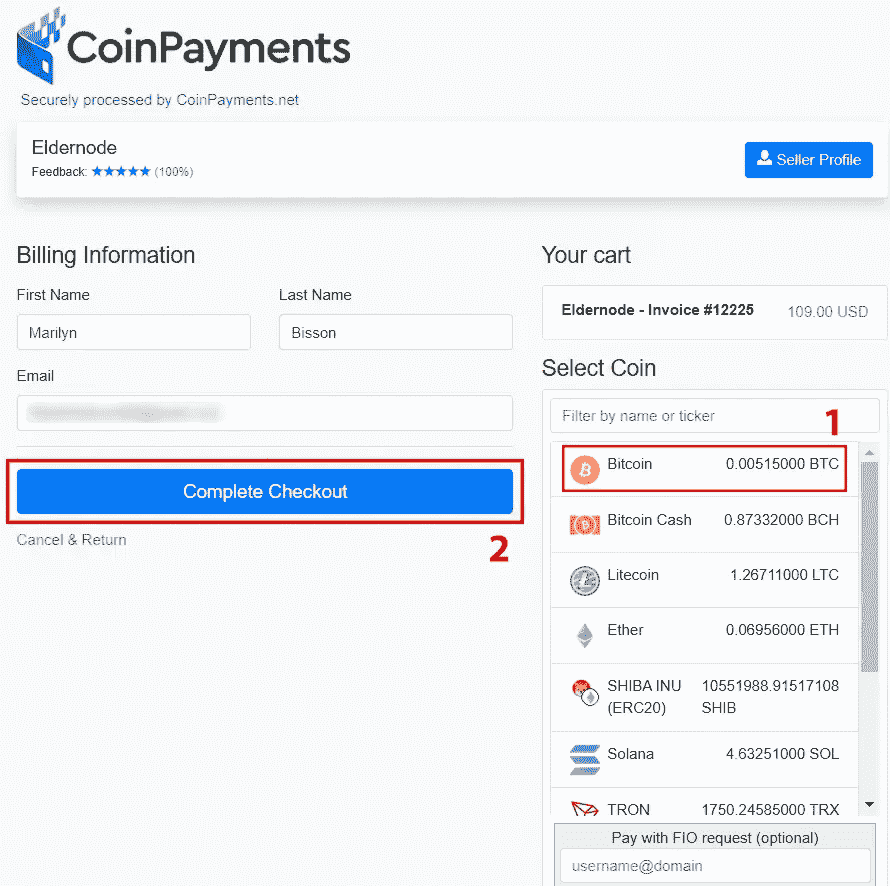
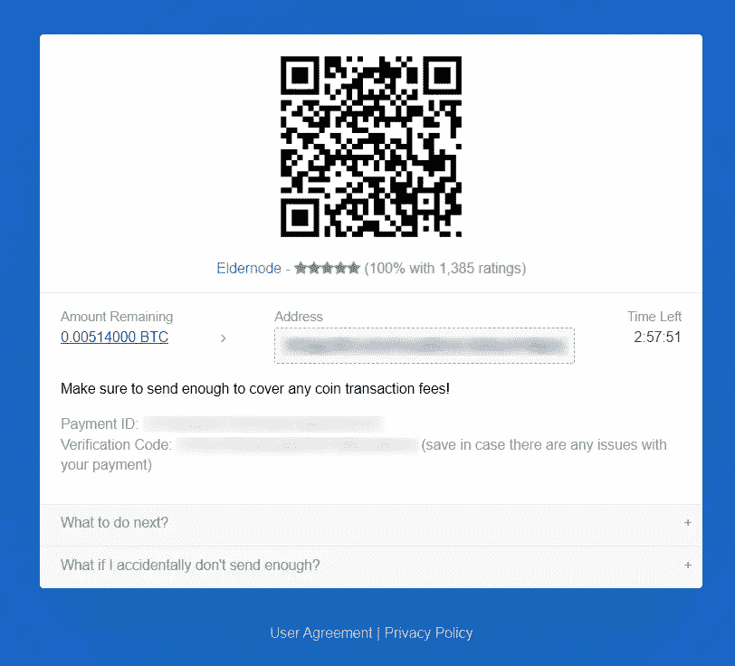

# 如何用比特币购买美国专用服务器

> 原文：<https://blog.eldernode.com/buy-a-usa-dedicated-server-with-bitcoin/>

选择最佳类型的托管服务是网站所有者在推出新网站时面临的首要和最重要的决定之一。尽管有许多选择最佳主机类型的选项，但没有一个选项能够像专用服务器一样为用户提供各种性能和高级别的控制。本文将教你如何用比特币购买美国[专用服务器。我们提供便宜的](https://blog.eldernode.com/buy-dedicated-server-with-bitcoin/)[美国专用服务器](https://eldernode.com/dedicated-server/usa/)，你可以用比特币购买，是你的最佳选择。

## **用比特币购买美国专用服务器的几个步骤**

专用服务器是一种计算机硬件，也是一种互联网托管，客户租用整个服务器，不与任何其他人共享。专用服务器上的所有资源，包括网络带宽和内存，都可供该组织的网站和相关应用程序使用。美国专用服务器位于美国顶级数据中心，包括纽约市、达拉斯、布法罗和洛杉矶。此外，美国的所有数据中心都有强大的电源备份系统，可以永远满足您专用服务器的需求。

### **美国专用服务器优势是什么？**

让我们看看美国专用服务器的优势:

–专用资源和知识产权

–能够定制硬盘

–VNC 入口

–强大的备份系统

–99.9%的正常运行时间

–最高质量的基础设施

–不同的操作系统

–非常合理的成本

–DDoS 保护

–全天候专门支持

–7 天退款保证

## **用比特币购买美国专用服务器**

如果你的网站有很多访问者，或者公司或组织的网站的安全性非常敏感，你可以选择美国专用服务器。这些服务器适合那些出于各种原因应该拥有美国 IP 才能开展业务的人。

首先，导航到 [Eldernode 官网](https://eldernode.com/)，从页面顶部选择**专用服务器**:

在打开的页面上，向下滚动并从**专用服务器位置**中选择**美国**:

正如你所看到的，我们提供了各种美国专用服务器计划，请仔细检查。选择适合您需求的计划，然后按**命令**。我更倾向于选择第二个选项:

您将查看购物车页面，该页面允许您选择计费周期和可配置选项，并填写选项以配置您的服务器。我们提供每月、每季度、每半年和每年的**计费周期**付款。在**配置服务器**部分，填写与主机名、根密码和 NS 前缀相关的字段。

**可配置选项**部分允许您注册操作系统、附加 IP 和一次性安全配置。因此，配置您想要的选项并点击**继续**:

再次查看所选项目，并按下**结账**:

如果您在我们的网站上有帐户，请点击已经注册的。但如果没有，您需要在我们的网站上注册。所以只要输入你的个人信息，选择你想要的支付方式，点击**完成订单**。

我有一个帐户，所以我选择**已经注册了**:

点击**完成订单**以完成结账流程:

现在从选择硬币区选择**比特币**并按下**完成结账**:

最后，扫描条形码以完成支付方式:

就是这样！

结论

## 美国专用服务器位于该国顶级数据中心。在这篇文章中，我们教你如何用比特币购买美国专用服务器。我希望这篇教程对你有用，并帮助你用比特币购买美国专用服务器。如果您在购买美国专用服务器的过程中遇到问题，您可以在实时聊天或门票部分与我们联系。

USA dedicated servers are located in the top data centers in the country. In this article, we taught you how to buy USA dedicated server with Bitcoin. I hope this tutorial was useful for you and helps you to purchase a USA dedicated server with Bitcoin. If you encounter a problem in the process of purchasing a USA dedicated server, you can contact us in the Live Chat or Tickets section.