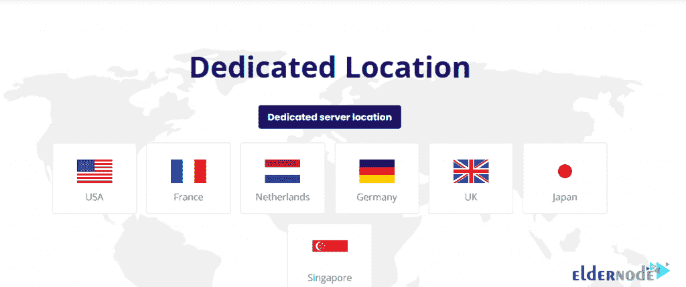

# 如何用比特币购买专用服务器(BTC 服务器)| Eldernode

> 原文：<https://blog.eldernode.com/buy-dedicated-server-with-bitcoin/>

在主机领域， [**专用服务器**](https://eldernode.com/dedicated-server/) 是指拥有特定硬件资源(RAM、CPU、HDD 等)的计算机。)使用数据中心服务，如 DC 电力、足够的带宽、冷却系统和专用 IP。也可以通过内部网或互联网进行远程通信。这种类型服务的用户可以从任何地方与他的服务器进行远程通信。还可以轻松地安装所需的操作系统和软件，并实现必要的设置，而不受提供商公司的任何限制。在这些服务中，硬件资源是完全专用的，用户可以自由使用。在这篇文章中，我们打算让你充分了解专用服务器，以及如何在 [Eldernode](https://eldernode.com/) 中**用比特币**购买专用服务器。

## 如何用比特币购买专用服务器(BTC)

如果你正计划推出自己的网站，你想买一个专用服务器，你需要知道有几个不同的主机服务选项摆在你面前。有时选择正确的选项是困难的。在本文中，我们将解释什么是专用服务器，以及它如何对您的企业有用。通过提高网站或应用程序的速度和质量，你将吸引更多的用户使用你的内容和服务。

## 什么是专用服务器？

专用服务器是由虚拟主机公司提供的虚拟主机服务器，专门供组织或个人使用。专用服务器是最昂贵的托管服务之一，可用于大型项目，具有非常高的灵活性。与许多客户端共享同一台服务器的共享服务器不同，在专用服务器上，只有一个用户可以完全使用一台服务器。诸如操作系统类型选择、服务器硬件类型、服务器安全实现等特征也对用户可用。

一般来说，选择和购买专用服务器适合托管繁重的网站、大型应用程序以及存储备份等信息。小型企业网站不需要托管在专用服务器上，但是对于快速发展和广泛分布的企业来说，使用专用服务器是一个好主意。

专用服务器比其他类型的服务器功能强大得多，服务器类型的选择和购买将完全取决于用户对服务器的使用。如果你的网站需要更多的服务器资源，我们建议购买专用服务器。

### 何时使用专用服务器？

当资源远远大于分配给 [VPS 服务器](https://eldernode.com/vps/)的资源时，通常需要专用服务器。例如，当一个或多个与具有特殊需求和定制且需要大量硬件资源来运行的公司相关的 web 服务被放置在相关的专用服务器上时，可以使用专用服务器。此外，当一个网站同时有许多访问者，需要强大的硬件资源来服务时，专用服务器将非常有用。

如今，专用服务器以两种类型的服务形式提供给用户，物理专用服务器和专用云服务器。这两种类型的服务在大多数情况下非常相似，由于其稳定性、安全性、性能和更高的速度，专用云服务器通常是更好的选择。如果在服务器上使用 VMWare、 [Hyper-V](https://blog.eldernode.com/install-and-configure-hyper-v-on-windows/) 、 [KVM](https://blog.eldernode.com/buy-kvm-vps-with-instant-setup/) 等虚拟化技术，最终的解决方案是使用物理专用服务器。

**具有 RAM、CPU、硬盘、月流量等相关硬件规格的专用服务器**以不同方案的形式由 **Eldernode** 按月或按年出租给用户。

***注:*** 选择专用服务器最重要的一个问题是适当的支持和技术知识。由于其辉煌的历史和与世界各地各种数据中心的合作，Eldernode 团队随时准备为您提供免费咨询。可以[送票免费咨询](https://my.eldernode.com/submitticket.php?step=2&deptid=1)或者联系 **Eldernode 在线支持**。

## 教程用比特币购买专用服务器(BTC)

### 专用服务器的优势

***1。**性能和可靠性*

专用服务器给你无限的带宽和磁盘空间。这使您能够完全控制网站上可供人们使用、共享和存储的信息和媒体。由于处理器、磁盘空间、内存和其他系统资源不与其他人共享，这样的服务器将不会很慢，并且可以处理大量的流量。

***2。速度和可用性**T3*

如果您想为访问者提供最佳体验，专用服务器将是您的理想选择。这种类型的服务器允许您的访问者高速访问网站上的页面。当你在经营一个网上商店和电子商务网站或者启动一个金融交易网站时，这一点尤其重要。

***3。安全和技术援助***

因为您是唯一可以访问专用服务器的人，所以您可以享受现有的高级安全性。专用服务器为您提供一个唯一的 IP 地址，以获得更好的隐私和安全性，并提供高级别的保护，抵御恶意软件和其他攻击者。另外，这样的服务器可以为你提供技术支持。您可以使用高级控制面板。这个控制面板使访问功能更容易，并使网站管理更容易。

### 专用服务器的缺点

***1。**成本和维护*

使用专用服务器的一个主要缺点是它们比其他主机选项更昂贵。你完全可以使用专用服务器，这增加了它的成本。对网站所有者来说，建立、维护和修理网站也是一个巨大的挑战。大多数企业为他们的站点使用虚拟或共享服务器。

***2。**技术要求*

要开发一个专用服务器并管理它所在的站点，您必须掌握大量的网络知识和技能。您应该熟悉的一些东西包括 IP 路由、服务器机制、MX 记录等等。如果你不想学习这样的概念，最好聘请专业的管理员或请托管公司为你管理。专用服务器很少崩溃，但如果崩溃了，修复起来会有点困难。如果你的网站有很大的流量或者必须处理大量的金融交易，你可以很好地使用这种类型的服务器。如果你的业务是新的，最好从共享或虚拟主机开始。

## elder node 中的专用服务器位置

Eldernode 是 VPS 服务器和专用服务器领域中规模最大、声誉最高的公司之一，为世界各地的人们提供这些服务。专用服务器目前分布在 7 个国家/地区:美国、法国、荷兰、德国、英国、日本和新加坡，每个国家/地区如下所述:

### 1。美国专用服务器

美国的专用服务器位于全国顶尖的数据中心，分别位于**纽约州**市、**达拉斯**、**布法罗**、**洛杉矶**。如果需要[购买美国专用服务器](https://eldernode.com/dedicated-server/usa/)，可以查看可用的套装。

### 2。法国专用服务器

法国的专用服务器位于该国顶级的数据中心，位于**巴黎**。如果需要[购买法国专用服务器](https://eldernode.com/dedicated-server/france/)，可以查看可用的套餐。

### 3。荷兰专用服务器

荷兰专用服务器将位于阿姆斯特丹和该国其他城市的顶级数据中心。荷兰数据中心是最早提供专用服务器服务的公司之一，并且一直使用最好的标准和设施。如果需要[购买荷兰专用服务器](https://eldernode.com/dedicated-server/netherlands/)，可以查看可用的套餐。

### 4。德国专用服务器

德国专用服务器位于柏林、**杜塞尔多夫**、**慕尼黑**和**法兰克福**的顶级数据中心。德国数据中心使用 IT 界的最新技术。这些数据中心的所有 Eldernode 机架都有强大的 DDoS 防火墙。重要的是要知道，所有可用的专用服务器都位于德国数据中心，这些数据中心使用强大的电源监控系统、液体冷却系统，并使用户对提供服务感到舒适。德国专用服务器具有强大的互联网连接端口，可以说所有用户都可以使用这些服务器进行虚拟化、网站和应用托管以及专用服务。如需[购买德国专用服务器](https://eldernode.com/dedicated-server/germany/)可以查看可用套餐。

### 5。英国专用服务器

英国专用服务器位于伦敦最先进的数据中心之一，该数据中心采用 IT 世界的最新技术，为用户提供强大的稳定性。如果需要[购买英国专用服务器](https://eldernode.com/dedicated-server/uk/)，可以查看可用的套餐。

### 6。日本专用服务器

日本的专用服务器位于东京的顶级数据中心。日本专用服务器使用数据中心的最高全球标准，拥有服务器所需的配电系统以及现代化的冷却系统。如果需要[购买日本专用服务器](https://eldernode.com/dedicated-server/japan/)，可以查看可用套餐。

### 7。新加坡专用服务器

新加坡的专用服务器位于该国顶级的数据中心。需要[购买新加坡专用服务器](https://eldernode.com/dedicated-server/singapore/)可以查看可用套餐。

## 如何用比特币从 Eldernode 购买专用服务器

要使用比特币从 Eldernode 购买专用服务器，只需遵循以下步骤:

**1。**首先，打开[老年节点网站](https://eldernode.com/)。

**2。**要购买专用服务器，您需要在网站上注册。为此，在输入您的信息后，点击网站主菜单中的**注册**加入网站。订阅网站后返回 Eldernode 主页。

**3。**现在点击网站主菜单中的**专用服务器**标签。

**4。**向下滚动一点，选择您的**期望位置**，从可用选项中购买专用服务器。

**5。**在这个阶段，你会看到专用服务器的不同规划。选择其中一个方案后，根据您的需要，点击**命令**。

**6。**在此页面上，填写完必填字段后，必须右键点击**继续**选项。

**7。**您现在已进入审核和结账阶段。点击**右边的**结账。

**8。**您已经进入付费详情页面。您可以在这里选择付款方式。如果您想通过比特币存入所需金额，请选择**比特币、以太坊、USDT 和所有加密货币**。然后点击**完成订单**。

*

**9。**最后，选择硬币类型后，点击**完成结账**。

*

## 结论

在本文中，我们试图让您充分了解专用服务器及其优缺点。由于比特币等数字货币的使用与日俱增，所以我们试图在 Eldernode 教你如何用比特币购买专用服务器。