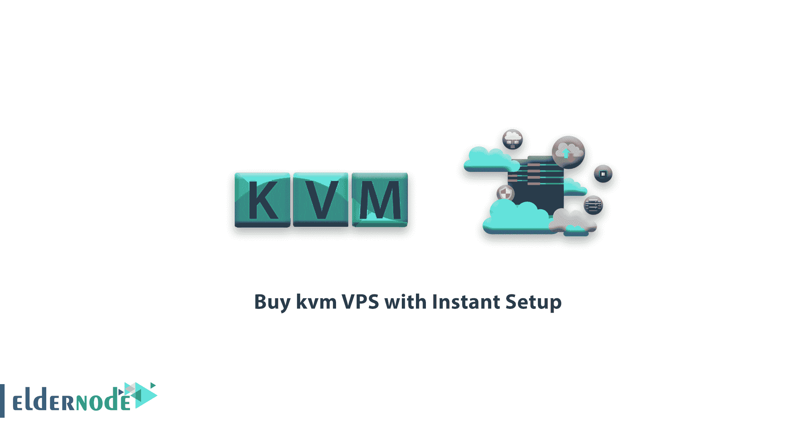

# 如何选购即时设置的 kvm VPS？-便宜的 KVM VPS

> 原文：<https://blog.eldernode.com/buy-kvm-vps-with-instant-setup/>

**购买带即时设置的 kvm VPS、KVM Linux VPS、KVM Windows VPS、KVM RDP 管理。**

什么是虚拟服务器？

虚拟的、完全独立的服务器，比如可以完全访问物理专用服务器的专用服务器，称为虚拟服务器。每个虚拟服务器都独立包含特定份额的服务器资源，如 RAM、C.P.U 或硬盘(H.D.D)。

## 用比特币购买 kvm VPS

更好地了解 KVM 技术

KVM 是由 Redhat 开发的开源虚拟化器，red hat 是技术超级大国中最受欢迎的虚拟化平台之一。

使用这种技术创建的虚拟服务器具有专用的内核和硬件资源，而且在这种平台上，不可能超售或超售。

在 eldernode，我们基于 kvm 提供以下服务:

[**Linux VPS**](https://eldernode.com/linux-vps/)

[**Windows VPS**](https://eldernode.com/windows-vps/)

**[RDP 管理](https://eldernode.com/buy-rdp/)**

KVM VPS 付款方式:

可以用比特币、莱特币、以太币、完美货币或者[数字货币](https://en.wikipedia.org/wiki/Digital_currency)支付。

kvm VPS 地点:新加坡、俄罗斯、美国、香港、英国、荷兰、澳大利亚、德国、日本、法国、土耳其、加拿大和其他一些国家。

您可以就本文提出问题，或者解决该领域的其他问题，请参考[提问页面](https://eldernode.com/ask)部分，并尽快提出您的问题。腾出时间给其他用户和专家来回答你的问题。