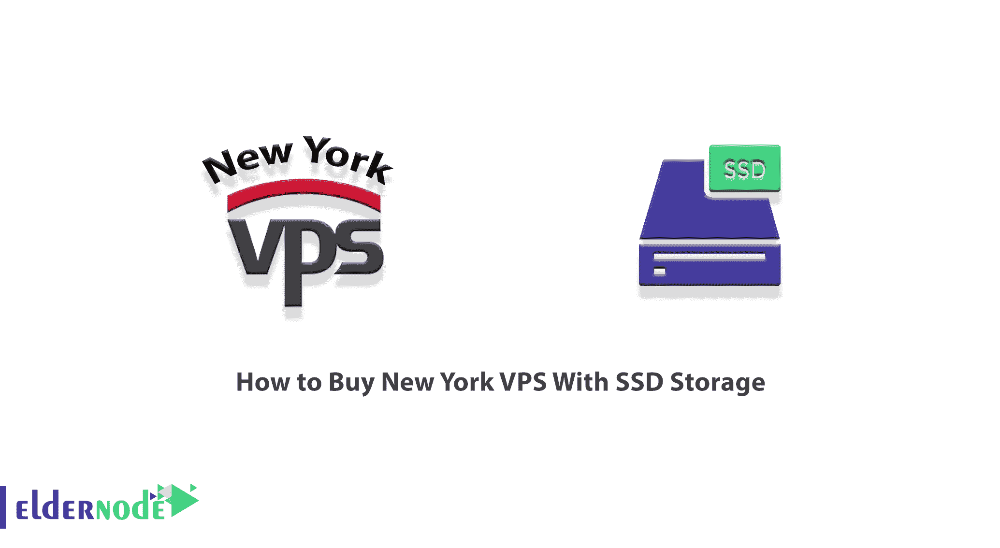
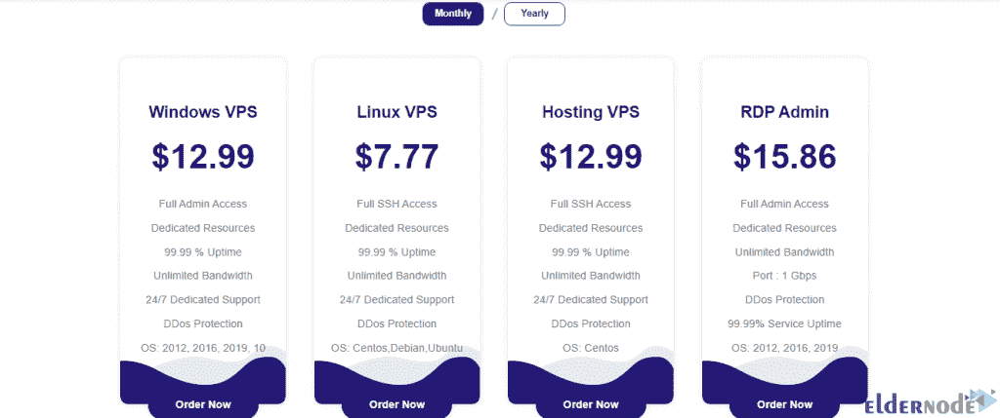
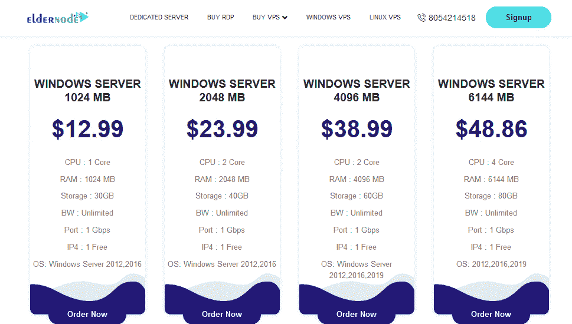
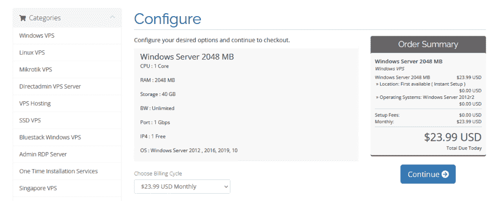
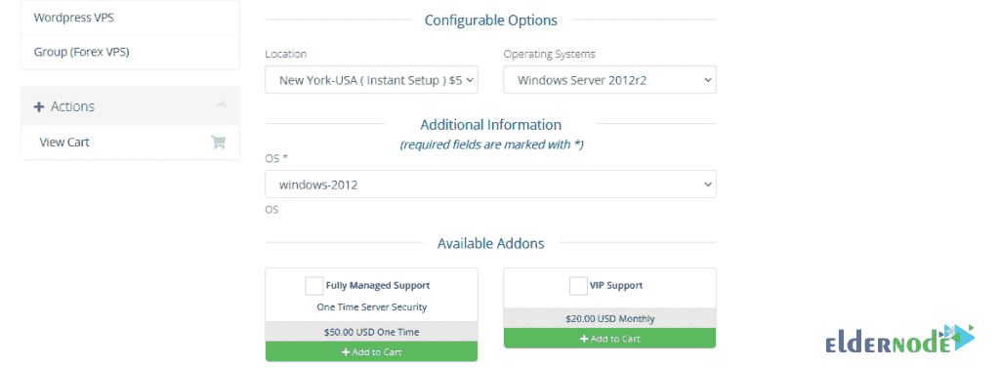
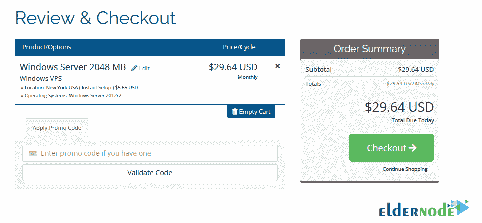
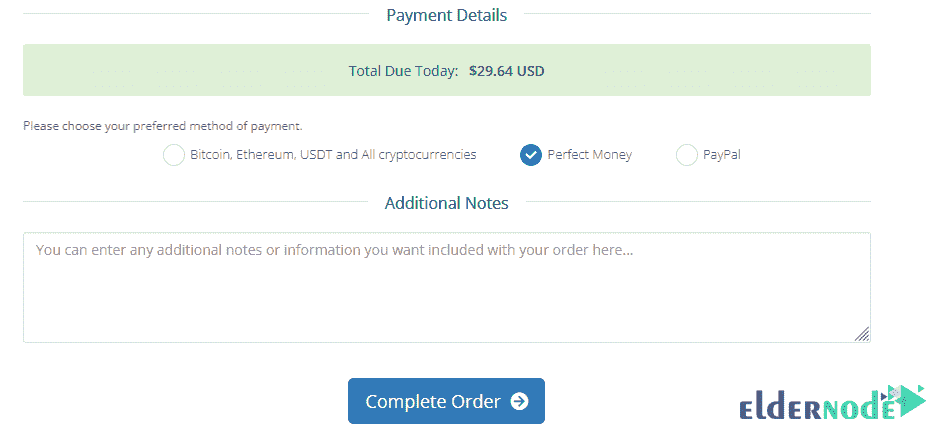

# 如何购买带 SSD 存储的纽约 VPS-elder node 博客

> 原文：<https://blog.eldernode.com/buy-new-york-vps-with-ssd-storage/>

当你决定在网络空间移动和成长，不想回到过去，为你的企业找到合适的主机是很重要的。通过选择和购买一个 [**VPS**](https://eldernode.com/vps/) ，你将完全控制你的服务。同时，你将拥有比共享主机更高的安全性、速度、效率和灵活性。在这篇文章中，我们将教你**如何在 Eldernode 上购买带 SSD 存储**的 [New York VPS](https://eldernode.com/new-york-vps/) 。

## **教程购买纽约 VPS 带 SSD 存储**

### **VPS**的特点及应用

如今，网站和信息技术平台已经成为许多公司发展、维护和保留信息的基础。在某种程度上可以保证公司的适当增长和盈利。对于正在设计一个新网站的人来说，选择一个具有最高安全和质量的可靠服务是非常重要的。

VPS 服务器的优势和应用有:

1-提高可靠性

2-完整的服务器管理

3-提高生产率和高性能

4-灵活性

5-节约成本

6 台服务器监控

7-专用邮件服务器

8-备份管理

### **SSD 存储简介**

SSD 代表固态硬盘，这意味着其中没有移动部件。SSD 技术一般不同于 HDD。需要注意的是，SSD 内存是由 NAND 闪存技术制成的，其内部解剖结构中没有机械部分。

固态硬盘之所以被称为 SSD，是因为与硬盘不同，它的机制不是基于对象的旋转及其内部执行的移动。

与 DRAM 或动态随机存取存储器中使用的必须每秒刷新几次的晶体管不同，NAND 闪存的设计使其即使在没有电源可用的情况下也可以充电或放电。

当然，这些类型的驱动器比硬盘驱动器更昂贵，因为它们的速度高，并且体积比硬盘驱动器小。在个人电脑和中档笔记本电脑中，固态硬盘内存被用于硬盘旁边，以便在其上安装 Windows 和一些应用程序，并享受其高速。

在 Eldernode 中， [Windows VPS](https://eldernode.com/windows-vps/) 、 [Linux VPS](https://eldernode.com/linux-vps/) 、[托管 VPS](https://eldernode.com/vps-hosting/) 、 [RDP Admin](https://eldernode.com/buy-rdp/) 等服务都支持 SSD 存储技术。在这篇文章中关注我们，向您展示如何在 Eldernode 上购买带有 SSD 存储的纽约 VPS。

## **在 Eldernode** 上购买带 SSD 存储的 New York VPS

在前面几节中熟悉了 VPS 以及 SSD 存储的功能和应用之后，我们现在想教您如何在 Eldernode 上购买带有 SSD 存储的纽约 VPS。为此，你必须首先在 Eldernode 网站上注册 **[。](https://blog.eldernode.com/register-on-eldernode-and-order-vps/)**

第一步，进入 [**SSD 虚拟私有服务器**](https://eldernode.com/ssd-vps/) 页面。

如下图所示，您可以指定是按**月**还是按**年**提供服务。然后选择您想要的服务并点击**立即订购**。我们在这里点击 **[Windows VPS](https://eldernode.com/windows-vps/)** 。

查看可用计划后，选择您想要的计划上的**立即订购**按钮:

下一节是关于配置您想要的服务。在此部分，您必须完成**位置**字段( [**纽约**](https://eldernode.com/new-york-vps/) )和**操作系统**。然后点击**继续**:

进入下一步后，你会在**审核&结账**部分看到所有你想买的服务。如果您有**折扣代码**，请输入申请。点击**结账**进入最后一节:

选择一种支付方式，点击**完成订单**完成购买:

## 结论

每个 VPS 服务器完全独立于其他帐户运行。因此，它可以使用具有不同版本、资源、软件和硬件的不同操作系统。这项服务之所以受欢迎，是因为它提供了专用但经济高效的服务器功能。在这篇文章中，我们试图教你如何在 Eldernode 上购买带 SSD 存储的纽约 VPS。