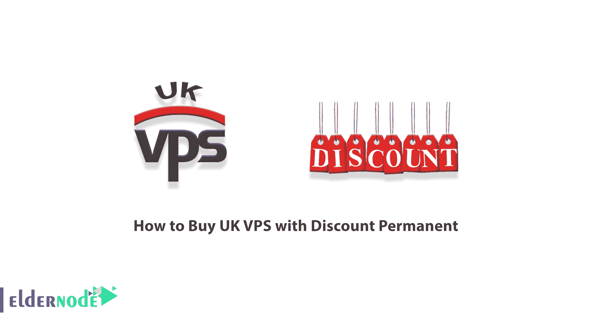
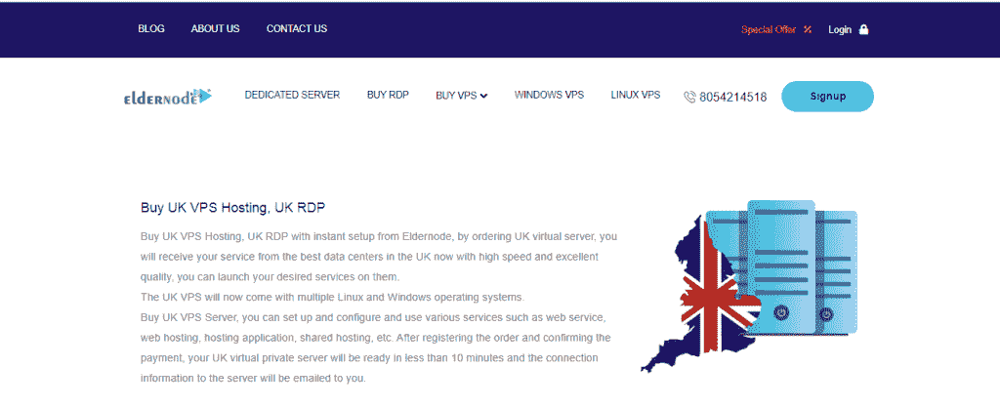
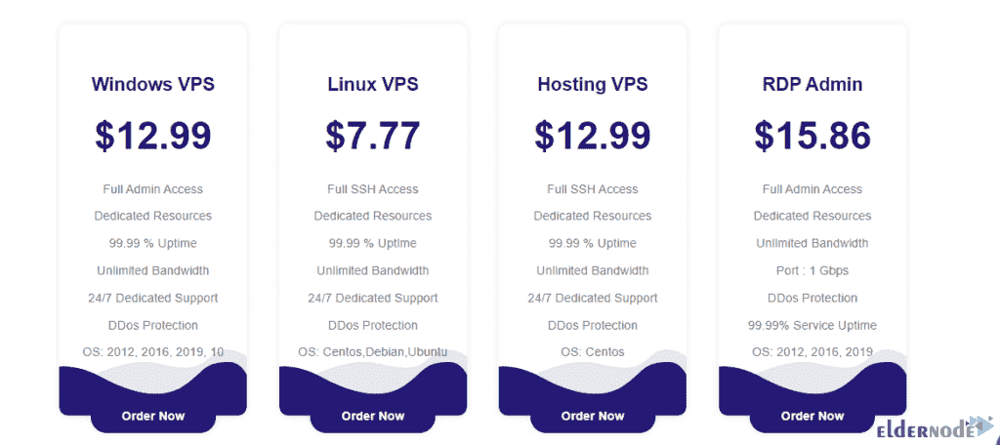
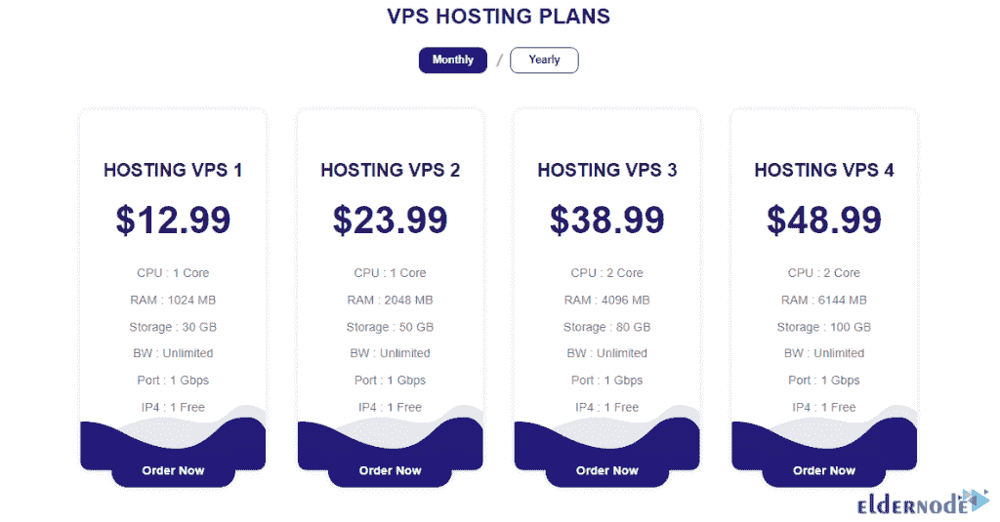
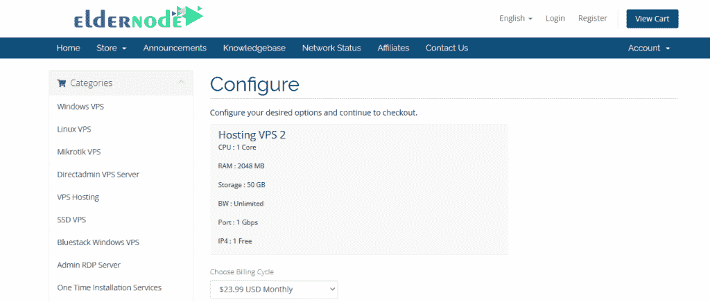
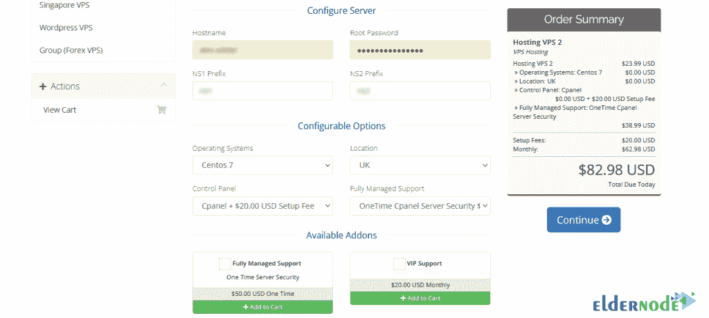
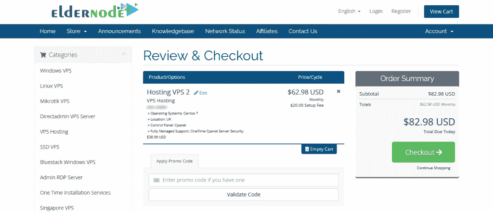
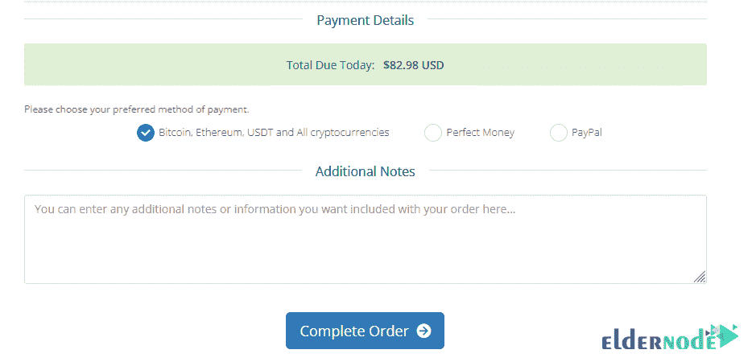

# 如何购买打折永久英国 VPS-elder node 博客

> 原文：<https://blog.eldernode.com/buy-uk-vps-with-discount/>

虚拟服务器(缩写为 VPS)通过为用户提供对操作系统(如专用服务器)的完全访问，提供了最大的灵活性。这项服务也比专用服务器更受欢迎。因为它提供了对专用服务器的近距离访问。同时，它比专用服务器更经济实惠。在这篇文章中，我们将教你如何购买[英国 VPS](https://eldernode.com/uk-vps/) 永久折扣。请加入我们。

## **教程用折扣永久购买英国 VPS**

Recommended Article: [Russia VPS Server](https://blog.eldernode.com/russia-vps-server/)

### **VPS 简介**

虚拟服务器代表虚拟专用服务器。一些人错误地将虚拟服务器称为 VDS，代表虚拟专用服务器。当然，副总统和 VDS 是不同的。

虚拟服务器是安装在单台计算机上为多个网站提供服务的专用服务器。一台计算机可能有几个虚拟处理器，每个虚拟处理器都有一个独立的操作系统和针对每个用户的特定软件。换句话说，虚拟服务器是其资源在几台机器或用户之间共享的服务器。

如今，个人、组织或小型和大型企业需要网站和基于 web 的应用程序，以便更好地销售他们的产品或服务，并与他们的客户进行更多的互动。这需要在硬件、软件和基础设施方面进行大量投资。

VPS 服务器为所有类型的小型和大型企业提供了非常灵活和经济高效的解决方案，使他们能够发展壮大自己的业务。虚拟服务器在操作系统、虚拟化技术、资源以及迁移到其他服务的能力方面非常灵活。

应该注意，虚拟服务器提供专用服务器的功能；而在共享主机平台上。几个虚拟服务器安装在一个强大的专用服务器上，并且相互独立运行。这种强大的物理服务器运行在 T2 的 Windows T3 或 T4 的 Linux T5 操作系统上，并使用一种强大的虚拟化技术，称为 hypervisor。这将创建一个虚拟机。

每个虚拟机运行一个完整的操作系统，并限制对内存和存储库等物理资源的访问。客户可以访问虚拟机操作系统，但不能访问物理服务器。

## **购买英国永久优惠价**

购买英国 VPS 服务器，首先要 [**在 Eldernode 网站**](https://blog.eldernode.com/register-on-eldernode-and-order-vps/) 注册。

要继续，您必须首先进入 [**英国 VPS**](https://eldernode.com/uk-vps/) 页面:

如下图可以看到，Eldernode 中为英国提供了[**Windows VPS**](https://eldernode.com/windows-vps/)[**Linux VPS**](https://eldernode.com/linux-vps/)[**托管 VPS**](https://eldernode.com/vps-hosting/)[**RDP Admin**](https://eldernode.com/buy-rdp/)服务器。您可以选择其中一个计划并点击**立即订购**。我们在这里选择虚拟主机。

如你所见，有 4 种不同的包装适合你。您可以通过选择这些产品包并点击**立即订购**来检查其中一个产品包:

点击立即订购将带您进入**配置**页面。在**服务器配置**部分，您需要完成**主机名**和**名称服务器(NS)** 。在**可配置选项**部分，您还必须填写与**操作系统**、**位置(英国)**、**控制面板**等相关的字段。需要注意的是，您可以选择**全托管支持**或 **VIP 支持**进行支持。然后点击**继续**。

在**审核&结账**页面，浏览完购物车，如果有**折扣码**就可以进入。然后点击右栏中的**结账**:

最后一步，您必须从**付款详情**部分选择一种付款方式，然后点击**完成订单**。这里我们选择支付方式**比特币、以太坊、USDT，以及所有加密货币**。

在打开的页面上，查看您的信息后，您可以在选择硬币部分的右栏中选择您想要的货币。然后点击完成结帐。

最后，通过扫描如下所示的条形码来支付您想要的服务。我们的专家将尽快为您提供服务。

## 结论

选择 VPS 服务器后，将为您分配一个帐户。在此帐户中，您将完全控制您的 VPS 服务器。完全控制意味着您可以自己安装和更新服务器操作系统。也可以安装自己喜欢的软件。我们的建议是把这个任务留给公司的技术专家。在这篇文章中，我们试图教你如何购买永久折扣的英国 VPS。